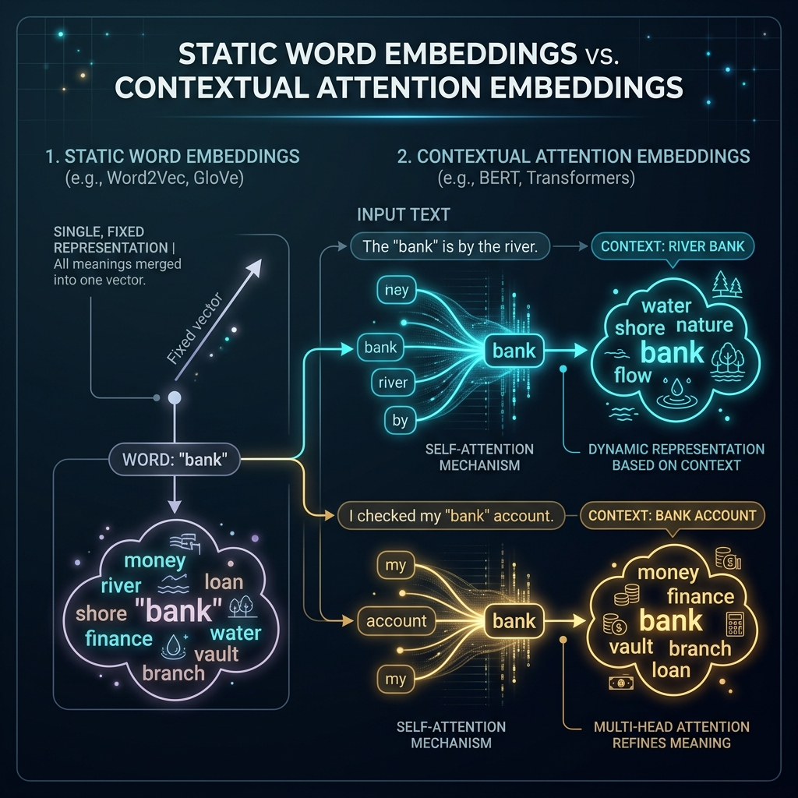
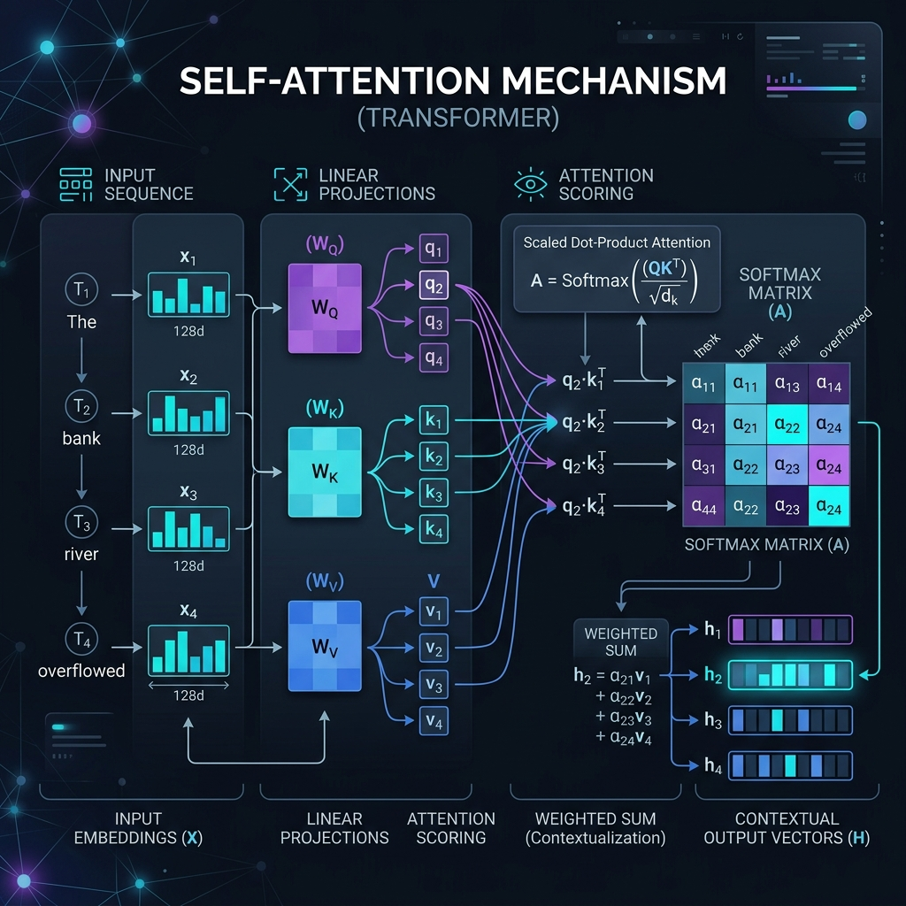

# Week 3 Submission on attentions.

# Before we get into attentions.

We corrected some nuances and understanding of the embedding layer itself. We misunderstood a few things previously which we corrected during our learning.

So we corrected ourselves in the below passage.

The model first tokenizes text into token IDs.
The embedding layer contains a full embedding matrix E (vocabsize,dim), which is randomly initialized at the start of training.
During the forward pass, each token ID is used to look up its row in E based on the words in the input sentence.
The selected rows are stacked to form the sequence matrix X which is nothing but the stack of embedded vectors for the words in that particular sentence, which becomes the input to the network.
During backpropagation, the embedding vectors in E are updated so that the model gradually learns useful representations.

Initially we thought that the output of the first layer is embedding matrix which is wrong . It is a learned parameters this embedding matrix (E) is not the output of the first layer at all it was created by using random values initially and then the values gets updated during back prop.

> Embedding Matrix (E) is nothing but the stack of embedded vectors of the entire library which is first initialized randomly.

We can look it like this it is the library of all of the books as the embedded matrix where each embedded vector for that word is a book while the token id is the index/location no. of where that book is kept in the library / embedding matrix.

And When during training based on the sentence the sequence matrix is created picking the embedded vector from embedded matrix, while in back propogation the books are updated based on the loss.

So, it is the embedding layer.

```
E starts random
     ↓
many forward passes
     ↓
loss + backpropagation
     ↓
embedding rows repeatedly updated
     ↓
E becomes meaningful
```

One most important point that we understood here is that the embedding matrix E is not universal. It is the learned representation based on the patterns and the context present in the sentences that it is trained on which becomes useful.

Like ex:
- River bank
- Bank account
- Bank loan
- Bank of the river

The embedding for the above words would be the same.

Bank embedding is the same doesn't matter which context it is in. So how do we get the contextual representations? **HERE IS WHERE ATTENTIONS ARE USED.**



```
Bank embedding
     ↓
learned general representation
based on all the ways "bank"
appeared during training
```

---X End of the correction for Week 2 X-------

Now Let's come to attentions.

# Week 3

### Attentions:

> Why do we need Attentions when we have the learned representation of the word/token?

The Embedding tells us the general representation of the word, But not the meaning in a particular sentence.

Although it has learned based on the company it kept but doesn't give meaning of the word that it is used currently in the given sentence.

Let's continue with the same example of the Bank:
- River bank
- Bank account
- Bank loan
- Bank of the river

Its learned embedding may capture that bank is related to things like:
money, loan, river, shore, account

Bank has the same base embedding for all the above sentences, But the context of the word bank changes based on the sentence it is in.

- River Bank -> context related to water, shore etc.
- Bank account -> context related to money, account, etc.
- Bank loan -> context related to money, loan, etc.
- Bank of the river -> context related to water, shore, etc.

**This is where we need attentions.**
Although an embedding captures a token’s general learned meaning from training, it is still a context-independent base representation at lookup time. It does not yet reflect the surrounding tokens of the current sentence.
Here is where and why we need Attention. **Attention adds that current context**.

> **PROBLEM:** While Embeddings tells us the general representation of the word based on the company it kept during the training, it doesn't provide the semantic meaning of the word in the given context window. It doesn't know if we are referring to a financial related bank or a river bank.  
> **SOLUTION:** Attention tells us the meaning of the words based on current sentence/context it is currently being used in.

Attention looks at the company the token is keeping right now and what context it is being used in.

## How does Attention mechanism work or know the current context of the word?

For the given sentence "The **bank** river overflowed".

Let me take the example of the word bank.

Now the word bank basically has a general representation correct.
To get the contextual meaning of the word bank in this sentence it has to look at the other words in the sentence.

This is done by multiplying the word bank embedding with the embeddings of the other words in the sentence.

Ex: The river bank flooded

> **Note:** Please do not use this to understand the working of the attention mechanism mathematically as this is only conceptual, mathematically it has nuances.

- Bank(embedding) * The(embedding) = 0.02
- Bank(embedding) * river(embedding) = 0.70
- Bank(embedding) * bank(embedding) = 0.20
- Bank(embedding) * flooded(embedding) = 0.08

Then the dot product between them will give the attention weights (we also call this the relevance score).

These attention weights only tell which word to focus on or in other words it tells the relative importance of the other words in the context of the current word.

It only tells which word to pay attention to, however it doesn't provide the contextual meaning of the word, it only provides the weights to focus on.

To get the new meaning of bank we would have to collect the information from those words and combine it.

i.e, New "Bank" meaning = [ 0.70 * (embedding of 'river') + 0.20 * (embedding of 'bank') + 0.08 * (embedding of 'flooded') + 0.02 * (embedding of 'the') ]

This new Bank meaning is the contextual representation.

### To Sum it up:
1. Calculate the relevance score between the current word and all the other words in the context.
2. Convert that relevance into percentage (Softmax).
3. Use those attention weights to get the weighted sum of embeddings of all the words in the context.
4. This weighted sum becomes the new contextual meaning of the word.

### Some things to think: what if the attention scores are equal for all the words?
Then it simply means that there is no one important word to focus on and all the words are equally important.

### Mathematically how does it actually work inside the Attention mechanism?

Previously we understood how attention works conceptually but we didn't understand how does it actually calculate those scores and how it combines them to give the contextual meaning.

To understand this we need to understand 3 new things / terminologies: Q, K, V

- **Q -> Query** (what am I looking for?)
- **K -> Key** (what category information do I contain?)
- **V -> Value** (what information can I provide?)

Now, What are these composed of and how are we calculating them?

$$Q = X W_Q \quad ; \quad K = X W_K \quad ; \quad V = X W_V$$

where $X$ is the input sequence vectors (it can be either Embedded vectors or output matrix of previous layer), $W_Q, W_K, W_V$ are the weight matrices that are learned during training.



Let's take the sentence "The **bank** river overflowed".

Embedding Matrix E:
- Token 1: The
- Token 2: bank
- Token 3: river
- Token 4: overflowed

```
X = [
  emb('The'),
  emb('bank'),
  emb('river'),
  emb('overflowed')
]
```

Now, when calculating contextual representation for "bank", for simplicity let's take one token embedding for our understanding although the computation happens on the sequence matrix (it doesn't take each token and do the operation separately, this is only for our understanding).

X = embedding of "bank"; Please note tha the weights are initialized randomly initially.
Also. We know that the shape of the sequence matrix is (seq_len, dimension)
i.e, in our case it is (4, 128) for all 4 tokens. [One row per token, 128 columns for 128
dimensions] (Roughtly we can think that dimensions can be the no of neuron in the first
layer; Roughly)
And the shape of WQ, WK, WV is (emb_dim, head_dim) i.e., (128, 64).
128 dimensions we get from the previous sequence matrix shape while the 64 is the
dimension of the output vector we want it can be anything we provide.
So, if X is the embedding of "Bank", size (1, 128) (Note herefor simplicity showing one
vector at a time but actually the entire sequence vector matrx is multiplied with WQ, WK,
WV)
Q(Bank) = X WQ [WQ is learned during training; unique matrix for Query, but shared across
tokens]
K(Bank) = X WK [WK is learned during training; unique matrix for Key, but shared across
tokens]
V(Bank) = X WV [WV is learned during training; unique matrix for Value, but shared across
tokens]
Likewise Q = X WQ ; K = X WK ; V = X WV
Each WQ, WK and WQ is randomly initialized and learned during the training. They are
unique to the Attention layer not to the tokens.
For The: X = emb('The'); Q(The) = X WQ ; K(The) = X WK ; V(The) = X WV
For bank: X = emb('bank'); Q(bank) = X WQ ; K(bank) = X WK ; V(bank) = X WV
For river: X = emb('river'); Q(river) = X WQ ; K(river) = X WK ; V(river) = X WV
For overflowed: X = emb('overflowed'); Q(overflowed) = X WQ ; K(overflowed) = X WK ;
V(overflowed) = X WV

**Note**: Although each Token has its own Q, K, V, they will always share the weights WQ, WK, WV across all tokens in the sequence.

Now we know Q, K, V.

Let's understand how calculating attention weights actually works.

**Step 1: calculate the relevance score between the current word (query) and all the other words (Keys)
So we calculate the attention weights for "bank" with "The", "bank", "river", "overflowed".
So, lets say for Queryfor Bank Q(bank) = X(E('bank')) * WQ
= Multiple the Query Matrix with the dot product of all the Key Matrices
Attention scores are calculated for bank = Q(bank) . K('The')
Q(bank) . K('bank')
Q(bank) . K('river')
Q(bank) . K('overflowed')
we know what is K('The') = X(emb('The)) * WK similary for others

**Step 2: Convert that relevance into percentage (Softmax).**
These raw scores from dot products give relative importance. We apply Softmax to get probabilities between 0 and 1 that sum up to 1.

**Step 3: Use attention weights to get weighted sum of Values (V).**
Multiply these Softmax weights with V matrix of each token and sum them up.

$$\text{Contextualized "bank"} = (0.02 \cdot V_{\text{The}}) + (0.70 \cdot V_{\text{river}}) + (0.20 \cdot V_{\text{bank}}) + (0.08 \cdot V_{\text{overflowed}})$$

This provides the contextual representation of each word in the given sentence.

## Scaling Factor ($\sqrt{d_k}$)

To prevent raw dot products from growing too large in magnitude (which pushes Softmax into saturated regions with tiny gradients), we scale down by dividing by $\sqrt{d_k}$.

Final formula:
$$\text{Contextual Representation } H = \text{Softmax}\left( \frac{Q K^T}{\sqrt{d_k}} \right) V$$

```
Text
 ↓
Tokenizer
 ↓
Token IDs
 ↓
Embedding Lookup
 ↓
Sequence Matrix X
 ↓
Create Q, K, V
 ↓
Calculate Attention Scores
 ↓
Softmax
 ↓
Attention Weights
 ↓
Weighted Sum of Values
 ↓
Contextual Representation
```

#### What is still pending?
- We need to still cover transformer blocks.
- Multi-head attention.