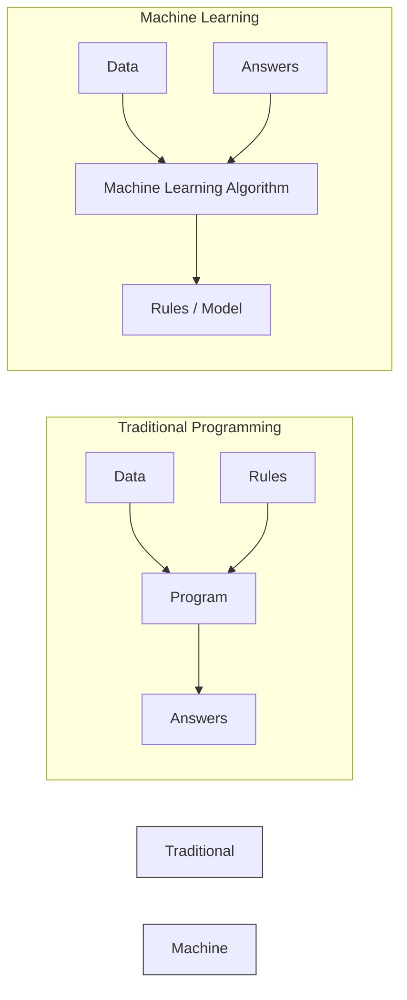

# Machine Learning Foundations

> [!NOTE]
> This topic is based on Chapter 5.1 (Learning Algorithms) of the *Deep Learning* textbook.

## Formal Definition
A machine learning algorithm is an algorithm that is able to learn from data. Mitchell (1997) provides the formal definition:
"A computer program is said to learn from experience $E$ with respect to some class of tasks $T$ and performance measure $P$, if its performance at tasks in $T$, as measured by $P$, improves with experience $E$."

In this lab, we focus on **Supervised Learning**, where the experience $E$ involves observing a dataset of features (Inputs) matched with targets (Labels).

## Component-by-Component Math Breakdown
- **$E$ (Experience):** The Dataset. If you want to train an AI to recognize dogs, $E$ is a massive folder of 10,000 pictures of dogs and cats.
- **$T$ (Task):** The actual goal. For example, $T$ is the task of looking at a new image and outputting the word "Dog" or "Cat".
- **$P$ (Performance):** The Loss Function (Error). We measure how well the AI is doing by checking its accuracy. If it guesses "Dog" on a picture of a Cat, $P$ goes down.

If feeding the model more images ($E$) makes its accuracy ($P$) on classification ($T$) go up, the machine is successfully *learning*.

## Beginner Intuition & Contrasting Analogy
Imagine you want to teach a robot how to bake a chocolate cake.
- **Traditional Programming:** You sit down and write a highly explicit, rigid recipe. "If temp < 350, turn on oven. Add 2 cups flour. Add 1 cup sugar." You provide the **Rules** and the **Data** (ingredients), and the robot outputs the **Answer** (a cake). If the recipe is slightly wrong, the robot will bake a terrible cake forever.
- **Machine Learning:** You don't write a recipe. Instead, you give the robot the ingredients (**Data**) and a picture of a perfect chocolate cake (**Answer/Label**). You tell the robot to just start mixing things randomly. It bakes a terrible cake, compares it to the picture (calculates Error), and adjusts its internal strategy. After 10,000 terrible cakes, it finally bakes a perfect one. The robot has output the **Rules** (the perfect recipe) entirely on its own!

## Where is this used in AI?
*   **Self-Driving Cars:** Humans cannot write `if` statements for every possible driving scenario (e.g., `if stop_sign_covered_in_snow_and_person_wearing_chicken_suit_crossing_road:`). It's too complex. Instead, Tesla engineers record millions of hours of expert human driving (Data + Answers) and feed it to a neural network to learn the Rules of driving itself.
*   **Medical Diagnosis:** Feeding an AI 100,000 X-Rays of lungs along with the doctor's diagnosis (Healthy vs Sick) so the AI learns to identify microscopic patterns of cancer that humans might miss.

## Small Numerical Example
Let's look at the data structure for a tiny Supervised Learning task (Predicting if someone will buy a house based on their age):
- **Input (Age):** $\mathbf{x} = [25, 45, 60]$
- **Target (Bought House?):** $\mathbf{y} = [0, 1, 1]$

The model makes a prediction $\hat{\mathbf{y}} = [0.1, 0.4, 0.9]$.
The performance $P$ calculates how far $\hat{\mathbf{y}}$ is from $\mathbf{y}$.

*(Source: Ian Goodfellow, Yoshua Bengio, and Aaron Courville - Deep Learning, Chapter 5.1)*

---

## Flashcards

What is the fundamental difference between Traditional Programming and Machine Learning? #card
Traditional Programming requires a human to input explicit Rules to process Data into Answers. Machine Learning takes Data and Answers, and outputs the Rules (the model) automatically.

What does Mitchell's formal definition of machine learning (Task $T$, Performance $P$, Experience $E$) mean in plain English? #card
A machine is "learning" if getting more Experience (training on more data) makes its Performance (accuracy) at a specific Task (like image recognition) improve.
