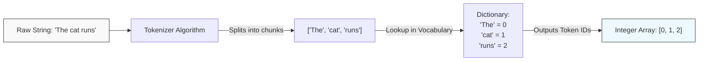

# Tokens and Vocabulary

> [!NOTE]
> This topic covers the foundational Natural Language Processing (NLP) concepts required to feed text into a neural network.

## Formal Definition
Neural networks are strictly mathematical engines; they cannot process raw text strings like `"Hello"`. Therefore, we must convert text into numbers.

- **Tokenization** is the algorithm that segments a continuous stream of text into smaller, discrete chunks called **Tokens** (these can be words, sub-words, or characters).
- The **Vocabulary ($V$)** is the complete, finite set of all possible unique tokens the model is allowed to recognize.
- The **Token ID** is the unique integer index of a specific token within the Vocabulary.

## Component-by-Component Math Breakdown
Let's break down the mathematical mapping of a string $S$ into a vector of Token IDs:
$f_{\text{tokenize}}(S) \rightarrow [i_1, i_2, \dots, i_n]$

- **$S$**: The raw input text string (e.g., `"The cat runs"`).
- **$f_{\text{tokenize}}$**: The Tokenizer function. It splits the string based on its rules (e.g., splitting by spaces).
- **$i$**: The integer Token ID.
- **$[i_1, i_2, \dots, i_n]$**: An array of integers. Every single integer $i$ must be strictly between $0$ and $|V|-1$ (where $|V|$ is the total size of your vocabulary). If a token ID is outside this range, the model will crash.

## Beginner Intuition & Contrasting Analogy
Think of the Vocabulary as a **Massive Numbered Dictionary**.
When you give the model the word `"Apple"`, it flips through the dictionary until it finds the word `"Apple"`. It sees that `"Apple"` is on page number `42`.
The model then replaces the word `"Apple"` with the number `42`.

## Where is this used in AI?
*   **Sub-word Tokenization (BPE):** Modern Large Language Models (like GPT-4) do not use "Whole Word" tokenization because there are millions of words in the world (the dictionary would be too big). Instead, they use algorithms like **Byte-Pair Encoding (BPE)**. BPE chunks words into sub-words. 
    For example, if ChatGPT sees a brand new word like `"Unbelievable"`, it might split it into 3 sub-word tokens: `["Un", "believ", "able"]`. This brilliant trick allows GPT-4 to read and generate words it has never seen before!
*   **Out of Vocabulary (OOV):** If you build a simple word-level tokenizer and someone types a typo like `"Catt"`, the tokenizer will fail to find it in the dictionary and output a special `<UNK>` (Unknown) token, effectively blinding the AI to that word.

## Small Numerical Example
If our vocabulary is extremely small:
`vocab = {"Order": 0, "Shipment": 1, "Payment": 2, "Receive": 3}`

- Input: `"Payment Receive"`
- Tokenizer splits: `["Payment", "Receive"]`
- Vocabulary lookup: `[2, 3]`

## Common Misunderstanding
**Misunderstanding:** A Token ID has inherent mathematical meaning (e.g., since `"Payment" = 2` and `"Shipment" = 1`, Payment is twice as big as Shipment).
**Correction:** Token IDs are *purely arbitrary identifiers*. Passing a raw `2` into a neural network's `Wx+b` equation is mathematically disastrous, as the network will literally try to multiply the concept of "Payment" by 2. This is why we must use **One-Hot Encoding** or **Embeddings** in the next step.

---

## Flashcards

Why shouldn't Token IDs be treated as ordinary continuous numerical features in a Linear Layer? #card
Because passing raw integers implies a false mathematical relationship (e.g., Token 4 is "twice as much" as Token 2). They are just arbitrary lookup page numbers, not actual measurements.

How do modern models like GPT-4 handle words they have never seen before without crashing? #card
They use Sub-word Tokenization (like Byte-Pair Encoding). Instead of needing the whole word in their vocabulary, they break unknown words down into smaller, known chunks (e.g., "Un-believ-able").
