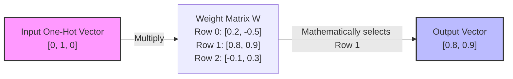

# One-Hot Encoding

> [!NOTE]
> This topic covers the foundational technique for converting discrete categorical tokens into mathematical vectors.

## Formal Definition
Because we cannot feed raw integer Token IDs into a neural network (as it implies a false mathematical hierarchy), we must convert each token into a vector. 
A **One-Hot Vector** is a vector of size $|V|$ (the vocabulary size) consisting entirely of $0$s, with the exception of a single $1$ placed at the index corresponding to the Token ID.

## Component-by-Component Math Breakdown
Let's analyze the mathematical property of **Orthogonality** in One-Hot Vectors.
Assume Vocabulary `V = ["Cat", "Dog", "Bird"]`.
- "Cat" (ID 0) = $[1, 0, 0]$
- "Dog" (ID 1) = $[0, 1, 0]$

If we take the mathematical **dot product** of these two vectors to measure their similarity:
$[1, 0, 0] \cdot [0, 1, 0] = (1 \times 0) + (0 \times 1) + (0 \times 0) = \mathbf{0}$

Because the dot product is exactly $0$, these vectors are perfectly orthogonal (perpendicular in 3D space). Mathematically, the network sees "Cat" and "Dog" as sharing exactly $0\%$ similarity.

## Beginner Intuition & Contrasting Analogy
Imagine a massive control panel with 10,000 light switches.
- **Continuous Numbers (Wrong):** You have a single dial. You turn it to 5 for "Cat" and 10 for "Dog". The machine assumes Dog is twice as heavy/important as Cat.
- **One-Hot Encoding (Right):** Every single word in the dictionary gets its own dedicated light switch. To say "Dog", you turn the "Dog" switch ON ($1$), and ensure all 9,999 other switches are perfectly OFF ($0$). No word is inherently bigger or better than any other word; they are completely isolated concepts.

*Notice how multiplying a one-hot vector against a matrix acts as a simple "Row Lookup" function.*

## Where is this used in AI?
*   **Legacy NLP (Bag of Words):** Before 2013, almost all text processing used One-Hot Encoding. The problem is that if your vocabulary is 100,000 words long, every single word requires an array of 100,000 numbers (with 99,999 of them being completely wasted zeros). This is called a **Sparse Vector**, and it crashes computer memory quickly.
*   **Modern AI (Dense Embeddings):** Modern LLMs (like GPT-4) still use One-Hot Vectors at the very first step, but they immediately multiply that sparse vector against a massive matrix to squish it down into a dense "Embedding" vector of size ~1,000. (We will cover Embeddings later in the curriculum).

## Small Numerical Example
If our Vocabulary size is 5:
`["Apple", "Banana", "Cherry", "Date", "Elderberry"]`

The word "Cherry" has Token ID `2` (using 0-based indexing).
Its One-Hot Vector is: `[0, 0, 1, 0, 0]`.

## Common Misunderstanding
**Misunderstanding:** One-hot encoding helps the AI understand what words mean.
**Correction:** One-hot encoding explicitly *prevents* meaning! By forcing the dot product of every word to be exactly $0$, the AI starts with the assumption that every word in the universe is 100% unrelated to every other word. It has to learn relationships entirely from scratch through the weights.

---

## Flashcards

What happens mathematically when you multiply a One-Hot vector by a Weight Matrix (`x @ W`)? #card
The one-hot vector acts as a mathematical row-selector. It pulls exactly one row of the Weight Matrix (the row corresponding to where the `1` is) and ignores the rest.

Does One-Hot Encoding capture semantic similarity between words? #card
No. It preserves token identity perfectly, but because the dot product of any two one-hot vectors is $0$, it mathematically forces every word to be 100% independent and unrelated.
