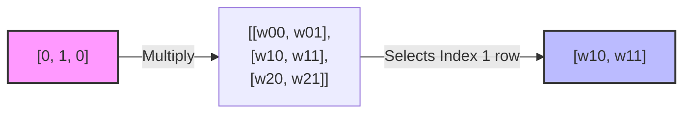

# One-Hot Encoding

## One-line definition
A vector of all zeros with a single `1` placed at the index of the Token ID.

## Why it exists
To mathematically represent a token to a Neural Network without implying that one token is "bigger" or "more important" than another.

## Beginner intuition
It’s like a row of light switches. If your vocabulary has 10 words, you have 10 switches. To represent the 3rd word, you turn on only the 3rd switch and leave the rest off.

## Week 1 assignment connection
If our Vocabulary size is 10, the word "Order" (Token ID 1) becomes `[0, 1, 0, 0, 0, 0, 0, 0, 0, 0]`.

## Small numerical example
Vocabulary: `["Cat", "Dog", "Bird"]`
"Dog" has Token ID `1`.
One-hot vector: `[0, 1, 0]`

## Common misunderstanding
**Misunderstanding:** One-hot encoding captures the meaning or similarity of words.
**Correction:** One-hot encoding explicitly assumes every single word is 100% independent and mathematically equidistant from every other word. It does *not* encode semantic similarity.

## What happens if removed or changed?
If we use raw Token IDs instead of One-hot vectors, the network assumes false linear relationships (e.g. `Word 4` is the average of `Word 3` and `Word 5`).

## Teach-back question
When we perform `x @ W` where `x` is a one-hot vector, what exactly happens mathematically to the matrix `W`?

## Flashcards

What happens mathematically when you multiply a One-Hot vector by a Weight Matrix (`x @ W`)? #card
The one-hot vector acts as a selector. It picks exactly one row of the Weight Matrix (the row corresponding to where the `1` is) and ignores the rest.

Does One-Hot Encoding capture semantic similarity between words? #card
No. It preserves token identity perfectly but assumes every category is mathematically equidistant and completely independent.
