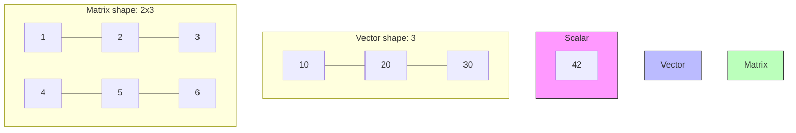

# Vectors, Matrices, and Shapes

> [!NOTE]
> This topic is based on Chapter 2.1 (Scalars, Vectors, Matrices and Tensors) of the *Deep Learning* textbook.

## Formal Definition
*   **Scalars:** A scalar is just a single number (e.g., $s \in \mathbb{R}$).
*   **Vectors:** A vector is a 1D array of numbers. We can identify each individual number by its index (e.g., $\mathbf{x} \in \mathbb{R}^n$).
*   **Matrices:** A matrix is a 2D array of numbers, so each element is identified by two indices (rows and columns) (e.g., $\mathbf{A} \in \mathbb{R}^{m \times n}$).

## Component-by-Component Math Breakdown
Let's analyze the standard notation for a matrix: $\mathbf{A} \in \mathbb{R}^{m \times n}$
- **$\mathbf{A}$**: The bold uppercase letter signifies it is a Matrix.
- **$\in$**: "Is a member of".
- **$\mathbb{R}$**: The set of Real Numbers (decimals, negatives, whole numbers).
- **$m$**: The number of **Rows** (height).
- **$n$**: The number of **Columns** (width).
- **$m \times n$**: This is the **Shape** of the matrix. If a matrix has 3 rows and 5 columns, its shape is $3 \times 5$.

## Beginner Intuition & Contrasting Analogy
Think of this entirely in terms of Microsoft Excel:
- **Scalar:** A single, isolated cell in Excel (e.g., cell A1 containing the number `42`).
- **Vector:** A single row (or single column) of data. Just a 1D list of numbers.
- **Matrix:** A full spreadsheet table. It has height (rows) and width (columns). 

## Where is this used in AI?
*   **Massive Parallel Processing:** Why don't we just use a thousand variables like `x1`, `x2`, `x3` in a Python `for` loop? Because CPUs process `for` loops one-by-one. It takes forever. 
    By organizing all those variables into a strict grid (a Matrix), we can send the *entire grid* to a GPU (Graphics Processing Unit). GPUs are hardware-designed to multiply entire grids of numbers instantly in a single clock cycle. If your data isn't perfectly shaped into a matrix, the GPU cannot process it.
*   **Weight Matrices:** The "brain" of a neural network is just a giant matrix of decimal numbers (called Weights) that gets multiplied against your input vector.

## Small Numerical Example
- Scalar $s = 5$
- Vector $\mathbf{x} = \begin{bmatrix} 1 \\ 2 \\ 3 \end{bmatrix}$ (Shape: `(3,)`)
- Matrix $\mathbf{A} = \begin{bmatrix} 1 & 2 \\ 3 & 4 \\ 5 & 6 \end{bmatrix}$ (Shape: `(3, 2)` $\rightarrow$ 3 rows, 2 columns)

## Common Misunderstanding
**Misunderstanding:** A NumPy 1D array of shape `(10,)` is a column vector.
**Correction:** A NumPy array with shape `(10,)` is strictly 1D (neither row nor column). It only has one axis. If you want a true mathematical column vector, its shape must explicitly be `(10, 1)` (which is technically a 2D matrix with a width of 1). 

*(Source: Ian Goodfellow, Yoshua Bengio, and Aaron Courville - Deep Learning, Chapter 2.1)*

---

## Flashcards

What is the exact difference between a Scalar, a Vector, and a Matrix? #card
A Scalar is a single number ($x \in \mathbb{R}$). A Vector is an ordered 1D array of numbers ($\mathbf{x} \in \mathbb{R}^n$). A Matrix is a 2D rectangular table of numbers ($\mathbf{A} \in \mathbb{R}^{m \times n}$).

If a NumPy array has shape `(10,)`, is it a row matrix or a column matrix? #card
Neither. It is a 1D array. NumPy dynamically treats it as a row or column during `np.dot` depending on its position, but its true shape remains `(10,)`. To be a true column matrix, it needs to be explicitly shaped as `(10, 1)`.
