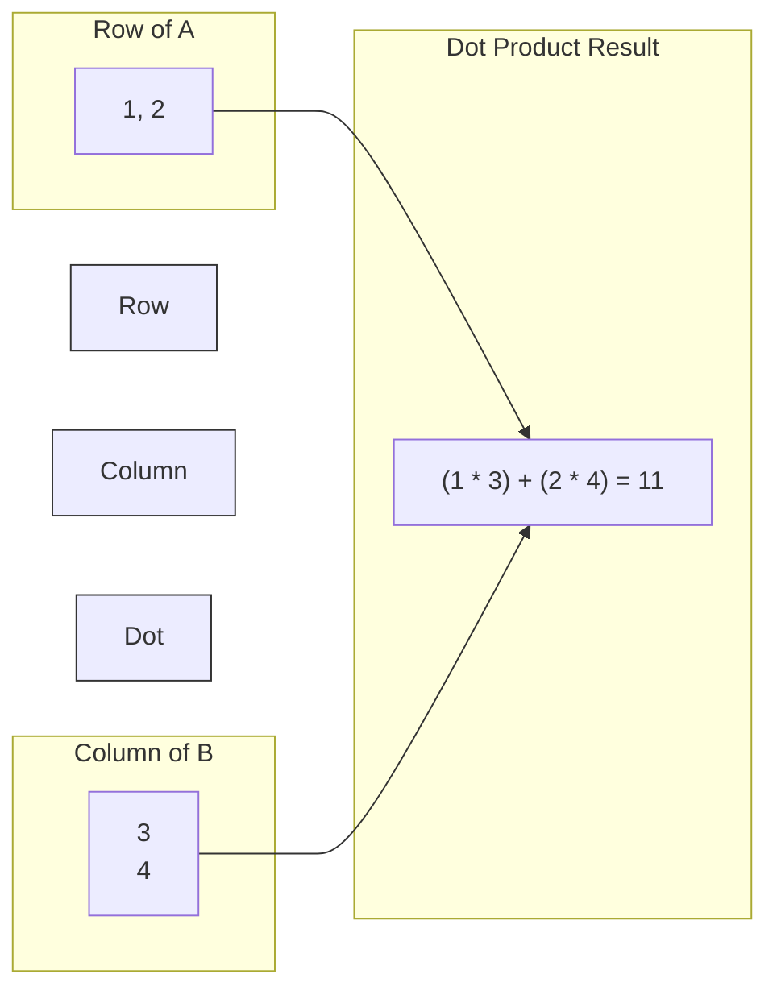

# Matrix Multiplication and Dot Product

> [!NOTE]
> This topic is based on Chapter 2.2 (Multiplying Matrices and Vectors) of the *Deep Learning* textbook.

## Formal Definition
The matrix product of matrices $\mathbf{A}$ and $\mathbf{B}$ is a third matrix $\mathbf{C}$. 
In order for this product to be mathematically defined, $\mathbf{A}$ must have the **exact same number of columns** as $\mathbf{B}$ has **rows**. 
If $\mathbf{A}$ is of shape $m \times n$ and $\mathbf{B}$ is of shape $n \times p$, then $\mathbf{C}$ is of shape $m \times p$.

The product operation is defined by the formula:
$C_{i,j} = \sum_{k} A_{i,k} B_{k,j}$

## Component-by-Component Math Breakdown
- **$C_{i,j}$**: The single resulting number in the $i$-th row and $j$-th column of the new output matrix.
- **$\sum_{k}$**: The Greek letter Sigma means "Sum everything up". The $k$ is just an index counter. It means "run a `for` loop over $k$ and add the results together".
- **$A_{i,k}$**: Take the $i$-th row of the first matrix, and move across it using index $k$.
- **$B_{k,j}$**: Take the $j$-th column of the second matrix, and move down it using index $k$.
- **$A_{i,k} B_{k,j}$**: Multiply the matching pairs together as you move, and (because of the $\sum$) add them all up to get your final $C_{i,j}$.

This specific operation of multiplying matching pairs and summing them up is called the **Dot Product**.

## Beginner Intuition & Contrasting Analogy
Imagine running a massive bakery. 
- You have a vector $\mathbf{x}$ of 3 raw ingredients: `[Flour, Sugar, Eggs]`.
- You have a matrix $\mathbf{W}$ containing 8 different recipes (the columns). Each recipe requires a specific ratio of those 3 ingredients.
- If you want to know exactly how much of every ingredient you need to bake all 8 recipes at once, you don't calculate them one by one. You use **Matrix Multiplication**. It instantly multiplies your ingredient vector against every single recipe column simultaneously, outputting exactly what you need.

## Where is this used in AI?
*   **The Core Engine of Neural Networks:** A neural network layer mathematically is just $y = \mathbf{x} \mathbf{W} + \mathbf{b}$. $\mathbf{x}$ is the input data (pixels of an image). $\mathbf{W}$ is the massive weight matrix (millions of connections). The Matrix Multiplication $\mathbf{x} \mathbf{W}$ instantly calculates how strongly every single pixel activates every single neuron in the next layer at the exact same time. Without this, training an AI would take centuries instead of hours.

## Small Numerical Example
Vector $\mathbf{x} = \begin{bmatrix} 1 & 2 \end{bmatrix}$ (Shape: `1 x 2`)
Matrix $\mathbf{W} = \begin{bmatrix} 3 & 4 \\ 5 & 6 \end{bmatrix}$ (Shape: `2 x 2`)

$\mathbf{x} \mathbf{W} = \begin{bmatrix} (1 \cdot 3 + 2 \cdot 5) & (1 \cdot 4 + 2 \cdot 6) \end{bmatrix} = \begin{bmatrix} 13 & 16 \end{bmatrix}$ (Output Shape: `1 x 2`)

## Common Misunderstanding
**Misunderstanding:** Matrix Multiplication is just multiplying the top-left number by the top-left number, the top-right by the top-right, etc.
**Correction:** That is called *Element-wise Multiplication* (in Python, the `*` operator). Matrix multiplication (`np.dot()` or `@` in Python) is entirely different. It requires the complex row-by-column Dot Product described above. 

*(Source: Ian Goodfellow, Yoshua Bengio, and Aaron Courville - Deep Learning, Chapter 2.2)*

---

## Flashcards

What is the fundamental difference between `*` and `np.dot()` in Python/NumPy? #card
`*` performs element-wise multiplication (multiplying matching cells directly). `np.dot()` performs the mathematical dot product (matrix multiplication), combining rows and columns according to $C_{i,j} = \sum_k A_{i,k} B_{k,j}$.

In order to multiply Matrix A by Matrix B, what rule must their shapes follow? #card
Matrix A must have the exact same number of columns as Matrix B has rows. If A is $(m \times n)$, B must be $(n \times p)$. The resulting matrix will be $(m \times p)$.
