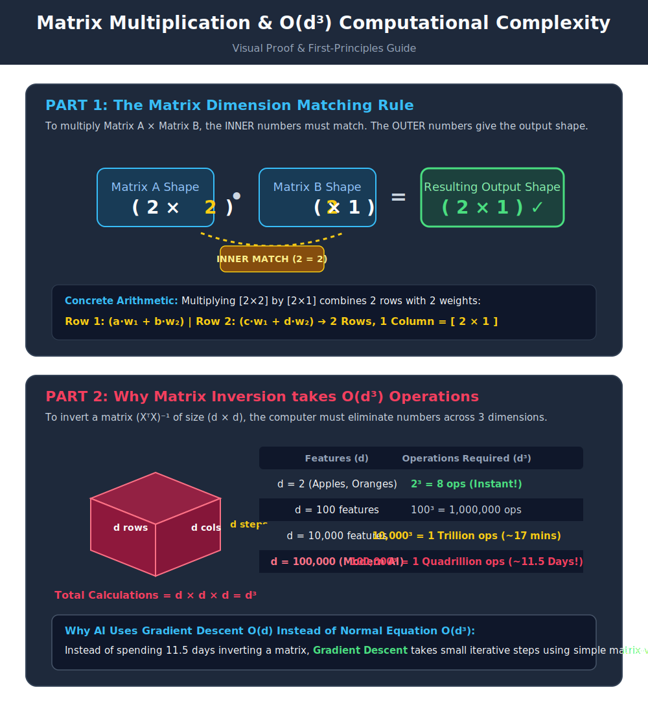

# Identity and Inverse Matrices (Optional)

> [!NOTE]
> This is an optional deep-dive topic based on Chapter 2.3 of the *Deep Learning* textbook.

## Formal Definition
Linear algebra offers a powerful tool called matrix inversion that allows us to analytically solve equations like $\mathbf{A}\mathbf{x} = \mathbf{b}$. To understand matrix inversion, we must first define the **Identity Matrix**. 

An identity matrix is a matrix that does not change any vector when we multiply that vector by that matrix. We denote the identity matrix that preserves $n$-dimensional vectors as $\mathbf{I}_n$. Formally, $\forall \mathbf{x} \in \mathbb{R}^n, \mathbf{I}_n \mathbf{x} = \mathbf{x}$.

The **Matrix Inverse** of $\mathbf{A}$ is denoted as $\mathbf{A}^{-1}$, and it is defined as the matrix such that:
$\mathbf{A}^{-1}\mathbf{A} = \mathbf{I}_n$

## Component-by-Component Math Breakdown
- **$\mathbf{I}_n$ (Identity Matrix):** A square matrix with $1$s perfectly down the main diagonal (top-left to bottom-right) and $0$s everywhere else.
- **$\mathbf{A}^{-1}$ (Inverse):** A special matrix calculated based on $\mathbf{A}$. If you multiply $\mathbf{A}$ by its inverse, they mathematically annihilate each other and leave behind only the Identity Matrix $\mathbf{I}_n$.
- **Solving $\mathbf{A}\mathbf{x} = \mathbf{b}$:** If we want to solve for $\mathbf{x}$, we can multiply both sides by $\mathbf{A}^{-1}$.
  1. $\mathbf{A}^{-1}\mathbf{A}\mathbf{x} = \mathbf{A}^{-1}\mathbf{b}$
  2. $\mathbf{I}_n \mathbf{x} = \mathbf{A}^{-1}\mathbf{b}$
  3. $\mathbf{x} = \mathbf{A}^{-1}\mathbf{b}$

## Beginner Intuition & Contrasting Analogy
- **Identity Matrix:** In normal math, if you multiply a number by $1$, it doesn't change ($5 \times 1 = 5$). The Identity Matrix is simply the linear algebra equivalent of the number $1$. Any matrix multiplied by the Identity Matrix stays exactly the same.
- **Inverse Matrix:** In normal math, if you multiply a number by its reciprocal ($5 \times \frac{1}{5}$), it equals $1$. The Inverse Matrix is the linear algebra equivalent of a reciprocal. It "undoes" whatever the first matrix did, hitting the rewind button to get back to the Identity state.

## Step-by-Step Numerical Matrix Example

Let's look at real matrices with actual numbers so you can see how $\mathbf{A}^{-1} \mathbf{A} = \mathbf{I}$ works in practice.

### 1. Matrix $\mathbf{A}$
$$ \mathbf{A} = \begin{bmatrix} 4 & 7 \\ 2 & 6 \end{bmatrix} $$

### 2. How is Inverse Matrix $\mathbf{A}^{-1}$ Calculated?

#### What is a Reciprocal in Normal Math?
In basic arithmetic, the **reciprocal** of a number $x$ is $\frac{1}{x}$.
- Example: The reciprocal of $5$ is $\frac{1}{5} = 0.2$ because $5 \times 0.2 = \mathbf{1}$.
- When you multiply a number by its reciprocal, you get $1$.

#### How do we calculate the Reciprocal of a Matrix?
You **cannot** simply divide 1 by each number inside the matrix. Instead, for a $2 \times 2$ matrix $\begin{bmatrix} a & b \\ c & d \end{bmatrix}$, the formula for its Inverse (Reciprocal) is:

$$ \mathbf{A}^{-1} = \frac{1}{\text{Determinant}} \begin{bmatrix} d & -b \\ -c & a \end{bmatrix} $$

Where the **Determinant** = $(a \times d) - (b \times c)$.

#### Step-by-Step Calculation for Matrix $\mathbf{A} = \begin{bmatrix} 4 & 7 \\ 2 & 6 \end{bmatrix}$:

1. **Calculate Determinant:** $(4 \times 6) - (7 \times 2) = 24 - 14 = \mathbf{10}$.
2. **Swap and Negate terms:** 
   - Swap top-left ($4$) and bottom-right ($6$).
   - Make top-right ($7$) and bottom-left ($2$) negative.
   - Result: $\begin{bmatrix} 6 & -7 \\ -2 & 4 \end{bmatrix}$
3. **Multiply every number by $\frac{1}{10}$ (or $0.1$):**
   - Top-Left: $6 \times 0.1 = \mathbf{0.6}$
   - Top-Right: $-7 \times 0.1 = \mathbf{-0.7}$
   - Bottom-Left: $-2 \times 0.1 = \mathbf{-0.2}$
   - Bottom-Right: $4 \times 0.1 = \mathbf{0.4}$

$$ \mathbf{A}^{-1} = \begin{bmatrix} 0.6 & -0.7 \\ -0.2 & 0.4 \end{bmatrix} $$

### 3. Multiplying $\mathbf{A}^{-1} \mathbf{A}$
Now let's multiply them together using matrix multiplication (Row $\times$ Column):

$$
\mathbf{A}^{-1} \mathbf{A} = \begin{bmatrix} 0.6 & -0.7 \\ -0.2 & 0.4 \end{bmatrix} \begin{bmatrix} 4 & 7 \\ 2 & 6 \end{bmatrix}
$$

Let's calculate every single position:
- **Top-Left:** $(0.6 \times 4) + (-0.7 \times 2) = 2.4 - 1.4 = \mathbf{1}$
- **Top-Right:** $(0.6 \times 7) + (-0.7 \times 6) = 4.2 - 4.2 = \mathbf{0}$
- **Bottom-Left:** $(-0.2 \times 4) + (0.4 \times 2) = -0.8 + 0.8 = \mathbf{0}$
- **Bottom-Right:** $(-0.2 \times 7) + (0.4 \times 6) = -1.4 + 2.4 = \mathbf{1}$

Putting the calculated numbers back into the table:
$$ \mathbf{A}^{-1} \mathbf{A} = \begin{bmatrix} 1 & 0 \\ 0 & 1 \end{bmatrix} = \mathbf{I}_2 $$

The numbers in $\mathbf{A}^{-1}$ completely cancelled out $\mathbf{A}$, leaving behind the **Identity Matrix**!

## Where is this used in AI?

### 1. Analytical Linear Regression (The Normal Equation)
In simple machine learning (like basic Linear Regression), we want to find weights $\mathbf{w}$ to solve the dataset equation:
$$ \mathbf{X} \mathbf{w} = \mathbf{y} $$

#### High-School Algebra Comparison:
- If this were simple high-school math: $3 \cdot w = 15$, you don't guess numbers. You divide by $3$ (multiply by $3^{-1}$ or $\frac{1}{3}$) to get $w = 5$ in **one step**.
- In Matrix Math, **you cannot divide matrices**. Instead, to "divide" by data matrix $\mathbf{X}$, we multiply by its inverse $\mathbf{X}^{-1}$!

Because data matrix $\mathbf{X}$ is rectangular (e.g. 1,000 rows, 2 features), we multiply $\mathbf{X}^T \mathbf{X}$ to make it square first, then take its inverse:
$$ \mathbf{w} = (\mathbf{X}^T \mathbf{X})^{-1} \mathbf{X}^T \mathbf{y} $$

This formula is called the **Normal Equation**. The computer calculates $(\mathbf{X}^T \mathbf{X})^{-1}$ to solve for the exact best weights in a single mathematical calculation, without any training loop!

### 2. Why don't Deep Learning Neural Networks use this?
- **Computational Cost:** Calculating the inverse $(\mathbf{X}^T \mathbf{X})^{-1}$ requires $O(n^3)$ operations. If a dataset has 100,000 features, calculating its inverse would crash any computer.
- **Why Deep Learning uses Gradient Descent:** Neural Networks have billions of weights. Instead of computing a massive inverse matrix in one step, they use **Gradient Descent** (gradually nudging weights downhill over many epochs) because it uses tiny amounts of memory per step.

---

## Flashcards

What is the Identity Matrix ($\mathbf{I}$)? #card
It is the linear algebra equivalent of the number 1. It is a square matrix with 1s on the diagonal and 0s elsewhere. Any matrix or vector multiplied by the Identity Matrix remains completely unchanged.

Why doesn't Deep Learning use Matrix Inversion (the Normal Equation) to solve for weights in one step? #card
Because calculating the inverse of massive matrices (e.g., $100,000 \times 100,000$) is computationally too expensive ($O(n^3)$ time complexity) and crashes computer memory. Deep Learning uses iterative approximations like Gradient Descent instead.

#My Understanding

This is a moment of discovery .

Let me put it in my own words.
buying 3 apples where x = 3 and  y = 15

f(x) = y   where f(x) = w*x = y

w*(3) = 15 now w = 5 so we now that y = 5times x 

this is for one feature 

when y is a function of multiple features we simply cannot represet them in terms of simple scalar we would need a matrix .

While to find the w we simply divide we cannot do the same for matrices 
in other words in the above exaple we divide by 1/3  so in matrix we multple by the Xinverse 
Additionally we can only do a inverse of a square matrix which is 2x2, 3x3 where as our matrix is 1000X2

So we cannot directly do w = Xinverse *y

in order to make oit a square matrix we need to multiple Xtranspose with X

X: 1000x2
Xt : 2x1000

Now multiple Xt*X
so the final dimension would be 
(2x1000) * (1000x2) = 2x2

we kow that
Xw~y

lets multiplky 
XtXw = Xty

now,
w = (XtX)inverse Xty this is called normal equation

now lets check the wieghts of w

Xt = 2x2 ; x = 1000x2 =resulting in  2x2
xt = 2x1000 ; y = 1000x1 = 2x1

(2x2) (2x1)= 2x1 

and since if a 2 features requires 2^3 operations if there are 100000 fatures it because really difficuly and expesnive for caculating w with these methods and hence we use gradient decent 