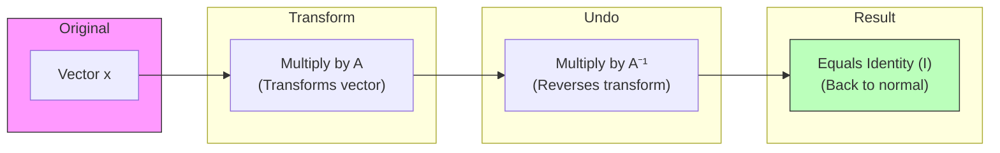

# Identity and Inverse Matrices (Optional)

> [!NOTE]
> This is an optional deep-dive topic based on Chapter 2.3 of the *Deep Learning* textbook.

## Formal Definition
Linear algebra offers a powerful tool called matrix inversion that allows us to analytically solve equations like $\mathbf{A}\mathbf{x} = \mathbf{b}$. To understand matrix inversion, we must first define the **Identity Matrix**. 

An identity matrix is a matrix that does not change any vector when we multiply that vector by that matrix. We denote the identity matrix that preserves $n$-dimensional vectors as $\mathbf{I}_n$. Formally, $\forall \mathbf{x} \in \mathbb{R}^n, \mathbf{I}_n \mathbf{x} = \mathbf{x}$.

The **Matrix Inverse** of $\mathbf{A}$ is denoted as $\mathbf{A}^{-1}$, and it is defined as the matrix such that:
$\mathbf{A}^{-1}\mathbf{A} = \mathbf{I}_n$

## Component-by-Component Math Breakdown
- **$\mathbf{I}_n$ (Identity Matrix):** A square matrix with $1$s perfectly down the main diagonal (top-left to bottom-right) and $0$s everywhere else.
- **$\mathbf{A}^{-1}$ (Inverse):** A special matrix calculated based on $\mathbf{A}$. If you multiply $\mathbf{A}$ by its inverse, they mathematically annihilate each other and leave behind only the Identity Matrix $\mathbf{I}_n$.
- **Solving $\mathbf{A}\mathbf{x} = \mathbf{b}$:** If we want to solve for $\mathbf{x}$, we can multiply both sides by $\mathbf{A}^{-1}$.
  1. $\mathbf{A}^{-1}\mathbf{A}\mathbf{x} = \mathbf{A}^{-1}\mathbf{b}$
  2. $\mathbf{I}_n \mathbf{x} = \mathbf{A}^{-1}\mathbf{b}$
  3. $\mathbf{x} = \mathbf{A}^{-1}\mathbf{b}$

## Beginner Intuition & Contrasting Analogy
- **Identity Matrix:** In normal math, if you multiply a number by $1$, it doesn't change ($5 \times 1 = 5$). The Identity Matrix is simply the linear algebra equivalent of the number $1$. Any matrix multiplied by the Identity Matrix stays exactly the same.
- **Inverse Matrix:** In normal math, if you multiply a number by its reciprocal ($5 \times \frac{1}{5}$), it equals $1$. The Inverse Matrix is the linear algebra equivalent of a reciprocal. It "undoes" whatever the first matrix did, hitting the rewind button to get back to the Identity state.

## Where is this used in AI?
*   **Analytical Linear Regression:** In simple machine learning (like basic Linear Regression), we don't actually need Gradient Descent or Neural Networks to find the best weights. We can mathematically solve for the perfect weights in a single step using the **Normal Equation**: $\mathbf{w} = (\mathbf{X}^T \mathbf{X})^{-1} \mathbf{X}^T \mathbf{y}$. Notice the inverse $(\dots)^{-1}$! The computer mathematically reverses the input data to find the exact perfect weights instantly.
*   **Why don't we always do this?** Calculating the inverse of a matrix requires $O(n^3)$ operations. If a neural network has a weight matrix of 10,000 x 10,000, calculating its inverse would take a computer far too long and use too much memory. That is why Deep Learning relies on Gradient Descent (guessing and checking) instead of matrix inversion.

## Small Numerical Example
Identity Matrix $\mathbf{I}_3$:
$\begin{bmatrix} 1 & 0 & 0 \\ 0 & 1 & 0 \\ 0 & 0 & 1 \end{bmatrix}$

Any vector multiplied by this matrix remains unchanged:
$\begin{bmatrix} 1 & 0 & 0 \\ 0 & 1 & 0 \\ 0 & 0 & 1 \end{bmatrix} \begin{bmatrix} 5 \\ 8 \\ 2 \end{bmatrix} = \begin{bmatrix} 5 \\ 8 \\ 2 \end{bmatrix}$

*(Source: Ian Goodfellow, Yoshua Bengio, and Aaron Courville - Deep Learning, Chapter 2.3)*

---

## Flashcards

What is the Identity Matrix ($\mathbf{I}$)? #card
It is the linear algebra equivalent of the number 1. It is a square matrix with 1s on the diagonal and 0s elsewhere. Any matrix or vector multiplied by the Identity Matrix remains completely unchanged.

Why doesn't Deep Learning use Matrix Inversion to perfectly solve for weights in one step? #card
Because calculating the inverse of massive matrices (e.g., $10,000 \times 10,000$) is computationally too expensive and memory-intensive ($O(n^3)$ time complexity). Deep Learning uses iterative approximations like Gradient Descent instead.
