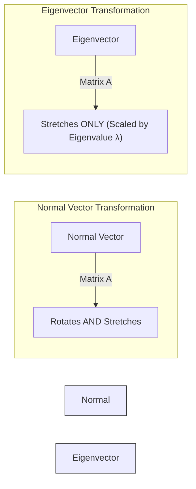

# Eigendecomposition (Optional)

> [!NOTE]
> This is an optional deep-dive topic based on Chapter 2.7 of the *Deep Learning* textbook. It provides the foundation for advanced concepts like Principal Component Analysis (PCA).

## Formal Definition
Many mathematical objects can be understood better by breaking them into constituent parts, or finding some of their properties that are universal, not caused by the way we choose to represent them. We can decompose matrices in ways that show us information about their functional properties that is not obvious from the representation of the matrix as an array of elements.

One of the most widely used kinds of matrix decomposition is called **eigendecomposition**, in which we decompose a matrix into a set of eigenvectors and eigenvalues.
An eigenvector of a square matrix $\mathbf{A}$ is a non-zero vector $\mathbf{v}$ such that multiplication by $\mathbf{A}$ alters only the scale of $\mathbf{v}$:
$\mathbf{A}\mathbf{v} = \lambda \mathbf{v}$

## Component-by-Component Math Breakdown
- **$\mathbf{A}$**: A square matrix representing some linear transformation (e.g., stretching or rotating space).
- **$\mathbf{v}$ (Eigenvector)**: A special "magic" vector belonging to matrix $\mathbf{A}$. When you multiply this specific vector by $\mathbf{A}$, the vector does *not* rotate or change direction. It only shrinks or grows.
- **$\lambda$ (Eigenvalue)**: A scalar number (like $2.0$ or $-0.5$) that dictates exactly *how much* the eigenvector $\mathbf{v}$ stretches or shrinks during the transformation.
- **$\mathbf{A}\mathbf{v} = \lambda \mathbf{v}$**: This equation proves that multiplying the vector by the complex matrix $\mathbf{A}$ (left side) is mathematically identical to just multiplying the vector by a single scalar number $\lambda$ (right side).

## Beginner Intuition & Contrasting Analogy
Imagine a square piece of stretchy rubber with a picture of a face drawn on it.
If you grab the top-right corner and the bottom-left corner and pull them outward (a matrix transformation):
- Most of the lines you could draw on the rubber (normal vectors) will be warped and rotated in weird curves.
- However, the diagonal line directly connecting your two hands (the **eigenvector**) will not rotate or bend at all! It will just stretch longer in the exact same direction. The amount it stretches (e.g., it gets twice as long) is the **eigenvalue** ($\lambda = 2$).

Finding the eigenvectors of a matrix is essentially finding the "primary axes" or "skeleton" along which the matrix operates.

## Where is this used in AI?
*   **Dimensionality Reduction (PCA):** Imagine an AI dataset with 1,000 features (dimensions) per patient (blood pressure, heart rate, cholesterol, etc.). Processing 1,000 dimensions is painfully slow. Using a technique called Principal Component Analysis (PCA), we find the **eigenvectors** of the data's covariance matrix. These eigenvectors mathematically prove where the *most important variance* in the data lies. We can throw away 900 dimensions and keep only the 100 eigenvectors with the highest eigenvalues, preserving 99% of the important information while making the AI 10x faster.
*   **Google PageRank:** The original algorithm that made Google a billion-dollar company (PageRank) models the internet as a massive matrix of links. The "importance" or "rank" of every website on the internet is mathematically just the primary **eigenvector** of that matrix!

## Small Numerical Example
Matrix $\mathbf{A} = \begin{bmatrix} 2 & 0 \\ 0 & 3 \end{bmatrix}$

Let's test the vector $\mathbf{v} = \begin{bmatrix} 1 \\ 0 \end{bmatrix}$:
$\mathbf{A}\mathbf{v} = \begin{bmatrix} 2 & 0 \\ 0 & 3 \end{bmatrix} \begin{bmatrix} 1 \\ 0 \end{bmatrix} = \begin{bmatrix} 2 \\ 0 \end{bmatrix}$

Notice that the output $\begin{bmatrix} 2 \\ 0 \end{bmatrix}$ is exactly $2 \times \begin{bmatrix} 1 \\ 0 \end{bmatrix}$. 
Because the vector's direction didn't change (it just multiplied by 2), $\begin{bmatrix} 1 \\ 0 \end{bmatrix}$ is an **eigenvector**, and its **eigenvalue** is $2$.

*(Source: Ian Goodfellow, Yoshua Bengio, and Aaron Courville - Deep Learning, Chapter 2.7)*

---

## Flashcards

What is an Eigenvector? #card
An eigenvector is a special vector that, when multiplied by a specific matrix, does not change its direction. It only stretches or shrinks.

What is an Eigenvalue ($\lambda$)? #card
The scalar number that represents exactly how much an eigenvector stretches or shrinks during the matrix transformation ($\mathbf{A}\mathbf{v} = \lambda \mathbf{v}$).
