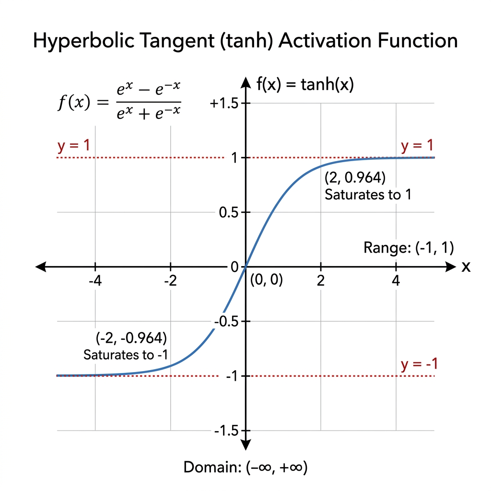

# Hidden Layers and tanh

> [!NOTE]
> This topic is based on Chapter 6 (Deep Feedforward Networks) of the *Deep Learning* textbook (Goodfellow et al.).

## Why is this Concept Required?
In **Week 1: Build a Basic Prediction Machine**, our goal is to build a neural network that can learn complex patterns from raw input features. If a neural network only consists of linear calculations ($\mathbf{W}^\top \mathbf{x} + \mathbf{b}$), stacking 10 or 100 layers together still results in a single flat, linear straight line. To solve non-linear problems (like predicting curved data or classifying non-separable points), every hidden neuron must apply a non-linear **activation function** $g(\cdot)$, such as $\tanh$.

---

## Formal Definition
A linear model can only represent linear functions. To represent non-linear functions, we use deep feedforward networks with **hidden layers**.
The design of a hidden unit includes an **activation function** $g$ applied to an **affine transformation** (a weighted sum plus bias):

$$\mathbf{h} = g(\mathbf{W}^\top \mathbf{x} + \mathbf{b})$$

One popular choice for $g$ is the hyperbolic tangent function, $\tanh$:

$$\tanh(z) = \frac{e^z - e^{-z}}{e^z + e^{-z}}$$

---

## Component-by-Component Math Breakdown

### 1. The Hidden Unit Formula: $\mathbf{h} = g(\mathbf{W}^\top \mathbf{x} + \mathbf{b})$

| Symbol | Name | Plain-English Meaning |
| :--- | :--- | :--- |
| $\mathbf{x}$ | **Input Vector** | The raw input features fed into the layer (e.g., house size, bedrooms). |
| $\mathbf{W}$ | **Weight Matrix** | The learned importance/strength given to each input feature. |
| $\mathbf{W}^\top$ | **Transpose of Weight Matrix** | Flips weights into the proper shape so matrix-vector multiplication aligns. |
| $\mathbf{b}$ | **Bias Vector** | An added offset scalar/vector that lets the neuron shift its activation threshold up or down regardless of input. |
| $\mathbf{W}^\top \mathbf{x} + \mathbf{b}$ | **Affine Transformation ($z$)** | The raw, unconstrained weighted sum (linear score). Can range from $-\infty$ to $+\infty$. |
| $g(\cdot)$ | **Activation Function** | The non-linear "squashing" function applied to the raw score $z$. |
| $\mathbf{h}$ | **Hidden Activation Output** | The transformed non-linear signal passed to the next layer in the neural network. |

### 2. The $\tanh$ Formula: $\tanh(z) = \frac{e^z - e^{-z}}{e^z + e^{-z}}$

| Symbol | Name | Plain-English Meaning |
| :--- | :--- | :--- |
| $z$ | **Raw Linear Score** | The output of $\mathbf{W}^\top \mathbf{x} + \mathbf{b}$. |
| $e$ | **Euler's Constant** | A constant $\approx 2.71828$, the base of natural logarithms. |
| $e^z$ | **Exponential of $z$** | Scales up positive inputs exponentially ($e^3 \approx 20.08$) and shrinks negative inputs ($e^{-3} \approx 0.049$). |
| $e^{-z}$ | **Exponential of Negated $z$** | The inverse exponential ($1 / e^z$). |
| $e^z - e^{-z}$ | **Numerator** | Computes the difference between positive and negative signals. If $z > 0$, numerator is positive. If $z < 0$, numerator is negative. |
| $e^z + e^{-z}$ | **Denominator** | The normalization factor (always positive and larger than the numerator), ensuring the final fraction never exceeds $+1$ or $-1$. |
| $\tanh(z)$ | **Hyperbolic Tangent** | Squashes any number $z$ into the strict open range **$(-1, +1)$**, centered at $0$. |

---

## Beginner Intuition & Contrasting Analogies

### Analogy 1: Drawing on Paper vs. Folding Paper
- **Without Activation ($z = \mathbf{W}^\top \mathbf{x} + \mathbf{b}$):** Imagine trying to separate red dots from blue dots on a flat sheet of paper using only a rigid **straight wooden ruler**. If blue dots encircle the red dots in a ring, a straight line will fail every single time.
- **With Activation ($\tanh$):** Applying $\tanh$ is like **folding or warping the paper in 3D space**! The non-linear function bends space so a straight line cut can cleanly isolate the red dots.

### Analogy 2: The Dimmer Switch with Safety Bumper
- Raw linear calculations can produce wild values like $z = +500$ or $z = -1200$.
- $\tanh$ acts as a **smooth dimmer switch with safety bumpers**. It maps extreme positive values to $+1.0$ (maximum positive response), extreme negative values to $-1.0$ (maximum negative response), and $0$ stays right at $0.0$ (neutral).

---

## Where is this used in AI?

1. **Universal Approximation Theorem:**
   By placing activation functions like $\tanh$ inside hidden layers, neural networks gain the mathematical power to approximate *any* continuous non-linear function, no matter how complex.
2. **Zero-Centered Activations:**
   Because $\tanh$ outputs values between $-1$ and $+1$, its average output is close to $0$. Zero-centered outputs keep gradients flowing evenly during training compared to activation functions that are strictly positive (like Sigmoid).
3. **Recurrent Neural Networks (RNNs & LSTMs):**
   $\tanh$ is extensively used in recurrent architectures to regulate internal memory states, preventing numbers from exploding to infinity across hundreds of time steps.

---

## Concrete Numerical Worked Example

Suppose a hidden unit receives an input vector $\mathbf{x} = \begin{bmatrix} 2.0 \\ -1.0 \end{bmatrix}$ with weights $\mathbf{W} = \begin{bmatrix} 0.5 \\ 1.5 \end{bmatrix}$ and bias $b = 0.5$.

1. **Step 1: Compute the Affine Transformation ($z$)**
   $$z = \mathbf{W}^\top \mathbf{x} + b = (0.5 \times 2.0) + (1.5 \times -1.0) + 0.5 = 1.0 - 1.5 + 0.5 = 0.0$$

2. **Step 2: Apply the $\tanh$ Activation Function**
   $$\tanh(0.0) = \frac{e^0 - e^{-0}}{e^0 + e^{-0}} = \frac{1 - 1}{1 + 1} = \frac{0}{2} = 0.0$$

3. **Step 3: Test with a Stronger Positive Signal ($z = 2.0$)**
   $$e^{2.0} \approx 7.389, \quad e^{-2.0} \approx 0.135$$
   $$\tanh(2.0) = \frac{7.389 - 0.135}{7.389 + 0.135} = \frac{7.254}{7.524} \approx 0.964$$

The raw score of $2.0$ is cleanly squashed to $+0.964$, right near the maximum ceiling of $+1.0$.

---

## Connection to Active Assignment
In **Week 1: Build a Basic Prediction Machine**, you implement a forward pass. Each hidden neuron takes feature inputs $x$, calculates $z = W^\top x + b$, and squashes $z$ using $\tanh(z)$. The resulting hidden activation state $h$ is passed into the final output layer to form your prediction.

*(Reference: Ian Goodfellow, Yoshua Bengio, and Aaron Courville - Deep Learning, Chapter 6: Deep Feedforward Networks)*

---

## Flashcards

What happens mathematically if you remove the activation function from a Neural Network? #card
The entire network collapses into a single linear equation. No matter how many hidden layers you have, a linear combination of linear combinations is still just a linear equation. The model loses its ability to learn complex, non-linear shapes.

What is the output range of the `tanh` activation function? #card
It bounds the output strictly between `-1` and `1`, and is zero-centered ($0 \to 0$). Inputs around $+3$ or $-3$ already push the output very close to $+1$ and $-1$.

---

## My Understanding

*This section is for you to fill in your own words after studying this topic.*
- What is the hidden unit formula $h = g(W^\top x + b)$ in simple terms?
- Why can't a neural network solve non-linear problems without an activation function like $\tanh$?
- How does $\tanh$ transform extreme numbers like $+5$ or $-10$?

