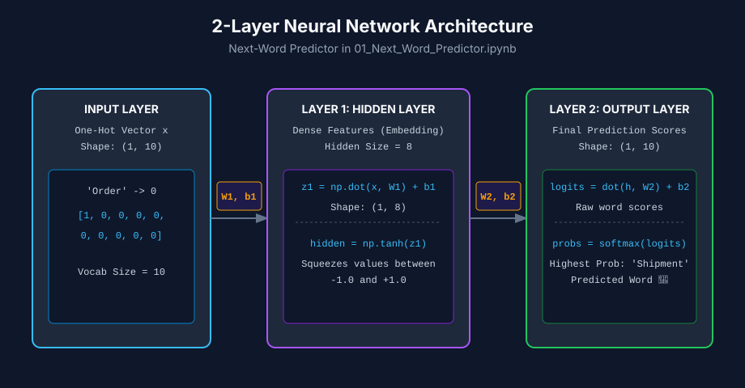

# Two-Layer Architecture and Forward Pass

> [!NOTE]
> This topic is based on Chapter 6 (Deep Feedforward Networks) of the *Deep Learning* textbook (Goodfellow et al.).

## 1. The Problem
A single linear layer ($\mathbf{y} = \mathbf{W}\mathbf{x} + \mathbf{b}$) can only draw flat, straight decision boundaries. If you pass raw inputs straight to an output layer, the model can only learn direct linear relationships between individual input features and outputs. It cannot combine features into higher-level abstract concepts (like combining "Order" and "Context" into a single hidden intent).

## 2. Why We Need Something New
To learn complex, non-linear relationships, a network needs an intermediate processing space—a **Hidden Layer**. By placing a hidden layer between the input and output, the network gains the ability to transform and compress raw inputs into abstract feature representations before making a final prediction decision.

## 3. One-Line Definition
A **Two-Layer Neural Network** (a basic Multi-Layer Perceptron) consists of one hidden layer with a non-linear activation function and one output layer that converts hidden features into final prediction scores.

## 4. Beginner Intuition / Mental Model

> **Analogy: The 2-Worker Assembly Line**
> - **Input Vector ($\mathbf{x}$):** Raw ingredients arriving at the factory (e.g. one-hot word ID).
> - **Worker 1 (Layer 1 - Hidden Layer):** Receives raw ingredients, combines them using weights $\mathbf{W}_1$, adds bias $\mathbf{b}_1$, and applies a non-linear filter ($\tanh$) to produce a condensed summary draft (the hidden vector $\mathbf{h}$).
> - **Worker 2 (Layer 2 - Output Layer):** Reads the summary draft, projects it across all vocabulary words using weights $\mathbf{W}_2$ and bias $\mathbf{b}_2$ to calculate raw scores (logits), and applies `softmax()` to announce the final winning prediction.



---

## 5. What Came Before → What Changes Now
- **What Came Before:** Single-layer linear models ($\mathbf{z} = \mathbf{W}\mathbf{x} + \mathbf{b}$). Output depends directly on raw input features.
- **What Changes Now:** Multi-stage transformation. Input $\mathbf{x} \to$ Hidden representation $\mathbf{h} \to$ Output logits $\mathbf{z}_2 \to$ Probabilities $\mathbf{P}$.

---

## 6. How It Works: Step-by-Step Forward Pass

1. **Step 1 (Input Encoding):** Convert the input word index into a Sparse One-Hot Vector $\mathbf{x}$ of size $V$ (Vocabulary Size).
2. **Step 2 (Hidden Layer Pre-Activation):** Multiply input $\mathbf{x}$ by weight matrix $\mathbf{W}_1$ and add bias $\mathbf{b}_1$:
   $$\mathbf{z}_1 = \mathbf{x} \mathbf{W}_1 + \mathbf{b}_1$$
3. **Step 3 (Hidden Activation):** Apply non-linear activation function $g(\cdot)$ (such as $\tanh$) to squash values into a stable range $(-1, +1)$:
   $$\mathbf{h} = \tanh(\mathbf{z}_1)$$
4. **Step 4 (Output Layer Logits):** Multiply hidden representation $\mathbf{h}$ by weight matrix $\mathbf{W}_2$ and add bias $\mathbf{b}_2$:
   $$\mathbf{z}_2 = \mathbf{h} \mathbf{W}_2 + \mathbf{b}_2$$
5. **Step 5 (Softmax Probabilities):** Convert raw logits $\mathbf{z}_2$ into normalized probabilities $\mathbf{P}$:
   $$\mathbf{P} = \text{Softmax}(\mathbf{z}_2)$$

---

## 7. Required Mathematics & Tensor Shape Tracing

### Mathematical Equations

$$\mathbf{h} = \tanh(\mathbf{x} \mathbf{W}_1 + \mathbf{b}_1)$$

$$\mathbf{z}_2 = \mathbf{h} \mathbf{W}_2 + \mathbf{b}_2$$

$$\mathbf{P} = \text{Softmax}(\mathbf{z}_2)$$

### Symbol & Tensor Shape Breakdown

| Symbol | Name | Shape in 01_Next_Word_Predictor | Plain-English Meaning |
| :--- | :--- | :--- | :--- |
| $\mathbf{x}$ | Input One-Hot Vector | $(1, 10)$ | 1-hot representation of input word ($V=10$). |
| $\mathbf{W}_1$ | Layer 1 Weight Matrix | $(10, 8)$ | Connects 10 input dimensions to 8 hidden neurons ($H=8$). |
| $\mathbf{b}_1$ | Layer 1 Bias Vector | $(1, 8)$ | Offset values for the 8 hidden neurons. |
| $\mathbf{h}$ | Hidden Vector | $(1, 8)$ | Non-linear dense representation after $\tanh$. |
| $\mathbf{W}_2$ | Layer 2 Weight Matrix | $(8, 10)$ | Connects 8 hidden neurons to 10 output class scores. |
| $\mathbf{b}_2$ | Layer 2 Bias Vector | $(1, 10)$ | Offset values for the 10 output class scores. |
| $\mathbf{z}_2$ | Output Logits | $(1, 10)$ | Unconstrained raw output scores for each word in vocabulary. |
| $\mathbf{P}$ | Softmax Probabilities | $(1, 10)$ | Normalized probabilities summing to $1.0$. |

---

## 8. Complete Worked Example

Suppose Vocabulary $V = 3$ (`["Order", "Shipment", "Receive"]`) and Hidden Size $H = 2$.

1. **Input ($\mathbf{x}$):** `"Order"` $\to [1.0, 0.0, 0.0]$
2. **Weights & Biases:**
   $$\mathbf{W}_1 = \begin{bmatrix} 0.5 & -0.2 \\ 0.1 & 0.8 \\ -0.4 & 0.3 \end{bmatrix}, \quad \mathbf{b}_1 = [0.0, 0.0]$$
3. **Layer 1 Pre-Activation ($\mathbf{z}_1$):**
   $$\mathbf{z}_1 = [1, 0, 0] \begin{bmatrix} 0.5 & -0.2 \\ 0.1 & 0.8 \\ -0.4 & 0.3 \end{bmatrix} + [0, 0] = [0.5, -0.2]$$
4. **Layer 1 Activation ($\mathbf{h}$):**
   $$\mathbf{h} = [\tanh(0.5), \tanh(-0.2)] \approx [0.462, -0.197]$$
5. **Layer 2 Logits ($\mathbf{z}_2$):**
   Suppose $\mathbf{W}_2 = \begin{bmatrix} 1.0 & 0.5 & -0.5 \\ -1.0 & 0.2 & 0.8 \end{bmatrix}$, $\mathbf{b}_2 = [0, 0, 0]$:
   $$\mathbf{z}_2 = [0.462, -0.197] \begin{bmatrix} 1.0 & 0.5 & -0.5 \\ -1.0 & 0.2 & 0.8 \end{bmatrix} = [0.659, 0.192, -0.389]$$
6. **Softmax Probabilities ($\mathbf{P}$):**
   $$\mathbf{P} \approx [0.528, 0.330, 0.142]$$
   - Class 0 (`"Order"`): $52.8\%$
   - Class 1 (`"Shipment"`): $33.0\%$
   - Class 2 (`"Receive"`): $14.2\%$

---

## 9. Math → Code Mapping

```python
def predict_next_word(input_word):
    # Step 1: Input Encoding (One-Hot Vector x)
    idx = state_to_id[input_word]
    x = one_hot(idx, vocabulary_size)
    
    # Steps 2 & 3: Layer 1 (Hidden Layer with Tanh)
    # Math: h = tanh(x * W1 + b1)
    hidden = np.tanh(np.dot(x, W1) + b1)
    
    # Step 4: Layer 2 (Output Layer Logits)
    # Math: z2 = hidden * W2 + b2
    logits = np.dot(hidden, W2) + b2
    
    # Step 5: Softmax Probabilities
    # Math: P = Softmax(z2)
    probs = softmax(logits)
    
    predicted_idx = np.argmax(probs)
    return id_to_state[predicted_idx], probs[predicted_idx]
```

---

## 10. Experiments / What-If Questions

- **What if Hidden Size $H = 1$?** The network can only pass a single number from Layer 1 to Layer 2, bottlenecking capacity and preventing it from learning multiple distinct word features.
- **What if we remove $\tanh$?** The two layers collapse into a single linear matrix $\mathbf{W}_{\text{combined}} = \mathbf{W}_1 \mathbf{W}_2$, destroying non-linear learning capability.

---

## 11. Common Misunderstandings

- **Misconception:** *"The input layer counts as Layer 1."*
  - **Correction:** The input vector is raw data, not a layer of parameters. A "2-Layer Network" means 2 layers of **trainable weight matrices** ($\mathbf{W}_1$ and $\mathbf{W}_2$).
- **Misconception:** *"Logits are probabilities."*
  - **Correction:** Logits are unconstrained raw scores (can be negative or $>1$). Only after applying `softmax()` do they become probabilities.

---

## 12. Limitations and Trade-Offs

- **Fixed Context Length:** This 2-layer network only looks at **one word** at a time to predict the next word. It cannot look back at a whole sentence (unlike Recurrent Neural Networks or Transformers).
- **Expressiveness:** Shallow 2-layer networks require many hidden units to approximate highly complex functions compared to deeper networks with 10+ layers.

---

## 13. Where It Appears in the Current Assignment
In **Week 1: `01_Next_Word_Predictor.ipynb`**, this exact 2-layer architecture is defined in Section 3 (`W1`, `b1`, `W2`, `b2`) and executed inside `predict_next_word()` during the forward pass.

---

## 14. Where It Appears in Modern AI Systems
In modern **Transformers** (like GPT-4 or Claude), inside every Transformer block sits a **Feed-Forward Network (FFN)**. That FFN is literally a 2-layer Multi-Layer Perceptron ($x \to \text{Linear}_1 \to \text{GELU} \to \text{Linear}_2 \to \text{Output}$) that processes token representations!

---

## 15. Connection to the Next Concept
Now that our 2-layer network can perform a **Forward Pass** to make predictions, how do we measure how "wrong" its predictions are? That leads directly to **Cross-Entropy Loss** and **Backpropagation**.

---

## 16. Teach-Back and Small Application Exercise
Try tracing a forward pass mentally: If $V=10$ and $H=8$, what is the total number of trainable weight and bias parameters in Layer 1 ($\mathbf{W}_1, \mathbf{b}_1$) and Layer 2 ($\mathbf{W}_2, \mathbf{b}_2$)?

---

## 17. Quick Revision Summary
- A 2-layer neural network has **1 Hidden Layer** ($\mathbf{W}_1, \mathbf{b}_1$) and **1 Output Layer** ($\mathbf{W}_2, \mathbf{b}_2$).
- Layer 1 compresses/transforms inputs into abstract hidden features $\mathbf{h} = \tanh(\mathbf{x}\mathbf{W}_1 + \mathbf{b}_1)$.
- Layer 2 scores vocabulary classes $\mathbf{z}_2 = \mathbf{h}\mathbf{W}_2 + \mathbf{b}_2$ and normalizes them via $\text{Softmax}(\mathbf{z}_2)$.

---

## 18. My Understanding

*This section is for you to fill in your own words after studying this topic.*
- What are the roles of Layer 1 vs Layer 2 in a 2-layer network?
- Why is the input vector not counted as a weighted layer?

---

## 19. Flashcards

How many weight matrices exist in a 2-layer neural network? #card
Two weight matrices: $W_1$ (Input to Hidden) and $W_2$ (Hidden to Output).

What is the purpose of Layer 1 (Hidden Layer) in a 2-layer next-word predictor? #card
It maps the sparse one-hot input vector into a dense, lower-dimensional non-linear feature representation using activation functions like $\tanh$.

---

## 20. Sources
- Goodfellow, Bengio, Courville - *Deep Learning* (Chapter 6: Deep Feedforward Networks)
