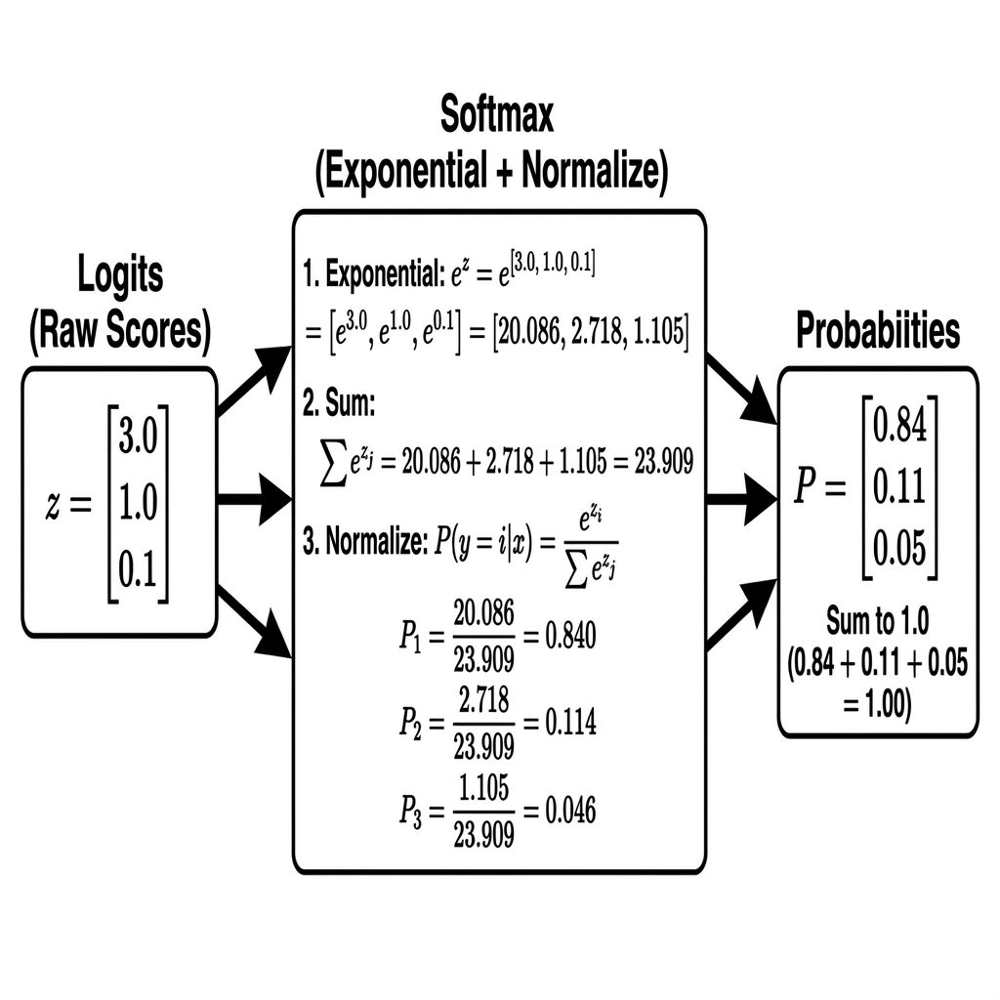

# Logits, Softmax, and Argmax

> [!NOTE]
> This topic is based on Chapter 6.2 (Gradient-Based Learning - Output Units) of the *Deep Learning* textbook (Goodfellow et al.).

## Why is this Concept Required?
In **Week 1: Build a Basic Prediction Machine**, after computing hidden activations with $\tanh$, our network must produce a final prediction over target classes (e.g., predicting the next token or classifying an output). Raw hidden activations cannot directly serve as probabilities because they are unconstrained numbers. We need a systematic pipeline:
1. Compute raw scores (**Logits**).
2. Convert raw scores into a valid probability distribution (**Softmax**).
3. Pick the winning class with highest confidence (**Argmax**).

---

## Formal Definition
Any neural network used for classification outputs a probability distribution over discrete classes. The final linear layer outputs raw, unnormalized scores called **logits** ($\mathbf{z}$). We use the **softmax** function to convert logits into a valid probability distribution where all values are positive and sum to $1.0$. Finally, we use **argmax** to find the index of the class with the highest probability.

Formally, the softmax probability for the $i$-th class is defined as:

$$\text{softmax}(\mathbf{z})_i = \frac{e^{z_i}}{\sum_{j=1}^{K} e^{z_j}}$$

---

## Component-by-Component Math Breakdown

### 1. The Softmax Formula: $P_i = \frac{e^{z_i}}{\sum_{j=1}^{K} e^{z_j}}$

| Symbol | Name | Plain-English Meaning |
| :--- | :--- | :--- |
| $\mathbf{z}$ | **Logits Vector** | The vector of raw, unconstrained output scores from the final layer ($[z_1, z_2, \dots, z_K]$). |
| $z_i$ | **Class $i$ Logit** | The raw numerical score assigned to class $i$. Can be negative, zero, or positive ($-\infty$ to $+\infty$). |
| $K$ | **Total Number of Classes** | The total count of target output classes (e.g., $K=3$ for 3 classes). |
| $e$ | **Euler's Constant** | $\approx 2.71828$, base of the natural logarithm. |
| $e^{z_i}$ | **Exponential Score of Class $i$** | Converts raw score $z_i$ into a strictly positive value ($e^z > 0$). Exponentiation also exaggerates score differences. |
| $\sum_{j=1}^{K} e^{z_j}$ | **Sum of Exponentials (Denominator)** | Adds up the exponentiated scores of *all* $K$ classes. Serves as the normalizing constant. |
| $\text{softmax}(\mathbf{z})_i$ | **Softmax Probability $P_i$** | The normalized probability for class $i$. Guaranteed to be between $0.0$ and $1.0$, with $\sum_{i=1}^K P_i = 1.0$. |

### 2. Argmax: $\hat{y} = \arg\max_{i} (\mathbf{P})$

| Symbol | Name | Plain-English Meaning |
| :--- | :--- | :--- |
| $\mathbf{P}$ | **Probability Vector** | The array of normalized probabilities output by Softmax. |
| $\arg\max_i$ | **Argument of Maximum** | Scans the probability array $\mathbf{P}$ and returns the **index $i$** of the largest value, not the value itself. |
| $\hat{y}$ | **Predicted Class Index** | The final predicted class label (e.g., class index `0`). |

---

## Beginner Intuition & Contrasting Analogies

### Analogy: The Talent Show (Logits $\to$ Softmax $\to$ Argmax)
Imagine a panel of judges scoring contestants in a talent show:

1. **Logits (Raw Loud Scores):** 
   Judge shouts raw unorganized points: "Apple gets +3.0! Banana gets +1.0! Cherry gets +0.1!"
   - *Problem:* Points can be negative, don't add up to 100%, and can't be directly compared across different contests.
2. **Softmax (The Official Percentage Pie Chart):**
   The mediator steps in, exponentiates every score to make them positive, and divides by the total:
   - "Apple has **84%** probability of winning."
   - "Banana has **11%** probability of winning."
   - "Cherry has **5%** probability of winning."
   - *Result:* Clean, positive numbers that sum up to exactly $100\%$ ($1.0$).
3. **Argmax (The Final Winner Announcement):**
   The host points to Apple: "The winner is **Contestant #0** (Apple)!"
   - Argmax drops the percentages and returns the winning category index.

---

## Where is this used in AI?

1. **Next-Token Prediction in LLMs (ChatGPT / Claude):**
   When an LLM predicts the next word, its final output layer generates a vector of **logits** across its entire vocabulary ($\sim 100,000$ words). **Softmax** converts these scores into a huge probability distribution. The AI can either use **Argmax** to pick the single most likely word or sample from the distribution.
2. **Multi-Class Classification:**
   In vision networks classifying images into categories (Cat, Dog, Bird), Softmax turns raw final-layer scores into class probabilities so the model can report its exact confidence level.

---

## Concrete Numerical Worked Example

Suppose our model predicts scores for $K = 3$ classes: **Class 0 (Apple)**, **Class 1 (Banana)**, and **Class 2 (Cherry)**.

1. **Step 1: Raw Logits ($\mathbf{z}$)**
   $$\mathbf{z} = [3.0, 1.0, 0.1]$$

2. **Step 2: Exponentiate Each Logit ($e^{z_i}$)**
   - $e^{3.0} \approx 20.086$
   - $e^{1.0} \approx 2.718$
   - $e^{0.1} \approx 1.105$

3. **Step 3: Sum Exponentials (Denominator)**
   $$\text{Sum} = 20.086 + 2.718 + 1.105 = 23.909$$

4. **Step 4: Compute Softmax Probabilities ($P_i = e^{z_i} / \text{Sum}$)**
   - $P_0 = 20.086 / 23.909 \approx \mathbf{0.840}$ (84.0%)
   - $P_1 = 2.718 / 23.909 \approx \mathbf{0.114}$ (11.4%)
   - $P_2 = 1.105 / 23.909 \approx \mathbf{0.046}$ (4.6%)
   
   *Check:* $0.840 + 0.114 + 0.046 = 1.000$ (100%).

5. **Step 5: Apply Argmax**
   $$\hat{y} = \arg\max([0.840, 0.114, 0.046]) = \mathbf{0} \quad \text{(Class 0: Apple)}$$

---

## Connection to Active Assignment
In **Week 1: Build a Basic Prediction Machine**, after the hidden layer $\mathbf{h} = \tanh(\mathbf{W}_1 \mathbf{x} + \mathbf{b}_1)$, you multiply by output weights to get raw logits $\mathbf{z} = \mathbf{W}_2 \mathbf{h} + \mathbf{b}_2$. You then apply Softmax to get predicted probabilities $\mathbf{P}$, which feed directly into your Loss function during training and Argmax during inference.

*(Reference: Ian Goodfellow, Yoshua Bengio, and Aaron Courville - Deep Learning, Chapter 6.2)*

---

## Flashcards

Are Logits restricted to be between 0 and 1? #card
No. Logits are raw, unconstrained output scores from the final layer. They can be any real number from negative infinity to positive infinity.

Why do we use the Exponential function ($e^z$) inside Softmax instead of just dividing the logits by their sum? #card
Two key reasons: First, exponentiating turns any negative or positive score into a strictly positive number ($e^z > 0$), which is required since probabilities cannot be negative. Second, exponentials exaggerate score differences, making the top prediction stand out cleanly.

---

## My Understanding

*This section is for you to fill in your own words after studying this topic.*
- What are logits in simple terms?
- Why do we need Softmax after computing logits?
- What is the difference between Softmax output and Argmax output?

