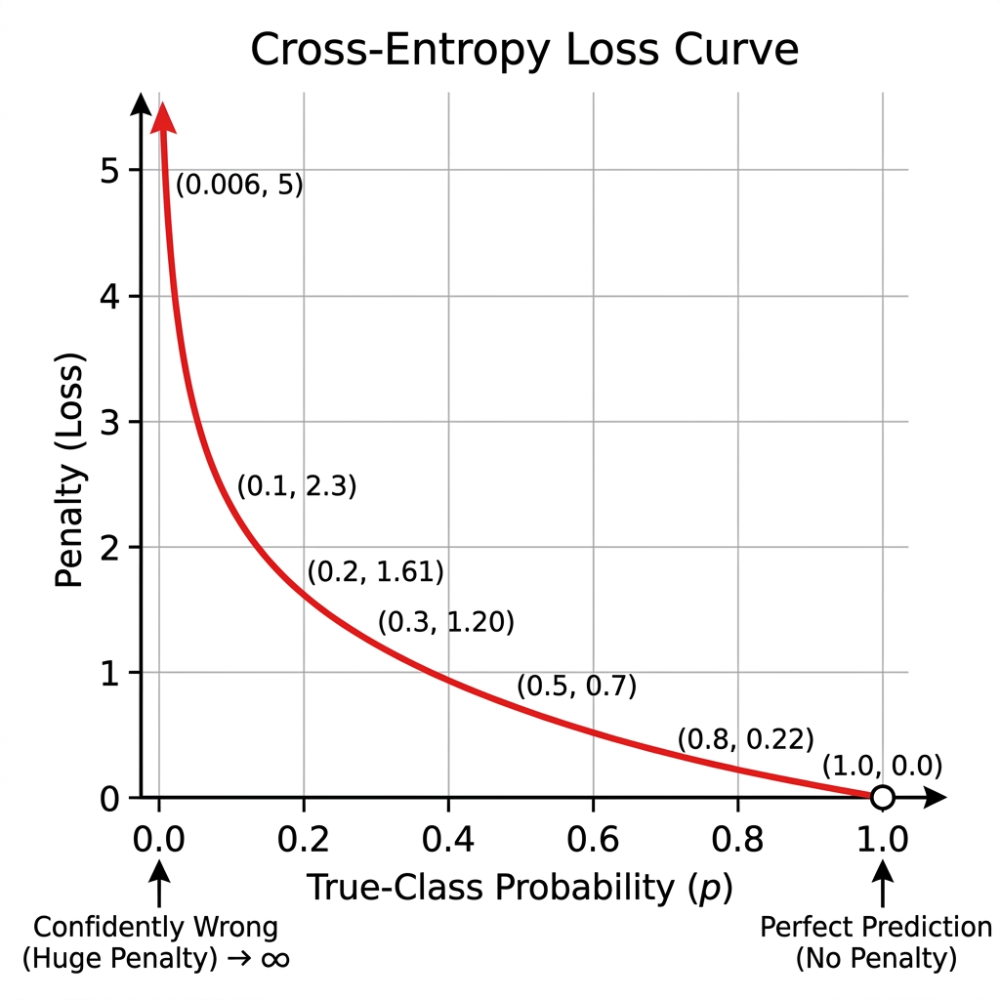

# Cross-Entropy Loss

> [!NOTE]
> This topic is based on Chapter 6.2 (Gradient-Based Learning) and Chapter 3.13 (Information Theory) of the *Deep Learning* textbook (Goodfellow et al.).

## Why is this Concept Required?
In **Week 1: Build a Basic Prediction Machine**, after computing probabilities with Softmax ($\mathbf{P}$), our network must evaluate how well it did. Without a loss function, the network has no way of knowing whether its predictions were accurate or terribly wrong, and no error signal to guide parameter updates. **Cross-Entropy Loss** calculates a precise scalar penalty score measure of error that drops to $0.0$ when the model is 100% right and explodes toward $+\infty$ when the model is confidently wrong.

---

## Formal Definition
To train a neural network using gradient descent, we need a mathematical function that quantifies "how wrong" its predictions are. This function is called the **Loss Function** $\mathcal{L}$. For classification tasks, the industry standard choice is **Cross-Entropy Loss**, derived from the principle of maximum likelihood estimation.

For a single example across $M$ classes, the multi-class formula is:

$$\mathcal{L} = - \sum_{c=1}^{M} y_c \log(p_c)$$

Since $y_c = 1$ for the true class and $0$ for all wrong classes, the formula simplifies to:

$$\mathcal{L} = - \log(p_{\text{true\_class}})$$

---

## Component-by-Component Math Breakdown

### 1. The Full Multi-Class Formula: $\mathcal{L} = - \sum_{c=1}^{M} y_c \log(p_c)$

| Symbol | Name | Plain-English Meaning |
| :--- | :--- | :--- |
| $\mathcal{L}$ | **Cross-Entropy Loss** | The scalar error penalty calculated for a single prediction. Smaller is better ($0.0$ = perfect prediction). |
| $M$ | **Total Number of Classes** | The total count of target classes (e.g., $M = 3$ for Apple, Banana, Cherry). |
| $c$ | **Class Index** | The current class being evaluated in the summation loop ($c = 1, \dots, M$). |
| $y_c$ | **True Label (One-Hot)** | Binary indicator: $y_c = 1$ if class $c$ is the correct ground-truth answer, and $y_c = 0$ for all incorrect classes. |
| $p_c$ | **Predicted Probability** | The Softmax output probability assigned by the model to class $c$ ($0.0 \le p_c \le 1.0$). |
| $\log(p_c)$ | **Natural Logarithm** | Takes the natural log (base $e$) of the probability $p_c$. Since $0 < p_c \le 1$, $\log(p_c)$ is always a **negative number** or $0$. |
| $-$ | **Negative Sign** | Negates the naturally negative output of $\log(p_c)$, turning the loss into a positive error penalty. |
| $\sum_{c=1}^M$ | **Summation** | Sums up the term $-y_c \log(p_c)$ across all $M$ classes. |

### 2. The One-Hot Collapse: $\mathcal{L} = - \log(p_{\text{true\_class}})$

Because ground-truth targets are one-hot encoded (e.g., $[1, 0, 0]$), every term where $y_c = 0$ evaluates to $0 \times \log(p_c) = 0$. The sum collapses to a single non-zero calculation:

$$\mathcal{L} = - \log(p_{\text{true\_class}})$$

---

## Beginner Intuition & Contrasting Analogies

### Analogy: The Confident Bet Penalty
Imagine taking a high-stakes exam where you must place bets on your answers:
- **Linear Penalty:** If you guess wrong, you lose $10$ points. If you guess very wrong, you lose $20$ points.
- **Logarithmic Penalty (Cross-Entropy):** 
  - If you bet with **$99\%$ confidence** on the right answer, your penalty is almost zero ($-\log(0.99) \approx 0.01$).
  - But if you bet with **$99\%$ confidence** on Choice A, and the true answer is actually Choice B... your true-class confidence was only $0.01\%$. The penalty isn't just a slap on the wrist — it's an **astronomical fine that explodes toward infinity** ($-\log(0.0001) \approx 9.21$)!

Cross-Entropy Loss severely punishes models for being **confidently wrong**.

---

## Where is this used in AI?

1. **Training Large Language Models (GPT-4, Claude):**
   Every single word generated by an LLM during pre-training undergoes a Cross-Entropy Loss check against the actual next word in the text corpus. The network updates its billions of parameters to minimize this loss.
2. **Image Classification & Vision Models:**
   Used to penalize vision classifiers when they assign low probabilities to the true image class label.

---

## Concrete Numerical Worked Example

Suppose our true label is **Class 0 (Apple)**, represented as one-hot vector $\mathbf{y} = [1, 0, 0]$.

Let's test three different model prediction scenarios:

### Scenario A: High Confidence & Correct Prediction
Model outputs Softmax probabilities $\mathbf{P} = [0.90, 0.07, 0.03]$.
- True class probability $p_{\text{true\_class}} = p_0 = 0.90$.
- $\mathcal{L} = - \log(0.90) \approx \mathbf{0.105}$ *(Tiny penalty — great job!)*

### Scenario B: Uncertain Prediction
Model outputs Softmax probabilities $\mathbf{P} = [0.40, 0.35, 0.25]$.
- True class probability $p_{\text{true\_class}} = p_0 = 0.40$.
- $\mathcal{L} = - \log(0.40) \approx \mathbf{0.916}$ *(Moderate penalty — needs improvement)*

### Scenario C: Confidently Wrong Prediction
Model outputs Softmax probabilities $\mathbf{P} = [0.01, 0.98, 0.01]$ (Model confidently chose Banana!).
- True class probability $p_{\text{true\_class}} = p_0 = 0.01$.
- $\mathcal{L} = - \log(0.01) \approx \mathbf{4.605}$ *(Massive penalty!)*

---

## Connection to Active Assignment
In **Week 1: Build a Basic Prediction Machine**, after computing Softmax probabilities $\mathbf{P}$, you compare $\mathbf{P}$ against true target labels $\mathbf{y}$ by calculating Cross-Entropy Loss $\mathcal{L} = -\log(p_{\text{true\_class}})$. This single scalar loss number tells you how well your network is doing on every training step.

*(Reference: Ian Goodfellow, Yoshua Bengio, and Aaron Courville - Deep Learning, Chapter 6.2 & Chapter 3.13)*

---

## Flashcards

What specific value does the Cross-Entropy Loss function look at to determine the penalty? #card
It looks exclusively at the True-Class Probability $p_{\text{true\_class}}$ (the probability the model assigned to the ground-truth label).

Why does Cross-Entropy heavily penalize a model for being confidently wrong? #card
Because of the logarithmic function. As the true-class probability $p_{\text{true\_class}}$ approaches $0.0$, $-\log(p)$ explodes toward $+\infty$, sending a massive error signal to the neural network.

---

## My Understanding

*This section is for you to fill in your own words after studying this topic.*
- What does Cross-Entropy Loss measure in simple terms?
- Why does the multi-class formula $- \sum y_c \log(p_c)$ simplify to just $- \log(p_{\text{true\_class}})$?
- How does the loss change when the model assigns $0.99$ vs $0.01$ to the true class?

