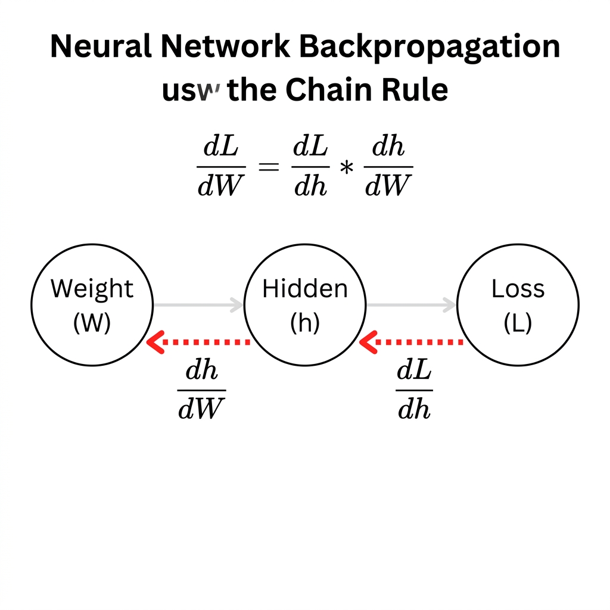

# Gradients and Backpropagation

> [!NOTE]
> This topic is based on Chapter 6.5 (Back-Propagation Algorithms) of the *Deep Learning* textbook (Goodfellow et al.).

## Why is this Concept Required?
In **Week 1: Build a Basic Prediction Machine**, after computing predictions (Forward Pass) and calculating error with Cross-Entropy Loss ($\mathcal{L}$), we need to update the weights $W$ and biases $b$ to reduce error. But a neural network contains many weights across layers! How do we know which specific weights caused the error, and by how much each weight should be adjusted? **Gradients** tell us the slope of error for every weight, and **Backpropagation** efficiently calculates these gradients backwards through the network using the calculus chain rule.

---

## Formal Definition
When training a neural network using gradient descent, we must calculate how changing any individual parameter affects the final loss $\mathcal{L}$. This calculation is called a **gradient** ($\nabla_{\mathbf{W}} \mathcal{L}$), which is a vector or matrix of partial derivatives. 

**Backpropagation** (backward propagation of errors) is the efficient algorithm used to compute gradients for all parameters by repeatedly applying the **chain rule of calculus** backwards from the output layer to the input layer.

Formally, for a simple weight $\mathbf{W}$ feeding into a hidden state $\mathbf{h}$ that produces loss $\mathcal{L}$:

$$\frac{\partial \mathcal{L}}{\partial \mathbf{W}} = \frac{\partial \mathcal{L}}{\partial \mathbf{h}} \cdot \frac{\partial \mathbf{h}}{\partial \mathbf{W}}$$

---

## Component-by-Component Math Breakdown

### 1. The Gradient & Chain Rule Formula: $\frac{\partial \mathcal{L}}{\partial \mathbf{W}} = \frac{\partial \mathcal{L}}{\partial \mathbf{h}} \cdot \frac{\partial \mathbf{h}}{\partial \mathbf{W}}$

| Symbol | Name | Plain-English Meaning |
| :--- | :--- | :--- |
| $\mathcal{L}$ | **Final Loss** | The scalar error computed at the output of the network (from Cross-Entropy Loss). |
| $\mathbf{h}$ | **Hidden State / Activation** | An intermediate calculation layer between input and output ($h = \tanh(W x + b)$). |
| $\mathbf{W}$ | **Weight Parameter** | A learned weight coefficient in the network. |
| $\partial$ | **Partial Derivative Symbol** | Asks: *"If I tweak the bottom variable by a tiny fraction, how much does the top variable change?"* |
| $\frac{\partial \mathcal{L}}{\partial \mathbf{h}}$ | **Output Error Gradient** | *"How much does a change in hidden state $h$ affect the final Loss $\mathcal{L}$?"* Calculated first at the output. |
| $\frac{\partial \mathbf{h}}{\partial \mathbf{W}}$ | **Local Node Gradient** | *"How much does a change in weight $W$ affect the hidden state $h$?"* Calculated at the local neuron. |
| $\cdot$ | **Multiplication / Matrix Product** | Multiplies downstream gradients by local gradients (the Chain Rule). |
| $\frac{\partial \mathcal{L}}{\partial \mathbf{W}}$ | **Final Weight Gradient** | The total error contribution (blame) assigned to weight $W$. Tells us the direction and rate of change of loss. |

---

## Beginner Intuition & Contrasting Analogies

### Analogy: The Assembly Line Blame Game
Imagine an assembly line building a luxury car:
- **Forward Pass:** Raw metal enters $\to$ Workers shape parts $\to$ Painter paints $\to$ Final car built.
- **Loss:** The final quality inspector finds a huge scratch on the door ($\text{Loss} = 8.5$).
- **Backpropagation:** The inspector walks **backwards** down the assembly line to assign blame:
  1. Inspector asks the Door Fitter ($\mathbf{h}$): *"How much did you contribute to this scratch?"* ($\frac{\partial \mathcal{L}}{\partial \mathbf{h}}$).
  2. Door Fitter replies: *"I installed it, but it came to me scratched from the Painter ($\mathbf{W}$)!"*
  3. Inspector multiplies the blame backwards to the Painter ($\frac{\partial \mathcal{L}}{\partial \mathbf{h}} \cdot \frac{\partial \mathbf{h}}{\partial \mathbf{W}}$).

Backpropagation systematically passes blame backward so every single worker knows exactly how much to adjust their machine!

---

## Where is this used in AI?

1. **PyTorch Autograd / Differentiable Programming:**
   When you write `loss.backward()` in PyTorch, PyTorch automatically executes backpropagation through every tensor operation in memory, calculating exact gradients for billions of parameters in milliseconds.
2. **GPU Parallel Acceleration:**
   Because backpropagation reduces mathematically to a chain of matrix multiplications, graphics cards (NVIDIA GPUs) execute backpropagation at blinding speed across thousands of CUDA cores.

---

## Concrete Numerical Worked Example

Suppose we have a single weight $W$:
- Currently $W = 2.0$.
- We calculate the gradient of loss with respect to $W$: $\frac{\partial \mathcal{L}}{\partial W} = +3.0$.

### Interpreting the Sign of the Gradient:
- **Gradient is $+3.0$ (Positive Slope):**
  This means increasing $W$ will **increase** the error loss $\mathcal{L}$.
  - To **decrease** loss, we must step in the **opposite direction** (subtracting the gradient to make $W$ smaller).
- **Gradient is $-4.0$ (Negative Slope):**
  This means increasing $W$ will **decrease** the error loss $\mathcal{L}$.
  - To **decrease** loss, stepping opposite to negative means adding a positive boost to make $W$ larger.

**Golden Rule:** We always update parameters in the **opposite direction of the gradient**:
$$W_{\text{new}} = W_{\text{old}} - (\text{Learning Rate} \times \text{Gradient})$$

---

## Connection to Active Assignment
In **Week 1: Build a Basic Prediction Machine**, after computing Cross-Entropy Loss $\mathcal{L}$, you run the backward pass. Backpropagation calculates $\frac{\partial \mathcal{L}}{\partial \mathbf{W}_2}$, $\frac{\partial \mathcal{L}}{\partial \mathbf{b}_2}$, $\frac{\partial \mathcal{L}}{\partial \mathbf{W}_1}$, and $\frac{\partial \mathcal{L}}{\partial \mathbf{b}_1}$ so your optimizer can update all weights in the next step.

*(Reference: Ian Goodfellow, Yoshua Bengio, and Aaron Courville - Deep Learning, Chapter 6.5)*

---

## Flashcards

Does Backpropagation actually change or update the weights of a Neural Network? #card
No. Backpropagation only calculates the Gradients (measuring how much each parameter contributes to the loss). The actual weight modification happens in a separate step using an Optimizer (like Gradient Descent).

What does the sign (positive or negative) of a Gradient tell us? #card
It tells us the slope of the loss curve. A positive gradient means increasing the weight increases loss. A negative gradient means increasing the weight decreases loss. We always move in the opposite direction of the gradient to reduce loss.

---

## My Understanding

*This section is for you to fill in your own words after studying this topic.*
- What is a gradient in simple terms?
- Why do we use the calculus chain rule during Backpropagation?
- If a weight has a positive gradient $+5.0$, should we increase or decrease the weight to reduce loss?

