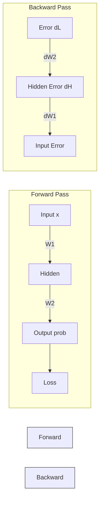

# Gradients and Backpropagation

## One-line definition
A **Gradient** tells us how the Loss would change if we tweaked a parameter, and **Backpropagation** is the chain-rule algorithm that calculates these gradients backwards from the output to the input.

## Why it exists
To figure out *who is to blame* for the error. If the network guesses wrong, Backpropagation calculates exactly how much `W1`, `b1`, `W2`, and `b2` contributed to the mistake.

## Beginner intuition
Imagine an assembly line building a car. The final inspector finds the door is scratched (Loss). **Backpropagation** is the inspector walking backwards down the line, asking the door-installer (W2) and the metal-painter (W1) exactly how much they contributed to the scratch (Gradients).

## Forward Pass vs Backward Pass

*The Forward Pass calculates the Prediction and the Loss. The Backward Pass calculates the Gradients (blame) starting from the Loss and flowing back to the first layer.*

## Week 1 assignment connection
In our `backward_pass` function, we first calculate the error at the output layer `d_logits = probs - true_label`. We then pass that error backward through `W2` and through the `tanh` derivative to calculate `dW1` and `db1`. 

## Small numerical example
A gradient is just a slope.
- Scalar Gradient: If the gradient for a weight is `+2.5`, it means increasing this weight will *increase* the loss. Because we want to *reduce* loss, we should decrease this weight.
- Scalar Gradient: If the gradient is `-0.5`, it means increasing this weight will *decrease* the loss. Because we want to *reduce* loss, we should increase this weight.

*(See `manual-exercises/01_SCALAR_NEURON_TRAINING_STEP.md` for the full calculation).*

## The Loss Curve
Think of a U-shaped valley. 
- If you are on the right side of the valley, the slope (gradient) is positive (pointing up and away from the center). To get to the bottom, you must step left (negative direction).
- If you are on the left side of the valley, the slope (gradient) is negative (pointing up and to the left). To get to the bottom, you must step right (positive direction).
- **Rule:** Always step in the opposite direction of the gradient!

## Common misunderstanding
**Misunderstanding:** Backpropagation updates the weights.
**Correction:** Backpropagation *only* calculates the gradients (the blame). It does not change the weights. The Weight Update step happens afterward.

## What happens if removed or changed?
Without Backpropagation, we would have to guess randomly whether to increase or decrease the millions of weights in our network, which is mathematically impossible.

## Teach-back question
Why does the error flow backward? Why can't we just calculate the gradients by moving forward from the input?

## My Understanding
*(Learner space to explain this in their own words later)*.

## Exercises
1. If the gradient for a bias parameter `b1` is calculated as `0.0`, what does that mean about the parameter's current value in relation to the loss?
2. If `W2` receives a gradient of `+1.8`, should the training loop increase or decrease `W2` to improve the model?

## Flashcards

Does Backpropagation actually change the weights of the neural network? #card
No. Backpropagation purely calculates the Gradients (how much each parameter is to blame for the loss). The weights are changed in a separate step using Gradient Descent.

What does the sign (positive or negative) of a Gradient tell us? #card
The direction of the slope. A positive gradient means increasing the weight increases the loss. A negative gradient means increasing the weight decreases the loss.
