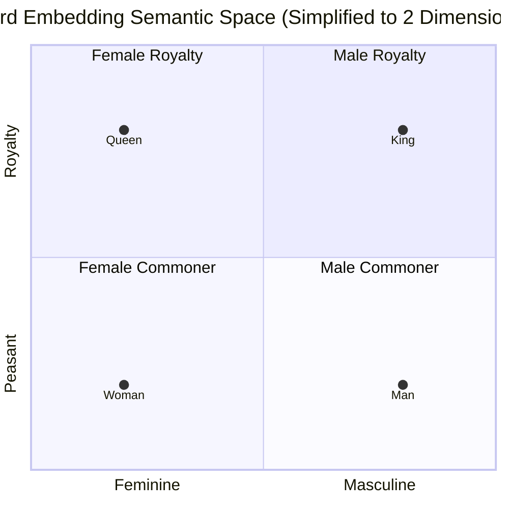

# Embeddings

> [!NOTE]
> This topic covers how neural networks mathematically represent the semantic meaning of language.

## Formal Definition
Because One-Hot Encoding creates massive, sparse vectors that assume every word is 100% unrelated to every other word, we need a better representation.
An **Embedding** is a dense, low-dimensional, continuous vector representation of a discrete token. Formally, an embedding for a token is a vector $\mathbf{v} \in \mathbb{R}^d$.

## Component-by-Component Math Breakdown
- **$\mathbf{v}$**: The embedding vector itself (e.g., `[0.2, -1.5, 0.8]`).
- **$\in \mathbb{R}$**: The vector is made of Real Numbers (decimals).
- **$d$ (Dimensionality)**: The length of the vector. If $d = 256$, it means every single word in the dictionary is represented by a list of exactly 256 decimal numbers. This is also called the `hidden_size` of the model.

## Beginner Intuition & Contrasting Analogy
Imagine you want to mathematically describe vehicles. 
- A **One-Hot Vector** is just a License Plate number — it uniquely identifies the car, but tells you absolutely nothing about how fast or heavy it is. 
- An **Embedding** is a list of distinct attributes: `[Speed, Weight, Cost, Off-road_Capability]`. 
  - A Ferrari might be `[0.9, 0.2, 0.9, 0.1]`. 
  - A Jeep might be `[0.3, 0.7, 0.4, 0.9]`. 

By looking at the embedding vectors, the computer can immediately calculate how similar two cars are mathematically.

*Notice how the mathematical distance between "Man" and "Woman" is perfectly parallel to the distance between "King" and "Queen". This is how AI understands relationships!*

## Where is this used in AI?
*   **Semantic Search (Google):** When you search Google for "How to fix a leaky faucet", Google doesn't just look for pages with the word "faucet". It converts your sentence into an Embedding vector, and searches its database for other vectors that are mathematically close to it. It will return pages about "repairing dripping taps" because the *meaning* (the vector) is nearly identical, even though the words are completely different.
*   **Learned Meanings:** Programmers do *not* manually assign attributes (like Speed or Royalty) to words. The neural network starts with completely random numbers. As it trains on billions of sentences, it naturally nudges words that appear in similar contexts (e.g., both "Receive" and "Restock" appear near "Inventory") into similar mathematical coordinates.

## Small Numerical Example
If $d = 3$:
- Token ID `5` ("Receive") $\rightarrow$ `[0.72, -0.15, 0.44]`
- Token ID `8` ("Restock") $\rightarrow$ `[0.70, -0.10, 0.40]`

Notice how mathematically close their numbers are! The AI knows they mean almost the same thing.

## Common Misunderstanding
**Misunderstanding:** Embeddings are static definitions from a dictionary.
**Correction:** Embeddings are dynamic and entirely dependent on the training data. If you train a network exclusively on medical texts, the embedding for "Apple" will cluster near "Diet" or "Health". If you train it on technology news, the embedding for "Apple" will cluster near "Microsoft" and "iPhone". The meaning is derived *entirely* from the context it was trained on.

---

## Flashcards

What is the fundamental flaw of One-Hot Encoding when trying to represent language? #card
One-Hot Encoding assumes every word is mathematically equidistant and completely independent from every other word. It captures zero semantic meaning or similarity.

Are Embedding attributes (like gender, royalty, or size) manually defined by programmers? #card
No. The neural network learns the values entirely on its own during training by observing which words frequently appear in similar contexts.
