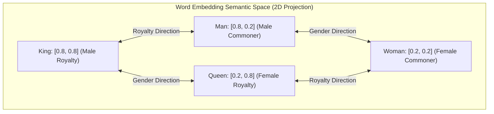

# Embeddings

> [!NOTE]
> This topic covers how neural networks mathematically represent the semantic meaning of language (Goodfellow et al., Chapter 12).

## Why is this Concept Required?
In **Week 2: Learning Relationships with Embeddings**, our goal is to move beyond One-Hot Encoding. In One-Hot Encoding, "Receive" is `[0, 0, 1, 0]` and "Restock" is `[0, 0, 0, 1]`. Their dot product is $0$, meaning the AI thinks "Receive" and "Restock" are just as completely unrelated as "Receive" and "Scenario". **Embeddings** map discrete tokens into dense, continuous vector spaces where contextually related words naturally cluster together with close mathematical coordinates.

---

## Formal Definition
An **Embedding** is a dense, continuous, low-dimensional vector representation of a discrete token. Instead of sparse 1s and 0s, an embedding vector represents a token as a list of real-valued numbers.

Formally, an embedding for a token is a vector:

$$\mathbf{v} \in \mathbb{R}^d$$

Where $\mathbf{v}$ is the embedding vector, $\mathbb{R}$ represents real numbers, and $d$ is the embedding dimension (also called `hidden_size`).

---

## Component-by-Component Math Breakdown

### 1. The Embedding Vector: $\mathbf{v} \in \mathbb{R}^d$

| Symbol | Name | Plain-English Meaning |
| :--- | :--- | :--- |
| $\mathbf{v}$ | **Embedding Vector** | A dense array of decimal numbers representing a single word (e.g., `[0.72, -0.15, 0.44]`). |
| $\in \mathbb{R}$ | **Element of Real Numbers** | Every entry in the vector is a real continuous decimal number (can be positive, negative, or zero). |
| $d$ | **Embedding Dimension** | The length/size of the vector (e.g., $d = 3$ for simple models, $d = 768$ or $4096$ for LLMs). |

### 2. The Embedding Matrix: $\mathbf{E} \in \mathbb{R}^{V \times d}$

| Symbol | Name | Plain-English Meaning |
| :--- | :--- | :--- |
| $\mathbf{E}$ | **Embedding Matrix** | The master lookup table stored by the model containing vector representations for all words. |
| $V$ | **Vocabulary Size** | The total number of unique words in the model's vocabulary (e.g., $V = 10$ words, or $V = 100,000$ tokens). |
| $V \times d$ | **Matrix Shape** | $V$ rows (one row per word) and $d$ columns (features per word). |

---

## Beginner Intuition & Contrasting Analogies

### Analogy: License Plate Number vs. Vehicle Feature Profile

- **One-Hot Encoding (License Plate Number):**
  - A license plate ID like `ABC-123` uniquely identifies a car, but tells you **zero** information about what the car is like.
  - Comparing `ABC-123` and `XYZ-789` tells you nothing about whether they are both sports cars or heavy trucks.
- **Embedding (Vehicle Feature Profile):**
  - An embedding is a list of descriptive attribute scores: `[Speed, Weight, Off-Road Capability, Price]`.
  - Ferrari $\to$ `[0.95, 0.20, 0.10, 0.90]`
  - Porsche $\to$ `[0.92, 0.22, 0.12, 0.88]`
  - Jeep $\to$ `[0.30, 0.80, 0.95, 0.40]`

By calculating the distance between vectors, the computer instantly sees that **Ferrari and Porsche are nearly identical**, while Jeep is far away!

```mermaid
graph TD
    subgraph SemanticSpace ["Word Embedding Semantic Space (2D Projection)"]
        King["King: [0.8, 0.8] (Male Royalty)"]
        Queen["Queen: [0.2, 0.8] (Female Royalty)"]
        Man["Man: [0.8, 0.2] (Male Commoner)"]
        Woman["Woman: [0.2, 0.2] (Female Commoner)"]
        
        King <-->|Gender Direction| Queen
        Man <-->|Gender Direction| Woman
        King <-->|Royalty Direction| Man
        Queen <-->|Royalty Direction| Woman
    end
```

---

## Where is this used in AI?

1. **Semantic Search & Retrieval (RAG / Google Search):**
   When you search for *"how to fix a leaky faucet"*, Google doesn't just match raw strings. It converts your query into an embedding vector and finds documents with vectors closest to it — returning articles on *"repairing dripping taps"* even though those exact words were never typed!
2. **LLM Input Layers (ChatGPT / Claude):**
   Every prompt you type into an LLM is first converted from Token IDs into dense Embedding vectors before passing through Transformer blocks.

---

## Concrete Numerical Worked Example

Suppose our model has embedding dimension $d = 3$:

| Word | Token ID | Learned Embedding Vector $\mathbf{v}$ |
| :--- | :--- | :--- |
| **Receive** | `6` | `[0.72, -0.15, 0.44]` |
| **Restock** | `7` | `[0.68, -0.12, 0.51]` |
| **Scenario** | `9` | `[-0.31, 0.82, -0.09]` |

Notice how **"Receive"** and **"Restock"** have numbers that are almost identical across all 3 dimensions! Meanwhile, **"Scenario"** points in a completely different direction in space.

---

## Connection to Active Assignment
In **Week 2: Learning Relationships with Embeddings**, your challenge is to replace One-Hot Encoding with a trainable Embedding Layer. When your model processes operational transitions like `Receive → Restock` and `Restock → Inventory`, gradient descent will automatically nudge the embedding vectors of `Receive` and `Restock` close together in vector space!

*(Reference: Ian Goodfellow, Yoshua Bengio, and Aaron Courville - Deep Learning, Chapter 12: Applications)*

---

## Flashcards

What is the fundamental flaw of One-Hot Encoding when trying to represent language? #card
One-Hot Encoding treats every word as mathematically equidistant and 100% independent. It captures zero semantic meaning, context, or similarity between words.

Are Embedding feature dimensions (like speed, gender, or business function) manually assigned by programmers? #card
No! Programmers initialize the embedding matrix with random numbers. The neural network learns the values automatically during training by observing which words appear in similar contexts.

---

## My Understanding

*This section is for you to fill in your own words after studying this topic.*
- Why does One-Hot Encoding fail to represent word relationships?
- What does an Embedding vector $\mathbf{v} \in \mathbb{R}^d$ represent in simple terms?
- How does training a model on sentences like "Receive -> Restock" cause their embedding vectors to move closer together?

