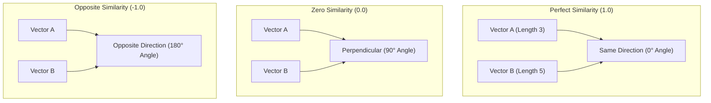
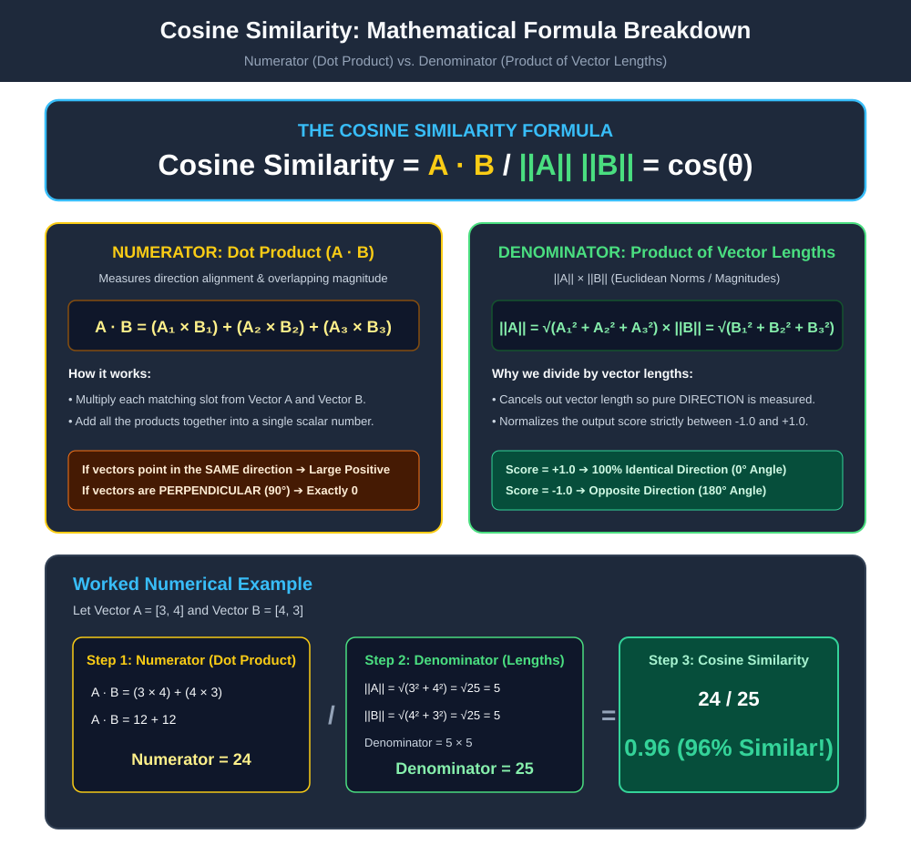

# Cosine Similarity

> [!NOTE]
> This topic covers the mathematical formula used to prove that a neural network has actually learned the semantic meaning of words.

## Formal Definition
If two words mean the exact same thing, their embedding vectors should point to the exact same location in space.
**Cosine Similarity** is a mathematical metric used to measure how similar two vectors are by looking exclusively at the *angle* between them, ignoring their magnitude (length). 

The formal equation for Cosine Similarity between vector $\mathbf{A}$ and vector $\mathbf{B}$ is:
$$ \cos(\theta) = \frac{\mathbf{A} \cdot \mathbf{B}}{||\mathbf{A}|| \times ||\mathbf{B}||} $$

## Component-by-Component Math Breakdown
- **$\mathbf{A} \cdot \mathbf{B}$**: The mathematical Dot Product of the two vectors. (Multiply matching elements and sum them up).
- **$||\mathbf{A}||$**: The $L^2$ Norm (Magnitude) of vector $\mathbf{A}$. This is the physical length of the vector, calculated using the Pythagorean theorem.
- **$\frac{\dots}{||\mathbf{A}|| \times ||\mathbf{B}||}$**: By dividing the dot product by the absolute lengths of the vectors, we mathematically "cancel out" their lengths. This isolates only the angle $\theta$ between them.
- **$\cos(\theta)$**: The cosine of the angle between them. The result is always a number strictly between `-1.0` and `1.0`.

## Beginner Intuition & Contrasting Analogy
Imagine you and your friend are both pointing at the exact same star in the night sky. 
- Your friend is short, so they extend their arm 2 feet. 
- You are tall, so you extend your arm 3 feet. 
If we measure the physical distance between your fingertips (Euclidean Distance), you are 1 foot apart. But if we measure the *angle* of your arms, the angle is 0 degrees. You are pointing in the exact same direction.

In NLP, common words like "The" get trained a lot, so their vector arms grow very long. Rare words have short arms. Cosine similarity ignores the length of the arm and only looks at where it's pointing!

## Where is this used in AI?
*   **Vector Databases (RAG):** When you upload a document to ChatGPT and ask a question, ChatGPT converts your question into an embedding vector, and calculates the **Cosine Similarity** against embedded paragraphs to retrieve relevant context.
*   **Evaluating Vector Geometry:** In embedding training, we calculate Cosine Similarity between vectors to inspect whether gradient descent moved their spatial directions closer together.
*   **IMPORTANT — Attention vs. Cosine Similarity:** Transformer Attention mechanisms calculate **Raw Scaled Dot Products** ($\frac{\mathbf{Q} \mathbf{K}^\top}{\sqrt{d_k}}$), **NOT** Cosine Similarity. Cosine similarity normalizes vector lengths to $1.0$, whereas Attention deliberately retains vector magnitudes so that higher-magnitude queries and keys can express stronger attention intensity.

---

## Step-by-Step Numerical Worked Example

Suppose Vector $\mathbf{A} = [3, 4]$ and Vector $\mathbf{B} = [4, 3]$:

### 1. Step 1: Numerator (Dot Product $\mathbf{A} \cdot \mathbf{B}$)
$$\mathbf{A} \cdot \mathbf{B} = (3 \times 4) + (4 \times 3) = 12 + 12 = \mathbf{24}$$

### 2. Step 2: Denominator (Product of Magnitudes $\|\mathbf{A}\| \cdot \|\mathbf{B}\|$)
- $\|\mathbf{A}\| = \sqrt{3^2 + 4^2} = \sqrt{9 + 16} = \sqrt{25} = \mathbf{5}$
- $\|\mathbf{B}\| = \sqrt{4^2 + 3^2} = \sqrt{16 + 9} = \sqrt{25} = \mathbf{5}$
- Denominator $= 5 \times 5 = \mathbf{25}$

### 3. Step 3: Compute Cosine Similarity
$$\text{Cosine Similarity} = \frac{24}{25} = \mathbf{0.96} \quad \text{(96\% Similar in direction!)}$$

---

## Common Misunderstanding

**Misunderstanding 1:** A Cosine Similarity of `0.0` or `-1.0` universally means words are "unrelated" or "antonyms" in human language.  
**Correction:** Cosine Similarity is strictly a **geometric metric** measuring vector angle $\cos(\theta)$. A score of $0.0$ means geometric orthogonality ($\mathbf{A} \cdot \mathbf{B} = 0$), and $-1.0$ means diametrically opposite vector direction. In natural language models, antonyms (e.g. "hot" and "cold", "large" and "small") appear in nearly identical surrounding contexts and frequently have **high positive cosine similarity**. Geometric orientation does not map 1-to-1 to human linguistic semantics.

**Misunderstanding 2:** Transformer Attention uses Cosine Similarity to calculate word relevance.  
**Correction:** Transformer Attention uses un-normalized Query-Key dot products scaled by $\frac{1}{\sqrt{d_k}}$. It does **not** divide by vector norms $\|\mathbf{Q}\| \|\mathbf{K}\|$.

---

## Flashcards

Why is Cosine Similarity preferred over Euclidean distance (physical distance) for comparing word embeddings? #card
Because embeddings for common words can grow longer (higher magnitude) than rare words. Cosine similarity divides by the magnitude to cancel it out. It only measures the angle (direction) between vectors, which is a much purer representation of semantic meaning.

What does a Cosine Similarity of 1.0, 0.0, and -1.0 mean respectively? #card
1.0 means identical direction (high semantic similarity). 0.0 means orthogonal (completely unrelated). -1.0 means opposite direction (exact opposites).
