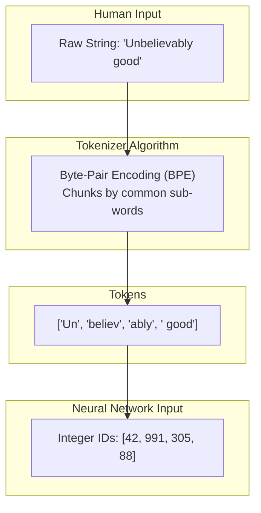

# Tokenizers

> [!NOTE]
> This topic covers the vital first-and-last step of language modeling: bridging the gap between human strings and machine integers.

## Formal Definition
A **Tokenizer** is a deterministic algorithm that segments raw human text into chunks (Tokens) and maps those chunks to numerical IDs (Token IDs) that the neural network can mathematically process.
Formally, we can define tokenization as a function $T$ that maps a string of characters $S$ to a sequence of integers:
$T(S) \rightarrow [t_1, t_2, \dots, t_n]$

## Component-by-Component Math Breakdown
- **$T$**: The Tokenizer function. Unlike the neural network weights, $T$ is fixed and deterministic. It does not change or "learn" during backpropagation.
- **$S$**: The raw input string (e.g., `"Unbelievable!"`).
- **$t_i$**: A Token ID (an integer index). 
- **$[t_1, t_2, \dots]$**: The final output vector of integers. The neural network never sees $S$; it only sees this integer vector.

## Beginner Intuition & Contrasting Analogy
Imagine you are translating a book into a Secret Numeric Code. 
Before you start translating, you must decide your **Strategy (The Tokenizer Rules):**
- **Strategy A (Character-level):** Assign a number to every letter. `"A"=1, "B"=2`. 
  - *Problem:* A sentence takes 100 numbers to encode. The code is too long!
- **Strategy B (Word-level):** Assign a number to every word. `"Cat"=1, "Dog"=2`. 
  - *Problem:* There are millions of words. Your codebook is too heavy to carry!
- **Strategy C (Sub-word level):** Assign numbers to common chunks. `"Un"=1, "believ"=2, "able"=3`. 
  - *Solution:* Perfect! A small codebook, but it can encode any word in existence by combining chunks.



## Where is this used in AI?
*   **GPT-4 (Tiktoken):** OpenAI uses a highly advanced Sub-Word tokenizer called `tiktoken` (specifically the `cl100k_base` encoding). It has exactly 100,277 sub-word chunks in its vocabulary. When you type into ChatGPT, your text is instantly passed through `tiktoken` to become an array of integers before the massive GPU neural network ever sees it.
*   **The "Context Window" Limit:** When you hear that ChatGPT has a "128,000 Token Limit", they aren't talking about words or characters. They are talking about the exact output length of $T(S)$. Because sub-words are smaller than words, 100 Tokens usually equals about 75 English words.

## Small Numerical Example
In our toy problem, our Tokenizer is incredibly simple. We use **Whole Word Tokenization**. 
```python
vocab = {"Order": 0, "Shipment": 1, ... "Receive": 6}
```
If we pass `"Receive"` to our Tokenizer, it outputs `[6]`.
If we try to pass `"Received"` to our network, it will crash, because our simple tokenizer has no sub-word fallback mechanism to handle the past-tense suffix "ed".

## Common Misunderstanding
**Misunderstanding:** The Tokenizer is a Neural Network layer that learns during training.
**Correction:** The Tokenizer is completely separate from the Neural Network. It runs on the CPU *before* the data goes into the GPU, and *after* the data comes out. It has no trainable weights and does not learn during backpropagation; it is a fixed, hard-coded set of lookup rules.

---

## Flashcards

Is the Tokenizer trained by Backpropagation alongside the neural network? #card
No. The Tokenizer is a separate, pre-defined algorithm that converts text to numbers before the network sees it. It does not learn during the neural network training loop.

What is the main mathematical advantage of Sub-Word tokenization (BPE) over Whole-Word tokenization? #card
It keeps the vocabulary size $|V|$ mathematically small (saving memory) while still allowing the model to process completely unknown words by breaking them down into familiar sub-word chunks (like prefixes and suffixes).
