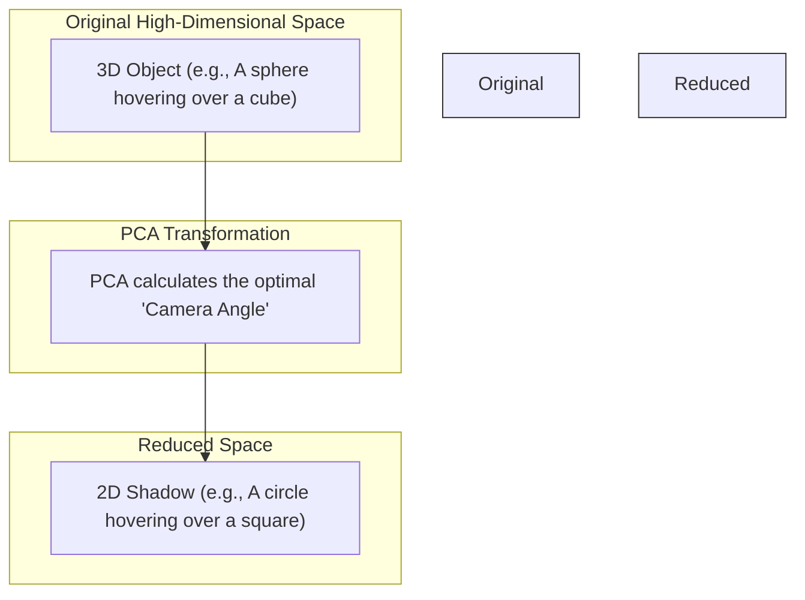

# Dimensionality Reduction and PCA

> [!NOTE]
> This topic covers how we compress massive mathematical vectors so that human beings can actually look at them.

## Formal Definition
**Dimensionality Reduction** is the transformation of data from a high-dimensional space into a low-dimensional space so that the low-dimensional representation retains some meaningful properties of the original data. 

**PCA (Principal Component Analysis)** is the most famous algorithm for this. It mathematically analyzes the data to find the "axes of greatest variance" (the directions where the data is most spread out) and projects the data onto those axes.

## Component-by-Component Math Breakdown
Let's look at the math of projecting a high-dimensional vector down to a 2D plot using a projection matrix $\mathbf{P}$.
$\mathbf{x}_{\text{2D}} = \mathbf{x}_{\text{High}} \mathbf{P}$

- **$\mathbf{x}_{\text{High}}$**: A 1,024-dimensional embedding vector representing a single word.
- **$\mathbf{P}$**: A special Projection Matrix of shape `1024 x 2` created by the PCA algorithm. This matrix holds the mathematically calculated "best camera angle".
- **$\mathbf{x}_{\text{2D}}$**: The output is a simple vector of shape `(2,)`, which gives us a standard `[X, Y]` coordinate we can plot on a graph!

## Beginner Intuition & Contrasting Analogy
Imagine you have a highly detailed physical, 3D model of a city. You want to put this model into a flat 2D book. You have to take a photograph of it.
- If you take a photo from directly above (a satellite view), you preserve the distances between the streets perfectly, but you completely lose the heights of the buildings. 
- If you take a photo from the side, you preserve the building heights, but completely lose the street map.

Dimensionality Reduction is the math of finding the **absolute best camera angle** to take a 2D photo of a massive, multi-dimensional object so that the most important relationships are visible in the resulting "shadow".

## Where is this used in AI?
*   **Visualizing Black Box AI Models:** In modern neural networks, embedding vectors can have 1,000 or more dimensions (e.g., GPT-3 has an embedding size of 12,288). Human beings cannot physically visualize a 12,288-dimensional graph. AI researchers use PCA (or newer algorithms like t-SNE or UMAP) to squash these vectors down to a simple 2D X/Y scatter plot. This allows researchers to visually see if the AI clustered "Cat" and "Dog" together.
*   **Week 2 Assignment:** In our stretch goal, we will learn embeddings with an 8-dimensional hidden size. To visualize if `"Receive"` and `"Restock"` actually clustered together, we will use the `scikit-learn` Python library to run PCA, transforming our `(N, 8)` matrix into an `(N, 2)` matrix. We will then plot these 2D points on a scatter plot.

## Small Numerical Example
Vector $\mathbf{x}_{\text{High}} = [4, 9, 2, 8, 1, 3]$ (6 dimensions)
Let's say PCA determines the projection matrix $\mathbf{P}$ should just average the first 3 numbers for X, and the last 3 for Y (highly simplified).
Output $\mathbf{x}_{\text{2D}} = [5, 4]$ (2 dimensions).

## Common Misunderstanding
**Misunderstanding:** The 2D PCA graph is a perfect representation of the embeddings.
**Correction:** Dimensionality reduction *always* loses information (just like a 2D photo permanently loses the 3D depth). Two words might look right next to each other on a 2D PCA plot, but actually be far apart in the true 1,024-dimensional space. Always trust the raw Cosine Similarity math over the 2D visual plot.

---

## Flashcards

What is the primary purpose of Dimensionality Reduction (like PCA) in Machine Learning? #card
To compress high-dimensional data (like 1,024-dimension embeddings) down to 2 or 3 dimensions so that human engineers can visually plot and interpret the relationships on a screen.

Does a 2D PCA plot perfectly preserve the distances between embeddings? #card
No. Dimensionality reduction always permanently loses information (like flattening a 3D object into a 2D shadow). Vectors that appear close on a 2D plot might actually be separated in a higher dimension that was flattened.
