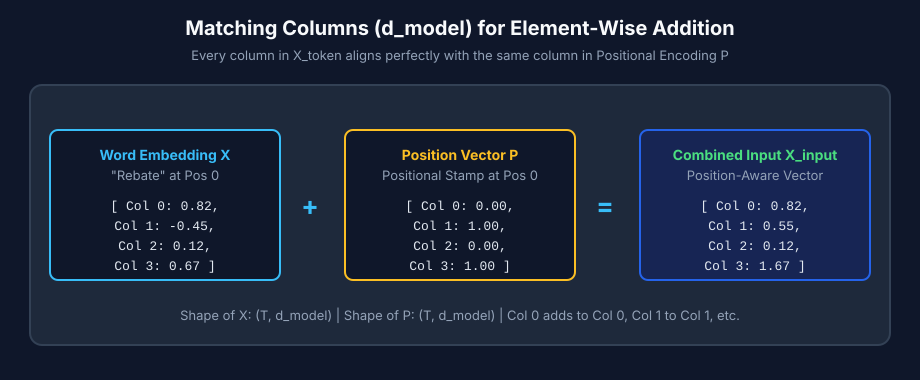
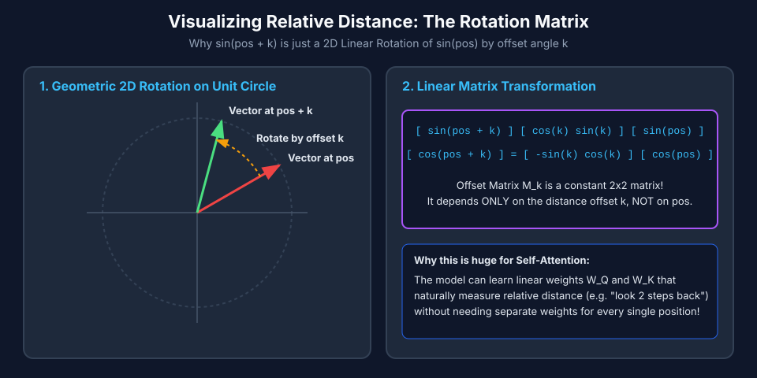
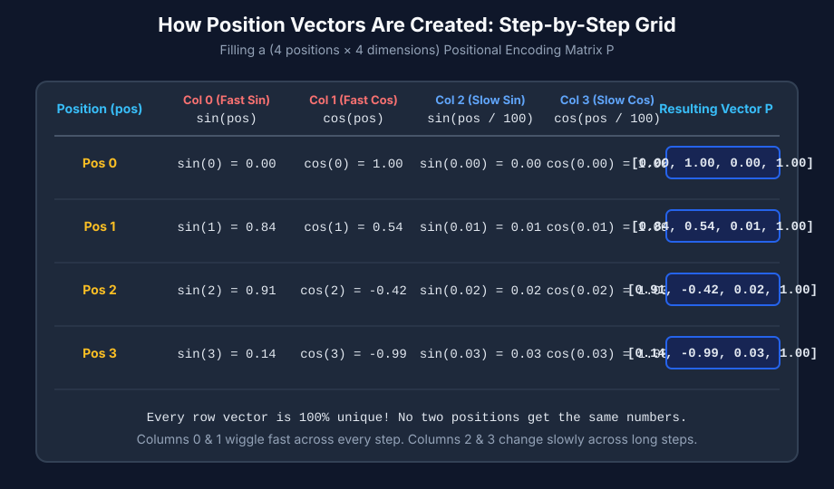

# 24b - TRANSFORMER - Positional Encoding

## 1. The Problem
Standard Self-Attention computes pairwise token similarities using matrix multiplication $\mathbf{Q} \mathbf{K}^\top$. 
Because matrix dot products only measure vector similarity and are invariant to row order, **Self-Attention is order-blind (permutation-equivariant)**.

### Toy Example
Consider two sentences with the exact same words in different order:
1. `"Dog bites man"`
2. `"Man bites dog"`

If we convert these words to semantic embeddings $\mathbf{X}_{\text{token}}$, the set of row vectors is identical. Raw Self-Attention will calculate the exact same attention weights regardless of word positions. To raw Self-Attention, `"Dog bites man"` and `"Man bites dog"` are completely indistinguishable!

### GPO (Group Purchasing Organization) Domain Example
In healthcare procurement and GPO contract management, business events must follow a strict chronological lifecycle.

**Full Business Workflow (Natural Language Sentence):**
> *"A GPO contract is established, a purchase order is placed, goods are shipped, an invoice is generated, and a volume rebate is claimed."*

**Token Sequence representation:**
`["Contract", "Order", "Shipment", "Invoice", "Rebate"]`
*(5 tokens at sequence positions 0, 1, 2, 3, 4)*

**Out-of-Sequence Audit Risk (Token Sequence):**
`["Rebate", "Invoice", "Order", "Contract", "Shipment"]`
*(Rebate claimed at position 0 before contract or order exists at positions 3 and 4 — a potential fraud or billing error!)*

Without Positional Encoding, raw Self-Attention views both sequences as the exact same set of 5 event tokens `{"Contract", "Order", "Shipment", "Invoice", "Rebate"}`. It cannot distinguish between a compliant GPO purchasing workflow and an out-of-sequence compliance violation!

## 2. Why We Need Something New (And why raw integer IDs don't work!)

A natural question arises:  
> *"If we already have Token IDs (e.g. `Contract` = 502) and Position indices (`pos` = 0, 1, 2, 3), why can't the neural network just use integer position IDs directly?"*

There are **3 fundamental reasons** why raw integer position IDs fail in neural network matrix math:

1. **Token IDs belong to the Vocabulary, NOT to sequence position:**  
   The Token ID for `"Contract"` is ALWAYS `502`, whether `"Contract"` appears at the beginning (index 0) or the end (index 100) of a sequence. Token IDs tell the model *what* the word is, not *where* it is.

2. **Shape Mismatch in Vector Space ($1$ vs $d_{model}$):**  
   Word embeddings $\mathbf{x}_{\text{token}}$ live in a high-dimensional vector space (e.g., $d_{model} = 768$ float numbers). A raw position index is a single scalar integer (e.g. `pos = 3`). You cannot perform element-wise addition ($\mathbf{X}_{\text{token}} + \mathbf{P}$) between a 768D vector and a 1D scalar integer! Position must be projected into a matching 768-dimensional vector $\mathbf{P} \in \mathbb{R}^{d_{model}}$.

3. **Magnitude Explosion & Scale Inconsistency:**  
   Neural network weights and embeddings are small floats bounded roughly between $-1.0$ and $+1.0$. If you directly added raw integer position numbers (`pos = 0, 1, 50, 1000`) to word embeddings (`0.15`), at position 1000 the position number `1000.0` would completely drown out the word's semantic meaning! 

Therefore, position must be converted into a normalized, high-dimensional **Positional Encoding Vector** $\mathbf{P} \in \mathbb{R}^{d_{model}}$ before being combined with word embeddings.

## 3. One-Line Definition
**Positional Encoding** is the process of adding position-dependent vectors to token embeddings so that the Transformer can distinguish token order.

## 4. Beginner Intuition / Mental Model
Imagine a **Conference Badge**:
- The token embedding is your **Name** (semantic meaning): `"John"`.
- The positional encoding is your **Seat Number** (order): `"Row 1, Seat 3"`.

When you combine them on your badge (`"John - Row 1, Seat 3"`), people know both *who you are* and *where you are sitting*.

In GPO terms:
- Token Embedding: `"Contract"` (what the event is).
- Positional Encoding: `Position 0` (first step in the sequence).

## 5. What Came Before → What Changes Now
- **Before (Raw Self-Attention):** Input vector $\mathbf{x}_i = \text{Embedding}(\text{token}_i)$. Order is lost.
- **Now (With Positional Encoding):** Input vector $\mathbf{x}_{\text{final}, i} = \text{Embedding}(\text{token}_i) + \text{PositionalEncoding}(i)$. Order is preserved!

## 6. How It Works
1. For an input sequence of length $T$, look up token embeddings $\mathbf{X}_{\text{token}} \in \mathbb{R}^{T \times d_{model}}$.
2. Generate or look up positional vectors $\mathbf{P} \in \mathbb{R}^{T \times d_{model}}$, where row $i$ corresponds to position index $i$.
3. Perform element-wise addition:
   $$\mathbf{X}_{\text{input}} = \mathbf{X}_{\text{token}} + \mathbf{P}$$
4. Pass $\mathbf{X}_{\text{input}}$ to $\mathbf{Q}, \mathbf{K}, \mathbf{V}$ projections as usual.

```
Token IDs  ──► Embedding Layer ──► X_token (T x d_model) ──┐
                                                            ├──(+)──► X_input ──► Q, K, V Projections
Position IDs ─► Pos Encoding  ──► P       (T x d_model) ──┘
```



## 7. Required Mathematics: The HOW & WHY of Sinusoidal Encodings

### WHY Sine and Cosine? (The 3 Core Design Reasons)

Why did Vaswani et al. (2017) choose Sine and Cosine functions out of all possible mathematical functions?


1. **Bounded Values ($-1.0$ to $+1.0$):**  
   *(Panel 1)* Sine and cosine are smoothly bounded between $-1$ and $+1$. No matter how long a sequence is (position 0 or position 10,000), the position numbers will **never explode** (unlike raw integer indices that shoot off to infinity) and never drown out the word embedding values!

2. **Extrapolation to Unseen Sequence Lengths:**  
   *(Panel 2)* Because sine and cosine are continuous periodic functions defined for all real numbers $pos \in [0, \infty)$, a model trained on sequences of length 512 can immediately compute smooth position vectors for sequence length 1,000 without breaking or retraining!

3. **Relative Distance via Linear Transformation (Trigonometric Addition Identity):**  
   *(Panel 3)* Because of the trigonometric identity:
   $$\sin(\alpha + \beta) = \sin(\alpha)\cos(\beta) + \cos(\alpha)\sin(\beta)$$
   $$\cos(\alpha + \beta) = \cos(\alpha)\cos(\beta) - \sin(\alpha)\sin(\beta)$$
   Setting $\alpha = pos$ (current position) and $\beta = k$ (offset distance), we can write the position vector at $(pos + k)$ as a 2D matrix multiplication of the vector at $pos$:
   $$\begin{bmatrix} \sin(pos + k) \\ \cos(pos + k) \end{bmatrix} = \begin{bmatrix} \cos(k) & \sin(k) \\ -\sin(k) & \cos(k) \end{bmatrix} \begin{bmatrix} \sin(pos) \\ \cos(pos) \end{bmatrix}$$
   For any fixed offset $k$ (e.g. *"token $j$ is $k$ positions away from token $i$"*), the vector at position $pos + k$ is simply a **linear matrix rotation by angle $\Delta k$** from position $pos$. This allows the Attention mechanism $\mathbf{Q}\mathbf{K}^\top$ to easily learn relative distance relationships (e.g., *"pay attention to the word 2 steps to my left"*) because matrix operations inside neural networks excel at linear transformations!



---

### HOW It Works: The Clock / Odometer Mental Model

How do multiple sine waves encode unique positions?

Imagine an **Odometer** in a car or a **Clock with multiple hands**:
- **Dimensions 0 & 1 (Fastest Wave):** Oscillate rapidly across every token (like the seconds hand).
- **Dimensions 2 & 3 (Medium Wave):** Oscillate moderately (like the minutes hand).
- **Higher Dimensions (Slowest Wave):** Oscillate very slowly across hundreds of tokens (like the hour hand).

Together, the $d_{model}$ dimensions create a **unique multi-frequency wave fingerprint** for every position index $0, 1, 2, 3, \dots$.

---

### Formula & Symbol Table

For position index $pos \in \{0, 1, \dots, T-1\}$ and dimension index $2i$:

$$\mathbf{P}_{(pos, 2i)} = \sin\left(\frac{pos}{10000^{2i / d_{model}}}\right)$$
$$\mathbf{P}_{(pos, 2i+1)} = \cos\left(\frac{pos}{10000^{2i / d_{model}}}\right)$$

| Symbol | Name | Plain-English Meaning |
| :--- | :--- | :--- |
| $pos$ | Position Index | Integer sequence position ($0, 1, 2, \dots, T-1$). |
| $2i$ | Vector Dimension | Feature index inside the $d_{model}$-dimensional vector. |
| $10000^{2i / d_{model}}$ | Wavelength Scaling | Controls wave frequency. Small $i \to$ fast oscillation; Large $i \to$ slow oscillation. |
| $\sin / \cos$ | Trigonometric Pair | Encodes 2D rotational position per dimension pair. |

#### Actual Numerical Matrix $\mathbf{P}$ (for $T=4$ tokens, $d_{model}=4$ dimensions):

| Position ($pos$) | Dim 0 ($\sin(pos)$) | Dim 1 ($\cos(pos)$) | Dim 2 ($\sin(\frac{pos}{100})$) | Dim 3 ($\cos(\frac{pos}{100})$) | Full Vector $\mathbf{p}_{pos}$ |
| :--- | :--- | :--- | :--- | :--- | :--- |
| **Position 0** | `0.0000` | `1.0000` | `0.0000` | `1.0000` | `[ 0.0000,  1.0000,  0.0000,  1.0000]` |
| **Position 1** | `0.8415` | `0.5403` | `0.0100` | `1.0000` | `[ 0.8415,  0.5403,  0.0100,  1.0000]` |
| **Position 2** | `0.9093` | `-0.4161` | `0.0200` | `0.9998` | `[ 0.9093, -0.4161,  0.0200,  0.9998]` |
| **Position 3** | `0.1411` | `-0.9900` | `0.0300` | `0.9996` | `[ 0.1411, -0.9900,  0.0300,  0.9996]` |



### Symbol Table

| Symbol | Name | Plain-English Meaning |
| :--- | :--- | :--- |
| $\mathbf{X}_{\text{token}}$ | Token Embedding Matrix | Shape $(T \times d_{model})$ — semantic representation of words / events. |
| $\mathbf{P}$ | Positional Encoding Matrix | Shape $(T \times d_{model})$ — spatial position representation. |
| $pos$ | Sequence Position | Integer index $(0, 1, 2, \dots, T-1)$. |
| $d_{model}$ | Model Dimension | Dimension of hidden representations (e.g. 64, 512, 768). |

## 8. Complete Worked Examples

### Example 1: Toy Sentence (`["Dog", "bites"]`)
Let sequence length $T = 2$, $d_{model} = 2$.

Suppose semantic embeddings:
- $\mathbf{x}_{\text{Dog}} = [1.0, 0.5]$
- $\mathbf{x}_{\text{bites}} = [0.2, 0.8]$

Suppose positional encoding vectors:
- Position 0 ($\mathbf{p}_0$): $[0.0, 1.0]$
- Position 1 ($\mathbf{p}_1$): $[1.0, 0.0]$

Combined input vectors:
- Position 0 (`"Dog"`): $\mathbf{x}_{\text{input}, 0} = [1.0, 0.5] + [0.0, 1.0] = [1.0, 1.5]$
- Position 1 (`"bites"`): $\mathbf{x}_{\text{input}, 1} = [0.2, 0.8] + [1.0, 0.0] = [1.2, 0.8]$

---

### Example 2: GPO Purchasing Lifecycle (`["Contract", "Invoice"]`)
Let sequence length $T = 2$, $d_{model} = 2$.

Semantic event embeddings:
- $\mathbf{x}_{\text{Contract}} = [2.5, 0.1]$
- $\mathbf{x}_{\text{Invoice}} = [0.4, 1.9]$

Positional vectors:
- Position 0 ($\mathbf{p}_0$): $[0.1, 0.9]$
- Position 1 ($\mathbf{p}_1$): $[0.8, 0.2]$

**Compliant Order (`"Contract"` @ Pos 0, `"Invoice"` @ Pos 1):**
- Event 0 (`"Contract"`): $[2.5, 0.1] + [0.1, 0.9] = \mathbf{[2.6, 1.0]}$
- Event 1 (`"Invoice"`): $[0.4, 1.9] + [0.8, 0.2] = \mathbf{[1.2, 2.1]}$

**Out-of-Order Audit Anomaly (`"Invoice"` @ Pos 0, `"Contract"` @ Pos 1):**
- Event 0 (`"Invoice"`): $[0.4, 1.9] + [0.1, 0.9] = \mathbf{[0.5, 2.8]}$
- Event 1 (`"Contract"`): $[2.5, 0.1] + [0.8, 0.2] = \mathbf{[3.3, 0.3]}$

Because Positional Encoding changes the vectors based on location, the Transformer's attention queries $Q$ and keys $K$ will produce completely distinct score matrices for the compliant flow vs. the audit anomaly!

## 9. Math → Code Mapping

```python
import numpy as np

def add_learned_positional_encoding(X_token, W_pos):
    """
    X_token: (T, d_model) - semantic word/event embeddings
    W_pos:   (max_len, d_model) - learned position embedding matrix
    """
    T, d_model = X_token.shape
    P = W_pos[:T, :] # Slice position vectors for length T
    X_input = X_token + P
    return X_input
```

## 10. Modern Variants in AI (Where it appears in modern LLMs)
1. **Absolute Learned Embeddings:** Used in GPT-2 and GPT-3.
2. **Rotary Position Embeddings (RoPE):** Used in **LLaMA 2/3**, **Mistral**, **Qwen**, and **PaLM**. Instead of adding vectors, RoPE rotates the Query and Key vectors in 2D planes by angles proportional to their positions.

## 11. Flashcards

Why is Positional Encoding necessary in Transformers? #card
Because standard Self-Attention operates on sets of vectors in parallel without any inherent concept of sequence order or word/event position.

How is positional information combined with word embeddings in GPT-2/3? #card
By element-wise adding a position embedding vector to the word embedding vector ($\mathbf{X}_{\text{token}} + \mathbf{P}$).

In a GPO workflow, why does Positional Encoding help detect compliance anomalies? #card
Because events like "Rebate" appearing at Position 0 produce different position-aware representations than "Rebate" appearing at Position 4 after "Contract" and "Invoice".

## 12. Sources
- Vaswani et al. (2017) *"Attention Is All You Need"*, Section 3.5.
- Su et al. (2021) *"RoFormers: Enhanced Transformer with Rotary Position Embedding"*.

