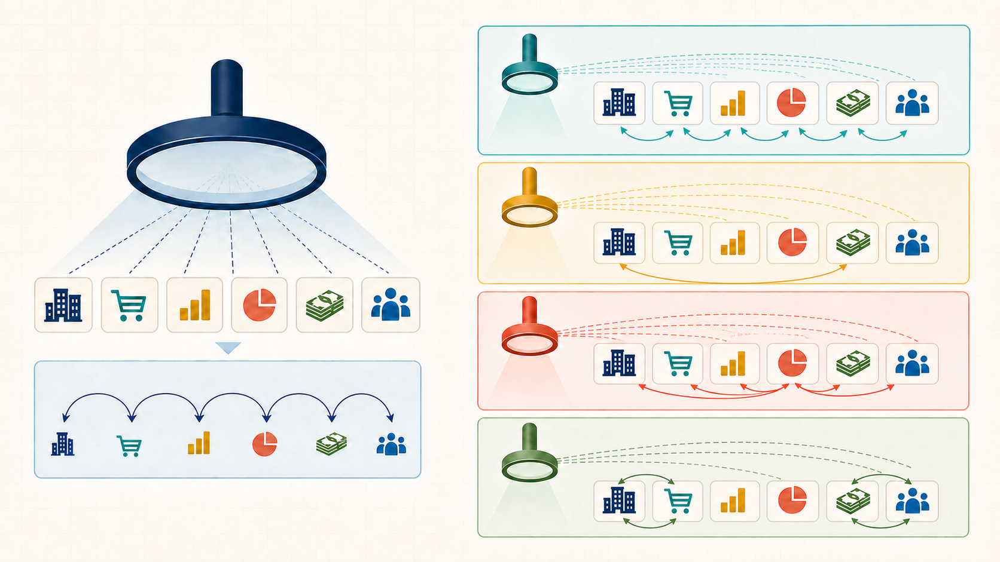
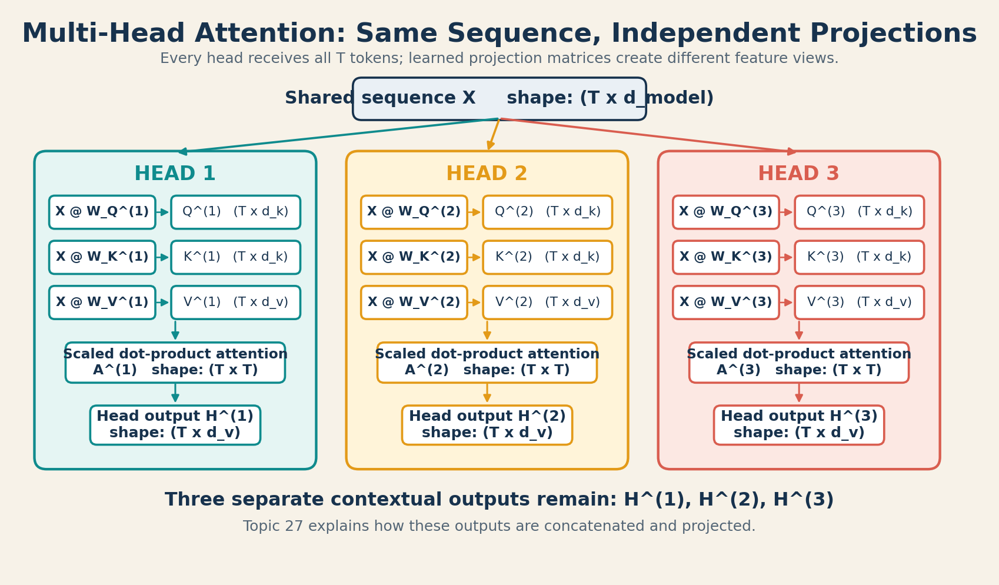

# 26 - TRANSFORMER - Multi-Head Attention

## 1. The Problem

Week 3 used one attention head. For every query token, that head produced one
attention distribution over the sequence.

Consider the token Forecast in a purchase-order sequence. Relevant context may
include Inventory, Shipment, Invoice, and earlier Orders. These relationships
can represent different kinds of evidence.

A single head is not incapable of learning complex behavior. Its specific
limitation is narrower: for each query, it has only one set of attention
weights. Different relationships must share that one routing pattern before
the values are combined.

## 2. Why We Need Something New

We want the model to form several attention distributions for the same query
token. Each distribution should be produced from its own learned Query, Key,
and Value projections.

This gives the model several parallel representation subspaces in which to
compare the same sequence. One head might eventually become sensitive to
short-range operational patterns while another becomes sensitive to financial
patterns. Those roles are learned possibilities, not roles assigned by us and
not guarantees of training.

## 3. One-Line Definition

**Multi-Head Attention (MHA)** applies several independently parameterized
scaled dot-product attention heads to the same sequence in parallel, producing
one contextual output and one attention matrix per head.

The head outputs must later be combined. Concatenation and output projection
are taught separately in Topic 27.

## 4. Beginner Intuition

Imagine several analysts reading the same business timeline:

- every analyst receives the full timeline;
- each analyst uses a different learned lens;
- each analyst produces a separate view of what matters.

The analogy helps explain parallel perspectives. It stops being exact because
attention heads are matrices optimized by gradient descent, not people with
predefined job titles or human reasoning.

**How to read the image:** The left side shows one head producing one
relationship pattern. On the right, every colored head receives the same
complete sequence but can produce a different pattern. The colors indicate
independent heads; they do not assign predefined business roles.

## 5. What Came Before -> What Changes Now

### Single-head self-attention

One set of learned projections creates:

$$
\mathbf{Q} = \mathbf{X}\mathbf{W}_Q,\qquad
\mathbf{K} = \mathbf{X}\mathbf{W}_K,\qquad
\mathbf{V} = \mathbf{X}\mathbf{W}_V
$$

This produces one attention matrix and one contextual output.

### Multi-head self-attention

Head $i$ has its own learned parameters:

$$
\mathbf{W}_Q^{(i)},\quad
\mathbf{W}_K^{(i)},\quad
\mathbf{W}_V^{(i)}
$$

It therefore produces its own:

$$
\mathbf{Q}^{(i)},\quad
\mathbf{K}^{(i)},\quad
\mathbf{V}^{(i)},\quad
\mathbf{A}^{(i)},\quad
\mathbf{H}^{(i)}
$$

All heads read every token. The input is not divided into different groups of
words. The feature dimension is divided into smaller per-head subspaces.

## 6. How One Head Works Inside MHA

Let:

- $T$ be the sequence length;
- $d_{\text{model}}$ be the input feature width;
- $h$ be the number of heads;
- $d_k$ be the Query and Key width of one head;
- $d_v$ be the Value and output width of one head.

For head $i$:

### Step 1: Project the shared input

$$
\mathbf{Q}^{(i)} = \mathbf{X}\mathbf{W}_Q^{(i)}
$$

$$
\mathbf{K}^{(i)} = \mathbf{X}\mathbf{W}_K^{(i)}
$$

$$
\mathbf{V}^{(i)} = \mathbf{X}\mathbf{W}_V^{(i)}
$$

### Step 2: Calculate that head's scores

$$
\mathbf{S}^{(i)}
=
\frac{\mathbf{Q}^{(i)}{\mathbf{K}^{(i)}}^\top}{\sqrt{d_k}}
$$

If attention is causal, the same causal-mask rule from Week 3 is applied to
every head's score matrix before Softmax.

### Step 3: Calculate that head's attention weights

$$
\mathbf{A}^{(i)} = \operatorname{Softmax}(\mathbf{S}^{(i)})
$$

Softmax is applied independently to every row. Each row of each head's
attention matrix sums to $1$.

### Step 4: Calculate that head's contextual output

$$
\mathbf{H}^{(i)} = \mathbf{A}^{(i)}\mathbf{V}^{(i)}
$$

This process repeats independently for all $h$ heads.

**Shape checkpoint:** Every branch begins with the full
$(T \times d_{\text{model}})$ sequence. Each head creates its own
$(T \times T)$ attention matrix and $(T \times d_v)$ contextual output.
The outputs remain separate until Topic 27.

## 7. Shape Trace

For one head:

| Quantity | Shape | Meaning |
| :--- | :--- | :--- |
| $\mathbf{X}$ | $(T \times d_{\text{model}})$ | Shared sequence representation |
| $\mathbf{W}_Q^{(i)}$ | $(d_{\text{model}} \times d_k)$ | Query projection for head $i$ |
| $\mathbf{W}_K^{(i)}$ | $(d_{\text{model}} \times d_k)$ | Key projection for head $i$ |
| $\mathbf{W}_V^{(i)}$ | $(d_{\text{model}} \times d_v)$ | Value projection for head $i$ |
| $\mathbf{Q}^{(i)}$ | $(T \times d_k)$ | Queries for head $i$ |
| $\mathbf{K}^{(i)}$ | $(T \times d_k)$ | Keys for head $i$ |
| $\mathbf{V}^{(i)}$ | $(T \times d_v)$ | Values for head $i$ |
| $\mathbf{A}^{(i)}$ | $(T \times T)$ | Attention weights for head $i$ |
| $\mathbf{H}^{(i)}$ | $(T \times d_v)$ | Contextual output from head $i$ |

Keeping all heads explicit gives:

| Quantity | Shape |
| :--- | :--- |
| All attention matrices | $(h \times T \times T)$ |
| All head outputs | $(h \times T \times d_v)$ |

The original Transformer commonly chooses:

$$
d_k = d_v = \frac{d_{\text{model}}}{h}
$$

For example, if $d_{\text{model}} = 8$ and $h = 2$, each head commonly uses
$d_k = d_v = 4$.

This equal split is a design convention used to keep total width and
computation manageable. It is not the mathematical definition of MHA.

## 8. Complete Two-Head Worked Example

This example uses deliberately chosen projection matrices so the two heads are
easy to inspect. They are illustrative parameters, not the result of training.

Let:

$$
T = 2,\qquad d_{\text{model}} = 4,\qquad h = 2,\qquad d_k = d_v = 2
$$

and:

$$
\mathbf{X}
=
\begin{bmatrix}
1 & 0 & 1 & 0 \\
0 & 1 & 0 & 1
\end{bmatrix}
$$

### Head 1 projections

Head 1 selects the first two input features for Queries, Keys, and Values:

$$
\mathbf{W}_Q^{(1)}
=
\mathbf{W}_K^{(1)}
=
\mathbf{W}_V^{(1)}
=
\begin{bmatrix}
1 & 0 \\
0 & 1 \\
0 & 0 \\
0 & 0
\end{bmatrix}
$$

Therefore:

$$
\mathbf{Q}^{(1)}
=
\mathbf{K}^{(1)}
=
\mathbf{V}^{(1)}
=
\begin{bmatrix}
1 & 0 \\
0 & 1
\end{bmatrix}
$$

The scaled score matrix is:

$$
\mathbf{S}^{(1)}
=
\frac{
\begin{bmatrix}
1 & 0 \\
0 & 1
\end{bmatrix}
}{\sqrt{2}}
\approx
\begin{bmatrix}
0.707 & 0 \\
0 & 0.707
\end{bmatrix}
$$

Applying row-wise Softmax:

$$
\mathbf{A}^{(1)}
\approx
\begin{bmatrix}
0.670 & 0.330 \\
0.330 & 0.670
\end{bmatrix}
$$

Because $\mathbf{V}^{(1)}$ is the identity matrix:

$$
\mathbf{H}^{(1)}
=
\mathbf{A}^{(1)}\mathbf{V}^{(1)}
\approx
\begin{bmatrix}
0.670 & 0.330 \\
0.330 & 0.670
\end{bmatrix}
$$

Head 1 places more weight on the token at the same position.

### Head 2 projections

Head 2 uses the same Query selection, swaps the Key features, and reads Values
from the final two input features:

$$
\mathbf{W}_Q^{(2)}
=
\begin{bmatrix}
1 & 0 \\
0 & 1 \\
0 & 0 \\
0 & 0
\end{bmatrix},
\qquad
\mathbf{W}_K^{(2)}
=
\begin{bmatrix}
0 & 1 \\
1 & 0 \\
0 & 0 \\
0 & 0
\end{bmatrix}
$$

$$
\mathbf{W}_V^{(2)}
=
\begin{bmatrix}
0 & 0 \\
0 & 0 \\
1 & 0 \\
0 & 1
\end{bmatrix}
$$

This gives:

$$
\mathbf{Q}^{(2)}
=
\begin{bmatrix}
1 & 0 \\
0 & 1
\end{bmatrix},
\qquad
\mathbf{K}^{(2)}
=
\begin{bmatrix}
0 & 1 \\
1 & 0
\end{bmatrix},
\qquad
\mathbf{V}^{(2)}
=
\begin{bmatrix}
1 & 0 \\
0 & 1
\end{bmatrix}
$$

The scaled scores are:

$$
\mathbf{S}^{(2)}
=
\frac{
\begin{bmatrix}
0 & 1 \\
1 & 0
\end{bmatrix}
}{\sqrt{2}}
\approx
\begin{bmatrix}
0 & 0.707 \\
0.707 & 0
\end{bmatrix}
$$

Applying row-wise Softmax:

$$
\mathbf{A}^{(2)}
\approx
\begin{bmatrix}
0.330 & 0.670 \\
0.670 & 0.330
\end{bmatrix}
$$

and:

$$
\mathbf{H}^{(2)}
=
\mathbf{A}^{(2)}\mathbf{V}^{(2)}
\approx
\begin{bmatrix}
0.330 & 0.670 \\
0.670 & 0.330
\end{bmatrix}
$$

Head 2 places more weight on the other token.

### What the example proves

The two heads received the same $\mathbf{X}$ but produced different attention
matrices because their projection parameters differed.

The example does not prove that trained heads will always specialize neatly.
That claim requires inspecting actual learned attention matrices and testing
the trained model, which is the subject of Topic 28.

## 9. Mathematics -> Code

The following NumPy version keeps the head loop visible. That is slower than a
vectorized implementation, but it maps directly to the mathematics above.

~~~python
import numpy as np

def softmax(x):
    shifted = x - np.max(x, axis=-1, keepdims=True)
    exp_x = np.exp(shifted)
    return exp_x / np.sum(exp_x, axis=-1, keepdims=True)

def attention_heads(X, W_Q, W_K, W_V, mask=None):
    """
    X:   (T, d_model)
    W_Q: (h, d_model, d_k)
    W_K: (h, d_model, d_k)
    W_V: (h, d_model, d_v)
    """
    num_heads = W_Q.shape[0]
    head_outputs = []
    attention_weights = []

    for head_index in range(num_heads):
        Q = X @ W_Q[head_index]              # (T, d_k)
        K = X @ W_K[head_index]              # (T, d_k)
        V = X @ W_V[head_index]              # (T, d_v)

        d_k = Q.shape[-1]
        scores = (Q @ K.T) / np.sqrt(d_k)    # (T, T)

        if mask is not None:
            scores = np.where(mask, scores, -np.inf)

        weights = softmax(scores)             # (T, T)
        head_output = weights @ V             # (T, d_v)

        attention_weights.append(weights)
        head_outputs.append(head_output)

    return (
        np.stack(head_outputs),               # (h, T, d_v)
        np.stack(attention_weights),           # (h, T, T)
    )
~~~

This function deliberately returns the heads separately. Topic 27 will answer
the next question: how do we turn those separate outputs into one model
representation?

## 10. Experiments and What-If Questions

1. Set both heads to identical projection matrices. Predict whether their
   attention weights will differ, then verify the result.
2. Change only $\mathbf{W}_K^{(2)}$. Which intermediate values change?
3. Apply the Week 3 causal mask to both heads. Which entries must become zero
   after Softmax?
4. Increase $h$ while keeping $d_{\text{model}}$ fixed. What happens to the
   common per-head dimension $d_{\text{model}}/h$?
5. Randomly remove one trained head and measure the model's loss again. A
   change in loss is stronger evidence of usefulness than a visually
   interesting heatmap alone.

## 11. Common Misunderstandings

**Misunderstanding: Each head receives different words.**

Every head receives the same sequence. The heads differ because they have
different learned projections.

**Misunderstanding: We assign one head to Inventory and another to Finance.**

Standard MHA does not assign business roles to heads. Training may produce
different patterns, overlapping patterns, or redundant heads.

**Misunderstanding: More heads means each head keeps the full model width.**

In the common design, the fixed model width is split across heads. If
$d_{\text{model}} = 8$ and $h = 4$, the common head dimension is $2$, not $8$.

**Misunderstanding: A larger single head is equivalent to several heads.**

A larger single head still produces one Softmax attention distribution per
query. Multiple heads produce multiple independently normalized distributions.

**Misunderstanding: Different heatmaps prove useful specialization.**

Different attention patterns show different routing, but usefulness requires
evidence from model behavior, loss, or controlled ablation.

## 12. Limitations and Trade-Offs

- More heads do not guarantee better learning.
- With fixed $d_{\text{model}}$, increasing $h$ makes each common head subspace
  narrower.
- Some trained heads can be redundant.
- Explicitly storing every attention matrix requires memory proportional to
  $hT^2$.
- Attention still has quadratic sequence-length cost because each head compares
  token positions pairwise.
- Head labels are interpretations made after training, not built-in semantics.

With $d_k = d_v = d_{\text{model}}/h$, the original Transformer keeps the
combined attention work in roughly the same order as one full-width head. MHA
adds several routing distributions without running $h$ full-width heads.
Projection, memory, and implementation overhead still exist.

## 13. Where It Appears in the Week 4 Assignment

Week 4 asks for two to four independent attention heads over the same business
sequence. This topic provides the first implementation unit:

- create separate learned Q/K/V projections per head;
- calculate one attention matrix per head;
- preserve the head dimension while inspecting outputs;
- avoid claiming specialization before examining trained evidence.

The Week 4 visualization should display $\mathbf{A}^{(i)}$ separately for every
head.

## 14. Where It Appears in Modern AI Systems

Multi-Head Attention is a core Transformer mechanism. Later architectures may
change how Key and Value heads are shared for efficiency, but grouped-query
attention, multi-query attention, KV caching, and optimized attention kernels
are deferred. They are not needed to understand this week's assignment.

## 15. Connection to the Next Concept

We now have:

$$
\mathbf{H}^{(1)},\mathbf{H}^{(2)},\ldots,\mathbf{H}^{(h)}
$$

The model still needs one output representation for each token. Topic 27,
**Concatenation and Output Projection**, explains how the head outputs are
joined and mixed.

## 16. Teach-Back and Small Application

Suppose:

$$
d_{\text{model}} = 12,\qquad h = 3,\qquad T = 5
$$

Using the common equal-split convention:

1. What is $d_k$ for one head?
2. What is the shape of one head's attention matrix?
3. What is the shape of all attention matrices when the head axis is explicit?
4. Why can three heads produce different attention patterns from the same
   input?
5. Why should you say a head may specialize rather than saying it will
   specialize?

## 17. Quick Revision

- One head produces one attention distribution per query token.
- MHA gives each head independent Q/K/V projection parameters.
- Every head reads the full sequence in a different projected feature space.
- One head outputs $(T \times d_v)$ and one attention matrix $(T \times T)$.
- All heads together output $(h \times T \times d_v)$ before combination.
- Multiple heads can learn different patterns, but uniqueness is not
  guaranteed.
- Topic 27 combines the separate outputs.

## 18. My Understanding

Write your own explanation:

1. The precise limitation of one attention head is...
2. Two heads can differ even with the same input because...
3. A heatmap lets me observe...
4. A heatmap alone cannot prove...
5. The unresolved question before Topic 27 is...

## 19. Flashcards

What changes from single-head attention to multi-head attention? #card

MHA uses multiple independently learned Q/K/V projection sets, producing
multiple attention distributions and contextual outputs for the same sequence.

Does each attention head receive only part of the token sequence? #card

No. Every head receives the full sequence. Each head works in a different
learned feature subspace.

If $d_{\text{model}} = 768$ and $h = 12$, what is the common per-head
dimension? #card

$768/12 = 64$.

Does adding heads guarantee unique specialization? #card

No. Heads may learn different, overlapping, or redundant patterns. Actual
behavior must be inspected and tested after training.

Why is one wider head not identical to several heads? #card

One head still produces one Softmax attention distribution per query. Several
heads produce several independently normalized distributions.

## 20. Sources

- Vaswani et al. (2017), [Attention Is All You Need](https://arxiv.org/abs/1706.03762), Section 3.2.2.
- Alammar and Grootendorst, [Hands-on Large Language Models](../resources/references/Hands-on-%20Large%20Language%20Models.md), Chapter 3.
