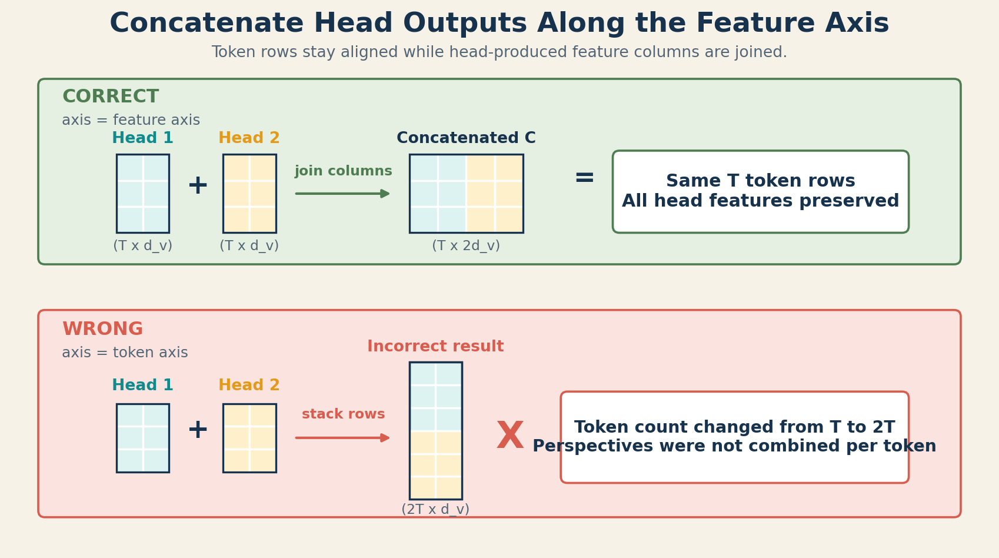
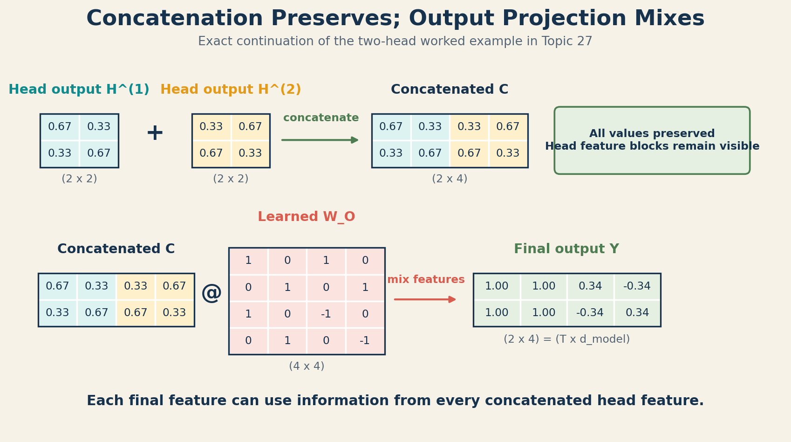

# 27 - TRANSFORMER - Concatenation and Output Projection

## 1. The Problem

Topic 26 ended with one contextual output from each attention head:

$$
\mathbf{H}^{(1)},\mathbf{H}^{(2)},\ldots,\mathbf{H}^{(h)}
$$

Each matrix describes the same $T$ token positions through a different learned
feature subspace. The next layer, however, should receive one representation
per token, not a Python list of separate head outputs.

We therefore have two unresolved problems:

1. How do we preserve every head's features in one matrix?
2. How do we let the model learn how those features should interact?

## 2. Why We Need Something New

We could average the heads, but averaging immediately merges features at the
same coordinate and can discard distinctions between heads.

We could keep the heads separate, but later Transformer operations expect a
single feature vector for each token.

Multi-Head Attention solves this in two stages:

1. **Concatenation** preserves every head output by joining them side by side.
2. **Output projection** uses a learned matrix $\mathbf{W}_O$ to mix those
   joined features into the model's output space.

## 3. One-Line Definition

**Concatenation and output projection** join all head outputs along the feature
axis and apply a learned linear transformation:

$$
\mathbf{Y}
=
\operatorname{Concat}
\left(
\mathbf{H}^{(1)},\ldots,\mathbf{H}^{(h)}
\right)
\mathbf{W}_O
$$

## 4. Beginner Intuition

Imagine that several analysts each write a short report for every business
event.

- Concatenation places all report fields side by side without deleting any.
- Output projection is an editable combination table that decides how much
  each final field should use from every analyst's report.

This analogy is useful for understanding preservation followed by mixing. It
stops being exact because $\mathbf{W}_O$ applies the same learned linear rule
to every token position; it does not read prose, vote, or choose an expert
dynamically.

## 5. What Came Before -> What Changes Now

### Before combination

For $h$ heads, each output has shape:

$$
\mathbf{H}^{(i)} \in \mathbb{R}^{T \times d_v}
$$

Keeping the head axis explicit gives:

$$
\mathbf{H}_{\text{all}}
\in
\mathbb{R}^{h \times T \times d_v}
$$

### After concatenation

The head feature blocks are joined:

$$
\mathbf{C}
=
\operatorname{Concat}
\left(
\mathbf{H}^{(1)},\ldots,\mathbf{H}^{(h)}
\right)
\in
\mathbb{R}^{T \times (h d_v)}
$$

### After output projection

The concatenated matrix is multiplied by:

$$
\mathbf{W}_O
\in
\mathbb{R}^{(h d_v) \times d_{\text{model}}}
$$

to produce:

$$
\mathbf{Y}
=
\mathbf{C}\mathbf{W}_O
\in
\mathbb{R}^{T \times d_{\text{model}}}
$$

## 6. Concatenation: Preserve the Head Features

Suppose two heads each produce a vector with two features for one token:

$$
\mathbf{h}^{(1)} = [a,b]
$$

$$
\mathbf{h}^{(2)} = [c,d]
$$

Concatenating along the feature axis gives:

$$
\operatorname{Concat}
\left(
\mathbf{h}^{(1)},\mathbf{h}^{(2)}
\right)
=
[a,b,c,d]
$$

Nothing is added or averaged. The values retain their head-specific positions.

For a complete sequence:

$$
\mathbf{H}^{(1)}
=
\begin{bmatrix}
a_1 & b_1 \\
a_2 & b_2
\end{bmatrix},
\qquad
\mathbf{H}^{(2)}
=
\begin{bmatrix}
c_1 & d_1 \\
c_2 & d_2
\end{bmatrix}
$$

Then:

$$
\mathbf{C}
=
\begin{bmatrix}
a_1 & b_1 & c_1 & d_1 \\
a_2 & b_2 & c_2 & d_2
\end{bmatrix}
$$

Token rows remain token rows. Only the feature columns are joined.

### The axis matters

Correct feature-axis concatenation:

$$
(T \times d_v) + (T \times d_v)
\longrightarrow
(T \times 2d_v)
$$

Incorrect token-axis concatenation:

$$
(T \times d_v) + (T \times d_v)
\longrightarrow
(2T \times d_v)
$$

The incorrect form makes the model appear to have twice as many tokens. It
changes sequence structure rather than combining perspectives for each token.

**Visual checkpoint:** Correct concatenation keeps the same $T$ token rows and
joins head features as new columns. Stacking along the token axis produces
$2T$ rows and changes the meaning of the sequence.

## 7. Why Concatenation Alone Is Not the Full Operation

Concatenation preserves information, but it does not learn interactions.

After concatenation, the feature layout is still block-structured:

$$
[
\underbrace{\text{head 1 features}}_{d_v}
\mid
\underbrace{\text{head 2 features}}_{d_v}
\mid
\cdots
\mid
\underbrace{\text{head }h\text{ features}}_{d_v}
]
$$

Without another learned transformation, one feature from head 1 cannot be
linearly combined with features from heads 2 and 3 inside this MHA operation.

There is also a shape problem in the general case. Concatenation has width
$h d_v$, while the surrounding model expects width $d_{\text{model}}$. These
widths are equal in the common setting $d_v=d_{\text{model}}/h$, but they are
not required to be equal in every design.

## 8. Output Projection: Learn the Combination

The output projection is:

$$
\mathbf{Y} = \mathbf{C}\mathbf{W}_O
$$

One output cell is:

$$
Y_{t,j}
=
\sum_{r=1}^{h d_v}
C_{t,r}W_{O,r,j}
$$

where:

- $t$ identifies the token row;
- $j$ identifies one final model feature;
- $r$ visits every concatenated feature from every head;
- $C_{t,r}$ is one head-produced feature for token $t$;
- $W_{O,r,j}$ is its learned contribution to final feature $j$.

This means one final feature can combine evidence from all heads.

### What $\mathbf{W}_O$ does not do

- It does not apply Softmax.
- It does not produce a probability distribution.
- It does not select one winning head.
- It does not behave like Mixture-of-Experts routing.
- It does not have a different matrix for every token position.

It is one learned linear map shared across token positions.

An optional bias vector may be included in software implementations:

$$
\mathbf{Y} = \mathbf{C}\mathbf{W}_O + \mathbf{b}_O
$$

The bias is omitted in this topic's calculations so the core operation remains
visible.

## 9. Shape Trace

| Stage | Shape | What changes? |
| :--- | :--- | :--- |
| One head output $\mathbf{H}^{(i)}$ | $(T \times d_v)$ | One contextual view |
| All explicit head outputs | $(h \times T \times d_v)$ | Head axis is separate |
| Transpose for concatenation | $(T \times h \times d_v)$ | Token axis comes first |
| Concatenated $\mathbf{C}$ | $(T \times h d_v)$ | Head and per-head feature axes merge |
| $\mathbf{W}_O$ | $(h d_v \times d_{\text{model}})$ | Learned output map |
| Final $\mathbf{Y}$ | $(T \times d_{\text{model}})$ | One model-space vector per token |

Example:

$$
T=5,\quad h=3,\quad d_v=4,\quad d_{\text{model}}=12
$$

Then:

$$
(3 \times 5 \times 4)
\longrightarrow
(5 \times 3 \times 4)
\longrightarrow
(5 \times 12)
$$

and:

$$
(5 \times 12)(12 \times 12)
\longrightarrow
(5 \times 12)
$$

## 10. Complete Worked Example

Continue the two-head example from Topic 26:

$$
\mathbf{H}^{(1)}
\approx
\begin{bmatrix}
0.670 & 0.330 \\
0.330 & 0.670
\end{bmatrix}
$$

$$
\mathbf{H}^{(2)}
\approx
\begin{bmatrix}
0.330 & 0.670 \\
0.670 & 0.330
\end{bmatrix}
$$

Here:

$$
T=2,\qquad h=2,\qquad d_v=2,\qquad d_{\text{model}}=4
$$

### Step 1: Concatenate along the feature axis

Join corresponding rows:

$$
\mathbf{C}
=
\operatorname{Concat}
\left(
\mathbf{H}^{(1)},\mathbf{H}^{(2)}
\right)
\approx
\begin{bmatrix}
0.670 & 0.330 & 0.330 & 0.670 \\
0.330 & 0.670 & 0.670 & 0.330
\end{bmatrix}
$$

Shape:

$$
(T \times h d_v) = (2 \times 4)
$$

### Step 2: Choose an inspectable output projection

Use:

$$
\mathbf{W}_O
=
\begin{bmatrix}
1 & 0 & 1 & 0 \\
0 & 1 & 0 & 1 \\
1 & 0 & -1 & 0 \\
0 & 1 & 0 & -1
\end{bmatrix}
$$

This is a deliberately chosen teaching matrix:

- output feature 1 adds the first feature from both heads;
- output feature 2 adds the second feature from both heads;
- output feature 3 subtracts head 2's first feature from head 1's;
- output feature 4 subtracts head 2's second feature from head 1's.

### Step 3: Calculate the first output row

For token row 1:

$$
\begin{aligned}
Y_{1,1} &= 0.670 + 0.330 = 1.000 \\
Y_{1,2} &= 0.330 + 0.670 = 1.000 \\
Y_{1,3} &= 0.670 - 0.330 = 0.340 \\
Y_{1,4} &= 0.330 - 0.670 = -0.340
\end{aligned}
$$

For token row 2:

$$
\begin{aligned}
Y_{2,1} &= 0.330 + 0.670 = 1.000 \\
Y_{2,2} &= 0.670 + 0.330 = 1.000 \\
Y_{2,3} &= 0.330 - 0.670 = -0.340 \\
Y_{2,4} &= 0.670 - 0.330 = 0.340
\end{aligned}
$$

Therefore:

$$
\mathbf{Y}
=
\mathbf{C}\mathbf{W}_O
\approx
\begin{bmatrix}
1.000 & 1.000 & 0.340 & -0.340 \\
1.000 & 1.000 & -0.340 & 0.340
\end{bmatrix}
$$

Shape:

$$
(2 \times 4)(4 \times 4) = (2 \times 4)
$$

### What the result shows

The first two output features combine similar coordinates from both heads.
The last two compare the heads. A learned $\mathbf{W}_O$ is not restricted to
these exact operations; gradient descent can learn any linear combination
supported by its dimensions.

**How to read the image:** Concatenation preserves the teal and amber feature
blocks. Multiplication by $\mathbf{W}_O$ then allows every final output feature
to combine values from both blocks.

## 11. Mathematics -> NumPy

Topic 26 returned:

- all head outputs with shape $(h,T,d_v)$;
- all attention matrices with shape $(h,T,T)$.

Only the head outputs are combined here. The attention matrices remain
separate so they can be visualized and inspected.

~~~python
import numpy as np

def combine_heads(head_outputs, W_O, b_O=None):
    """
    head_outputs: (h, T, d_v)
    W_O:          (h * d_v, d_model)
    b_O:          (d_model,), optional
    """
    h, T, d_v = head_outputs.shape

    # Put tokens first: (h, T, d_v) -> (T, h, d_v)
    token_first = head_outputs.transpose(1, 0, 2)

    # Merge only the head and per-head feature axes.
    concatenated = token_first.reshape(T, h * d_v)

    # Mix all concatenated features into model space.
    output = concatenated @ W_O

    if b_O is not None:
        output = output + b_O

    return output, concatenated
~~~

For two explicitly named head matrices, NumPy can also concatenate directly:

~~~python
concatenated = np.concatenate([head_1, head_2], axis=-1)
~~~

Both forms produce $(T,h d_v)$ when the axes are arranged correctly.

### Verify the worked example

~~~python
head_1 = np.array([
    [0.670, 0.330],
    [0.330, 0.670],
])

head_2 = np.array([
    [0.330, 0.670],
    [0.670, 0.330],
])

head_outputs = np.stack([head_1, head_2])  # (2, 2, 2)

W_O = np.array([
    [1.0, 0.0,  1.0,  0.0],
    [0.0, 1.0,  0.0,  1.0],
    [1.0, 0.0, -1.0,  0.0],
    [0.0, 1.0,  0.0, -1.0],
])

output, concatenated = combine_heads(head_outputs, W_O)

print("Concatenated shape:", concatenated.shape)  # (2, 4)
print("Output shape:", output.shape)              # (2, 4)
print(np.round(output, 3))
~~~

Expected output:

~~~text
[[ 1.    1.    0.34 -0.34]
 [ 1.    1.   -0.34  0.34]]
~~~

## 12. How $\mathbf{W}_O$ Learns

$\mathbf{W}_O$ is initialized like other model weights and updated during
training.

At a high level:

1. MHA produces $\mathbf{Y}$.
2. Later model operations contribute to a prediction.
3. The loss measures prediction error.
4. Backpropagation calculates how changes in $\mathbf{W}_O$ would affect the
   loss.
5. The optimizer updates $\mathbf{W}_O$.

The gradient also flows backward through concatenation into every head.
Concatenation has no learned parameters; it only rearranges values. The
learnable behavior comes from the projection matrices and $\mathbf{W}_O$.

## 13. Experiments and What-If Questions

1. Replace $\mathbf{W}_O$ with the identity matrix when
   $h d_v=d_{\text{model}}$. Confirm that the output equals the concatenated
   matrix.
2. Set all rows of $\mathbf{W}_O$ associated with head 2 to zero. Predict which
   head can influence the final output.
3. Swap the order of head 1 and head 2 during concatenation without changing
   $\mathbf{W}_O$. Explain why the output changes.
4. Average the heads instead of concatenating them. Compare the shape and
   identify which head-specific information becomes inseparable.
5. Concatenate on axis $0$ deliberately. Inspect the incorrect shape and
   explain why it now represents extra token rows.
6. Use a non-square $\mathbf{W}_O$ where $h d_v \ne d_{\text{model}}$ to verify
   that output projection can restore the required model width.

## 14. Common Misunderstandings

**Misunderstanding: Concatenation adds the head outputs.**

Concatenation joins features side by side. Addition or averaging combines
values immediately and does not increase feature width.

**Misunderstanding: Heads should be concatenated along the token axis.**

They must be joined along the feature axis so each token receives all
head-produced features.

**Misunderstanding: If $h d_v=d_{\text{model}}$, $\mathbf{W}_O$ is useless.**

Matching shapes only means a projection is not needed for width conversion.
$\mathbf{W}_O$ still provides learned cross-head feature mixing.

**Misunderstanding: $\mathbf{W}_O$ uses attention to choose the best head.**

$\mathbf{W}_O$ is a linear projection. There is no head-selection Softmax or
Mixture-of-Experts gate.

**Misunderstanding: Attention heatmaps are concatenated and projected.**

The contextual head outputs $\mathbf{H}^{(i)}$ are combined. The attention
weight matrices $\mathbf{A}^{(i)}$ remain useful as separate inspection
artifacts.

**Misunderstanding: Reshape alone always performs the right concatenation.**

Reshape preserves memory order; it does not understand semantic axes. Starting
from $(h,T,d_v)$, transpose to $(T,h,d_v)$ before reshaping.

## 15. Limitations and Trade-Offs

- Concatenation increases temporary feature width to $h d_v$.
- $\mathbf{W}_O$ adds $(h d_v)d_{\text{model}}$ learned parameters, plus an
  optional bias.
- Output projection is linear; nonlinear processing occurs elsewhere in the
  Transformer.
- A learned projection can mix heads, but it does not guarantee every head is
  useful or unique.
- Interpreting one head in isolation can be incomplete because $\mathbf{W}_O$
  may combine its features strongly with other heads.

## 16. Where It Appears in the Week 4 Assignment

The assignment asks: "How should the model combine these four opinions into one
final decision?"

For standard MHA, the immediate answer is:

$$
\text{separate contextual head outputs}
\longrightarrow
\text{feature concatenation}
\longrightarrow
\text{learned output projection}
$$

This creates one combined representation per token. It does not itself produce
the final ForecastIQ business decision. A later prediction layer and training
objective use that representation to make a prediction.

The NumPy implementation should expose:

- each $\mathbf{H}^{(i)}$;
- concatenated $\mathbf{C}$;
- $\mathbf{W}_O$;
- final $\mathbf{Y}$;
- every intermediate shape.

## 17. Where It Appears in Modern AI Systems

Concatenation and output projection are part of the canonical Multi-Head
Attention definition in the original Transformer. Implementations often
compute all Q/K/V projections together and use reshape and transpose operations
instead of Python loops, but the mathematical stages remain equivalent.

Residual connections and Layer Normalization are surrounding Transformer-block
operations, not replacements for $\mathbf{W}_O$. They remain a high-level
preview for this week.

## 18. Connection to the Next Concept

We can now compute a complete MHA output:

$$
\mathbf{Y}
=
\operatorname{Concat}
\left(
\mathbf{H}^{(1)},\ldots,\mathbf{H}^{(h)}
\right)
\mathbf{W}_O
$$

The next question is empirical: did training make the heads learn different
and useful patterns, or did some become redundant?

Topic 28, **Inspecting Specialization and Redundancy in Attention Heads**,
teaches how to inspect heatmaps, compare heads, and perform ablation without
turning expectations into unsupported claims.

## 19. Teach-Back, Revision, and Flashcards

### Teach-back

Suppose:

$$
T=6,\qquad h=4,\qquad d_v=3,\qquad d_{\text{model}}=12
$$

1. What is the shape of one head output?
2. What is the shape after concatenating all four heads?
3. What must the shape of $\mathbf{W}_O$ be?
4. What is the final output shape?
5. Why must concatenation use the feature axis?
6. What can $\mathbf{W}_O$ learn that concatenation alone cannot?

### Quick revision

- Concatenation preserves all head-produced features.
- Heads are joined along the feature axis, not the token axis.
- $h$ matrices of $(T \times d_v)$ become one $(T \times h d_v)$ matrix.
- $\mathbf{W}_O$ has shape $(h d_v \times d_{\text{model}})$.
- The final MHA output has shape $(T \times d_{\text{model}})$.
- $\mathbf{W}_O$ learns cross-head feature combinations.
- Attention matrices remain separate for visualization and analysis.

### Flashcards

What is concatenated in Multi-Head Attention? #card

The contextual outputs $\mathbf{H}^{(i)}$ from all heads are concatenated along
their feature dimension.

If four heads each output $(T \times 8)$, what is the concatenated shape? #card

$(T \times 32)$.

What is the shape of $\mathbf{W}_O$? #card

$(h d_v \times d_{\text{model}})$.

Why is output projection useful when $h d_v=d_{\text{model}}$ already? #card

It learns how features from different heads should be mixed, even though no
width conversion is required.

Does $\mathbf{W}_O$ select one winning attention head? #card

No. It linearly combines concatenated head features and does not use a
head-selection Softmax.

## 20. My Understanding

Complete these statements in your own words:

1. Concatenation is necessary because...
2. Concatenation must use the feature axis because...
3. Concatenation alone cannot...
4. $\mathbf{W}_O$ learns...
5. The difference between MHA output projection and expert routing is...
6. The evidence I would inspect next is...

## 21. Sources

- Vaswani et al. (2017), [Attention Is All You Need](https://arxiv.org/abs/1706.03762), Section 3.2.2.
- Alammar and Grootendorst, [Hands-on Large Language Models](../resources/references/Hands-on-%20Large%20Language%20Models.md), Chapter 3.
