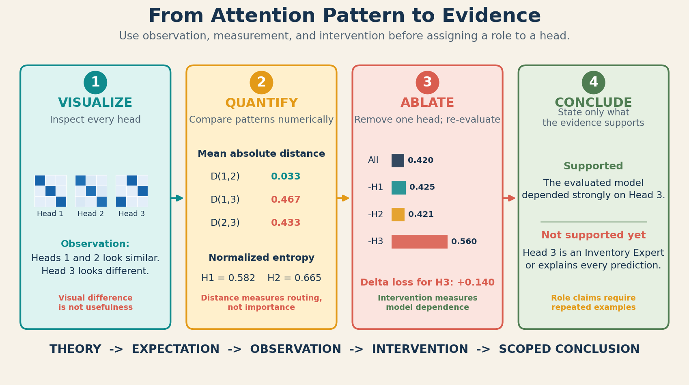
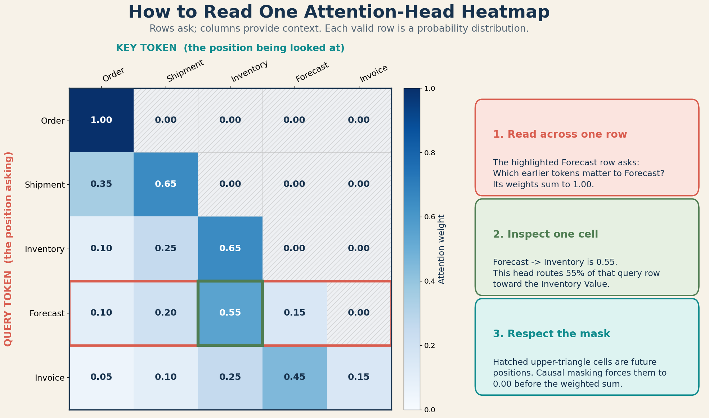

# 28 - TRANSFORMER - Inspecting Specialization and Redundancy in Attention Heads

## 1. The Problem

Topics 26 and 27 explain what Multi-Head Attention can represent:

- each head has independent Q/K/V projections;
- each head produces its own attention matrix;
- the contextual head outputs are concatenated;
- $\mathbf{W}_O$ mixes the head features.

Those mechanics do not tell us what a trained head actually learned.

If two heatmaps look different, we still do not know whether either pattern
helps the prediction. If two heatmaps look similar, we still do not know
whether one head can be removed safely. A visually appealing pattern is an
observation, not a complete explanation.

## 2. Why We Need Evidence

The Week 4 assignment asks whether heads learn different relationships and
whether every head learns something unique. These questions cannot be answered
from architecture alone.

We need an evidence process that separates:

1. **Theory:** what MHA makes possible.
2. **Expectation:** what we predict may emerge after training.
3. **Observation:** what the trained model produced.
4. **Intervention:** what changes when a head is removed.

Without this separation, it is easy to name a head "Inventory Expert" merely
because one cell in one heatmap is bright.

## 3. One-Line Definition

**Head analysis** combines visual inspection, numerical comparison, and
controlled ablation to investigate whether trained attention heads show
different patterns, consistent specialization, or functional redundancy.

## 4. The Evidence Ladder

Not all evidence answers the same question.

| Evidence | What it can show | What it cannot establish alone |
| :--- | :--- | :--- |
| Shape and row-sum checks | Implementation is structurally plausible | Learned usefulness |
| One heatmap | Routing weights for one example | Stable specialization |
| Heatmaps across examples | Repeated visual patterns | Causal importance |
| Pairwise matrix distance | Heads route differently or similarly | Effect on prediction |
| Group attention mass | Attention sent to a chosen token group | Why prediction changed |
| Head ablation | Model dependence on that head under the test | Human-readable role |
| Repeated seeds and evaluation sets | Stability of the finding | Universal behavior in all models |

A strong conclusion usually uses several levels rather than one.

**Evidence rule:** Visualization creates an observation, numerical comparison
measures the pattern, and ablation tests model dependence. A role label belongs
only in a scoped conclusion supported by repeated evidence.

## 5. Specialization and Redundancy

### Specialization

A head shows evidence of specialization when it consistently responds to a
particular kind of relationship across relevant examples and its contribution
matters to model behavior.

For example, a head may repeatedly route Forecast queries toward Inventory
tokens. That recurring pattern is evidence of routing specialization.
Ablation that worsens forecast loss provides additional evidence that the head
is useful.

The cautious wording matters:

- "Head 2 often assigns high attention mass to Inventory for Forecast queries"
  is an observation.
- "Head 2 is the model's Inventory Expert" is a much stronger interpretation
  that may not be justified.

### Representational similarity

Two heads are representationally similar when their attention matrices or
contextual outputs are numerically similar on the evaluated examples.

### Functional redundancy

A head is functionally redundant for a particular model, dataset, and metric
when removing it causes little meaningful degradation because other pathways
can compensate.

Similarity and redundancy are not identical:

- similar heatmaps can still use different Value projections;
- different heatmaps can produce similar contextual outputs;
- $\mathbf{W}_O$ may strongly use one head and nearly ignore another;
- two heads may be individually removable but jointly necessary.

## 6. What an Attention Heatmap Shows

For head $i$:

$$
\mathbf{A}^{(i)}
\in
\mathbb{R}^{T \times T}
$$

In the heatmap:

- row $q$ is the query-token position;
- column $k$ is the key-token position;
- cell $A^{(i)}_{q,k}$ is the attention weight from query $q$ to key $k$;
- each unmasked row sums to approximately $1$;
- a brighter cell represents a larger attention weight in that row.

For a causal model, future-token cells must be zero. A triangular heatmap is
therefore partly caused by the mask, not purely by learned specialization.

### What the heatmap omits

The heatmap does not show:

- the Value vectors being combined;
- the content of the resulting head output;
- how $\mathbf{W}_O$ uses that head;
- residual pathways around the attention sublayer;
- downstream transformations;
- whether changing that attention pattern would change the prediction.

Attention weights are useful internal observations, but they should not be
treated automatically as a complete causal explanation.

**How to read the image:** Select one query row, compare its key columns, and
verify that the valid weights sum to $1$. The highlighted
Forecast-to-Inventory cell shows routing inside one head; the hatched cells
show restrictions imposed by the causal mask.

## 7. Compare Heads Numerically

Visual comparison is helpful, but it can be subjective. A simple pairwise
measure is mean absolute difference.

For heads $i$ and $j$:

$$
D_{i,j}
=
\frac{1}{T^2}
\sum_{q=1}^{T}
\sum_{k=1}^{T}
\left|
A^{(i)}_{q,k} - A^{(j)}_{q,k}
\right|
$$

Interpretation:

- $D_{i,j}=0$ means the attention matrices are identical;
- a larger value means the routing weights differ more on that example;
- no universal threshold converts this value into "specialized" or
  "redundant."

For causal attention, compare only valid unmasked cells when sequence lengths
or masks differ. Otherwise structural zeros can dominate the result.

## 8. Measure Concentration with Entropy

One head may spread attention broadly while another concentrates it on a few
keys. Row entropy measures this concentration.

For query row $q$ in head $i$:

$$
E^{(i)}_q
=
-
\sum_{k=1}^{T}
A^{(i)}_{q,k}
\log
\left(
A^{(i)}_{q,k} + \epsilon
\right)
$$

where $\epsilon$ is a tiny value that prevents $\log(0)$ in code.

For an unmasked row:

- entropy near $0$ means attention is highly concentrated;
- entropy near $\log(T)$ means attention is close to uniform.

Normalized entropy is:

$$
\widetilde{E}^{(i)}_q
=
\frac{E^{(i)}_q}{\log(T)}
$$

and lies approximately between $0$ and $1$.

Low attention entropy does not mean high prediction confidence. It only means
the head's routing distribution is concentrated.

## 9. Measure Attention to a Business Group

Suppose a business hypothesis defines a key-token group:

$$
G_{\text{inventory}}
=
\{
\text{Inventory},\text{Restock},\text{Receive}
\}
$$

For query position $q$, the attention mass from head $i$ to that group is:

$$
M^{(i)}(q,G)
=
\sum_{k \in G}
A^{(i)}_{q,k}
$$

This can test a specific prediction:

> For Forecast queries, Head 2 may send more attention mass to inventory-related
> tokens than the other heads.

The group must be defined before inspecting the result when possible. Creating
a group after seeing the brightest cells risks fitting the explanation to the
observation.

High group mass shows routing toward that group. It does not prove that the
group caused the final prediction.

## 10. Head Ablation

An ablation is a controlled intervention. To ablate head $i$, set its contextual
output to zero before concatenation:

$$
\widetilde{\mathbf{H}}^{(i)}
=
\mathbf{0}
$$

All other parameters remain fixed. Then evaluate the trained model again.

Let:

$$
L_{\text{base}}
=
\text{loss with every head active}
$$

and:

$$
L_{-i}
=
\text{loss with head }i\text{ ablated}
$$

Define:

$$
\Delta L_i = L_{-i} - L_{\text{base}}
$$

Interpretation on the measured evaluation set:

- large positive $\Delta L_i$: the model depended strongly on that head;
- near-zero $\Delta L_i$: the head may be redundant, weakly used, or
  compensated for by other pathways;
- negative $\Delta L_i$: removing the head improved this measured loss, which
  may indicate interference, overfitting, or measurement variance.

Use evaluation loss rather than one prediction whenever possible.

### Ablation without retraining

Zero one head and evaluate immediately. This asks:

> How much does the current trained model depend on this head?

### Pruning followed by retraining

Remove a head and then fine-tune or retrain. This asks a different question:

> Can the remaining model adapt and recover without this head?

Do not mix the two conclusions.

## 11. Complete Worked Example

Consider three attention heads over a sequence of length $T=3$:

$$
\mathbf{A}^{(1)}
=
\begin{bmatrix}
0.80 & 0.10 & 0.10 \\
0.10 & 0.80 & 0.10 \\
0.10 & 0.10 & 0.80
\end{bmatrix}
$$

$$
\mathbf{A}^{(2)}
=
\begin{bmatrix}
0.75 & 0.15 & 0.10 \\
0.10 & 0.75 & 0.15 \\
0.15 & 0.10 & 0.75
\end{bmatrix}
$$

$$
\mathbf{A}^{(3)}
=
\begin{bmatrix}
0.10 & 0.80 & 0.10 \\
0.10 & 0.10 & 0.80 \\
0.80 & 0.10 & 0.10
\end{bmatrix}
$$

Every row sums to $1$.

### Step 1: Compare Heads 1 and 2

The absolute difference is:

$$
\left|
\mathbf{A}^{(1)}-\mathbf{A}^{(2)}
\right|
=
\begin{bmatrix}
0.05 & 0.05 & 0.00 \\
0.00 & 0.05 & 0.05 \\
0.05 & 0.00 & 0.05
\end{bmatrix}
$$

The entries sum to $0.30$, so:

$$
D_{1,2}
=
\frac{0.30}{9}
\approx
0.033
$$

These heads have similar attention routing on this example.

### Step 2: Compare Heads 1 and 3

Each row has an absolute-difference sum of $1.40$. Therefore:

$$
D_{1,3}
=
\frac{3(1.40)}{9}
\approx
0.467
$$

Heads 1 and 3 route attention very differently on this example.

Similarly:

$$
D_{2,3}
=
\frac{3.90}{9}
\approx
0.433
$$

### Step 3: Measure concentration

Every row of Head 1 has distribution $[0.8,0.1,0.1]$ in some order:

$$
E^{(1)}
=
-
\left(
0.8\log 0.8
+
0.1\log 0.1
+
0.1\log 0.1
\right)
\approx
0.639
$$

Since $\log(3)\approx1.099$:

$$
\widetilde{E}^{(1)}
\approx
\frac{0.639}{1.099}
\approx
0.582
$$

Head 2 has normalized entropy of approximately $0.665$, so it is slightly more
diffuse. Head 3 has the same entropy as Head 1 because it contains the same
probabilities in different positions.

Entropy detects concentration, not which positions receive attention.

### Step 4: Add hypothetical ablation evidence

Suppose these are measured evaluation losses from a trained model:

| Evaluation condition | Loss | Change from baseline |
| :--- | ---: | ---: |
| All heads active | $0.420$ | $0.000$ |
| Head 1 ablated | $0.425$ | $+0.005$ |
| Head 2 ablated | $0.421$ | $+0.001$ |
| Head 3 ablated | $0.560$ | $+0.140$ |

For this hypothetical experiment:

- Heads 1 and 2 have similar heatmaps and small individual ablation effects,
  which is evidence consistent with possible redundancy.
- Head 3 has a different pattern and a large ablation effect, which is stronger
  evidence that the current model uses it.

We still cannot claim that Head 3 has a specific semantic role. To support that
claim, we would need consistent relation-level observations across examples.

## 12. Visualize Every Head

~~~python
import matplotlib.pyplot as plt
import numpy as np

def plot_attention_heads(attention_weights, tokens):
    """
    attention_weights: (h, T, T)
    tokens: sequence of T labels
    """
    h, T, key_count = attention_weights.shape
    assert T == key_count
    assert len(tokens) == T

    fig, axes = plt.subplots(
        1,
        h,
        figsize=(4 * h, 4),
        squeeze=False,
        constrained_layout=True,
    )
    axes = axes[0]

    for head_index, ax in enumerate(axes):
        matrix = attention_weights[head_index]
        image = ax.imshow(matrix, vmin=0.0, vmax=1.0, cmap="Blues")

        ax.set_title(f"Head {head_index + 1}")
        ax.set_xlabel("Key token")
        ax.set_ylabel("Query token")
        ax.set_xticks(range(T), tokens, rotation=45, ha="right")
        ax.set_yticks(range(T), tokens)

        if T <= 8:
            for query_index in range(T):
                for key_index in range(T):
                    value = matrix[query_index, key_index]
                    ax.text(
                        key_index,
                        query_index,
                        f"{value:.2f}",
                        ha="center",
                        va="center",
                        fontsize=8,
                    )

    fig.colorbar(image, ax=axes.tolist(), label="Attention weight", shrink=0.8)
    return fig
~~~

Use the same color scale for every head. Separate automatic color scales can
make small differences look larger than they are.

## 13. Numerical Inspection Code

### Validate row sums

~~~python
def validate_attention(attention_weights, atol=1e-6):
    row_sums = attention_weights.sum(axis=-1)
    if not np.allclose(row_sums, 1.0, atol=atol):
        raise ValueError("Every attention row must sum to approximately 1.")
    return row_sums
~~~

### Pairwise mean absolute difference

~~~python
def pairwise_attention_distance(attention_weights, valid_mask=None):
    """
    attention_weights: (h, T, T)
    valid_mask: optional (T, T) boolean mask
    """
    h = attention_weights.shape[0]
    distances = np.zeros((h, h))

    if valid_mask is None:
        valid_mask = np.ones(attention_weights.shape[1:], dtype=bool)

    for first in range(h):
        for second in range(h):
            difference = np.abs(
                attention_weights[first] - attention_weights[second]
            )
            distances[first, second] = difference[valid_mask].mean()

    return distances
~~~

### Normalized row entropy

~~~python
def normalized_attention_entropy(attention_weights, valid_counts=None):
    """
    Returns entropy per head and query row with shape (h, T).
    """
    epsilon = 1e-12
    safe_weights = np.clip(attention_weights, epsilon, 1.0)
    entropy = -np.sum(
        attention_weights * np.log(safe_weights),
        axis=-1,
    )

    T = attention_weights.shape[-1]
    if valid_counts is None:
        valid_counts = np.full(attention_weights.shape[1], T)

    normalizer = np.log(np.maximum(valid_counts, 2))
    return entropy / normalizer[None, :]
~~~

For causal attention, query rows have different numbers of valid keys. Passing
the valid count per row prevents early causal rows from being compared against
the wrong maximum entropy.

### Attention mass to a chosen token group

~~~python
def attention_mass_to_group(attention_weights, key_indices):
    """
    Returns (h, T): group mass for each head and query position.
    """
    return attention_weights[:, :, key_indices].sum(axis=-1)
~~~

## 14. Ablation Code

This code assumes the combination function from Topic 27 is available.

~~~python
def evaluate_head_ablation(
    head_outputs,
    W_O,
    predict_fn,
    targets,
    loss_fn,
):
    """
    head_outputs: (h, T, d_v) from a trained model
    predict_fn: maps the combined MHA output to predictions
    """
    def evaluate(outputs):
        combined, _ = combine_heads(outputs, W_O)
        predictions = predict_fn(combined)
        return float(loss_fn(predictions, targets))

    baseline_loss = evaluate(head_outputs)
    results = []

    for head_index in range(head_outputs.shape[0]):
        ablated = head_outputs.copy()
        ablated[head_index] = 0.0

        ablated_loss = evaluate(ablated)
        results.append({
            "head": head_index,
            "loss": ablated_loss,
            "delta_loss": ablated_loss - baseline_loss,
        })

    return baseline_loss, results
~~~

For a real evaluation, accumulate loss over the complete held-out dataset.
One sequence can be inspected as a case study but is too small for a general
importance claim.

## 15. A Reliable Week 4 Experiment

### Step 1: Define the prediction before training

Write a hypothesis such as:

> At least one trained head may route Forecast queries toward Inventory more
> strongly than it did before training.

Do not predict exact named head numbers because head identities can change
across random seeds.

### Step 2: Save the baseline

Record:

- random seed;
- untrained loss;
- untrained attention matrices;
- row sums and shapes.

Different random heads are evidence of different initialization, not learned
specialization.

### Step 3: Train the full model

Use the same training data and objective for every comparison. Record the loss
curve and final held-out loss.

### Step 4: Inspect multiple examples

Include:

- examples that contain Forecast and Inventory;
- examples with other business relationships;
- examples where the expected relationship is absent.

A real specialization claim should survive more than one carefully selected
example.

### Step 5: Quantify patterns

For each head, record:

- pairwise attention distance;
- normalized entropy;
- attention mass to predefined token groups;
- variation across examples.

### Step 6: Ablate one head at a time

Evaluate held-out loss with each head zeroed. Keep the model weights fixed.

### Step 7: Repeat with multiple seeds

Head 1 in one run is not equivalent to Head 1 in another run. Compare patterns
and performance, not just numeric head labels.

### Step 8: Report the evidence boundary

Use language such as:

- "We observed..."
- "This is consistent with..."
- "This does not prove..."
- "A stronger test would be..."

## 16. Theory vs Expectation vs Observation

| Category | Appropriate Week 4 statement |
| :--- | :--- |
| Theory | Independent projections allow heads to produce different attention patterns. |
| Expectation | Some heads may focus on different business relationships after training. |
| Observation | On seed 3, Head 2 assigned $0.61$ attention mass to inventory-related keys for Forecast queries. |
| Intervention | Ablating Head 2 increased held-out loss from $0.42$ to $0.56$. |
| Cautious conclusion | The model used Head 2, and its routing was associated with inventory tokens on the evaluated examples. |
| Unsupported conclusion | Head 2 understands inventory and explains every ForecastIQ decision. |

Replace the example numbers with actual measured values from the implementation.

## 17. Common Misunderstandings

**Misunderstanding: Different-looking heads must have different useful roles.**

Different attention matrices establish different routing only. Their Value
outputs or contributions through $\mathbf{W}_O$ may still be unimportant.

**Misunderstanding: Similar heatmaps prove one head is redundant.**

The Value projections and output projection can make similar attention patterns
function differently. Use ablation evidence.

**Misunderstanding: A near-zero ablation effect proves a head is universally
useless.**

The conclusion is limited to the evaluated model, data, metric, and ablation
method. Other heads may compensate.

**Misunderstanding: Low entropy means the model is confident.**

Low entropy means one attention row is concentrated. Prediction confidence is a
different quantity.

**Misunderstanding: A diagonal pattern is always learned specialization.**

Position, causal masking, repeated tokens, and dataset structure can produce
simple patterns. Compare against baselines and masks.

**Misunderstanding: The brightest cell explains the prediction.**

The final result also depends on Values, $\mathbf{W}_O$, other layers, and
downstream computation.

**Misunderstanding: Heads keep stable names across training runs.**

Head order has no fixed business meaning. Different seeds can place similar
functions in different head indices.

## 18. Limitations and Trade-Offs

- Heatmaps become difficult to inspect for long sequences.
- Averages can hide example-specific behavior.
- Pairwise distance measures routing similarity, not causal importance.
- Single-head ablations miss interactions between groups of heads.
- Zeroing a head creates an input pattern the downstream model did not see
  during training.
- Choosing important heads on a test set leaks test information; use validation
  data for model decisions.
- Small evaluation sets can make ablation changes noisy.
- Attention-based interpretation remains incomplete because the full model has
  other computational paths.

Published pruning results demonstrate that redundancy can occur in trained
Transformers. They do not imply that every model can discard the same fraction
of heads or that the Week 4 model will reproduce those exact results.

## 19. Where It Appears in the Week 4 Assignment

The Week 4 deliverables require:

- visualizing every head;
- comparing attention patterns;
- explaining what each head appears to have learned;
- asking whether every head is unique;
- testing what happens if one head disappears.

The evidence sequence should be:

$$
\text{train}
\longrightarrow
\text{visualize}
\longrightarrow
\text{quantify}
\longrightarrow
\text{ablate}
\longrightarrow
\text{interpret cautiously}
$$

For the ForecastIQ challenge, do not force business labels into standard heads.
Let training optimize the task, then test whether any stable business-related
patterns emerged.

## 20. Where It Appears in Modern AI Research

Research on trained Transformers has found both important specialized heads and
substantial redundancy in particular models and tasks.

Michel, Levy, and Neubig found that many attention heads in their evaluated NLP
models could be removed at test time with little performance impact, while
dependence on multiple heads varied by attention type and layer.

Voita and colleagues found that some important heads had consistent,
linguistically interpretable functions in their machine-translation models and
that specialized heads tended to survive their pruning procedure.

These findings support a balanced conclusion:

- MHA permits specialization;
- some specialization can emerge and matter;
- redundancy can also emerge;
- the result must be measured for the model under study.

## 21. Connection to the Next Learning Step

The permanent Week 4 topic sequence is now complete:

$$
\text{independent heads}
\longrightarrow
\text{concatenation and output projection}
\longrightarrow
\text{evidence about trained heads}
$$

The next step is implementation:

1. build the small NumPy MHA forward pass;
2. expose every intermediate shape;
3. train the small prediction model;
4. save per-head heatmaps;
5. compare and ablate heads;
6. record actual evidence in the Week 4 reflection.

Residual connections and Layer Normalization can be previewed at a high level,
but their full mechanics belong to the later Transformer-block learning path.

## 22. Teach-Back and Small Application

For a trained four-head model, suppose:

- Heads 1 and 2 have pairwise distance $0.02$;
- Heads 1 and 3 have pairwise distance $0.41$;
- ablating Head 1 changes loss by $+0.001$;
- ablating Head 2 changes loss by $+0.003$;
- ablating Head 3 changes loss by $+0.18$.

Answer:

1. What do the distance values say?
2. What do they not say?
3. Which head has the strongest measured individual contribution?
4. What evidence is consistent with possible redundancy?
5. Why can we not call Head 3 an "Inventory Head" from these numbers?
6. What additional observations would support that label?

## 23. Quick Revision

- Architecture permits different heads; training does not guarantee uniqueness.
- A heatmap shows attention routing for one head and example.
- Pairwise distance compares attention patterns.
- Entropy measures concentration, not prediction confidence.
- Group attention mass tests a predefined routing hypothesis.
- Ablation measures model dependence under a controlled intervention.
- Similarity is not the same as functional redundancy.
- Attention weights are not a complete explanation of model predictions.
- Claims must remain tied to the evaluated model, data, seed, and metric.

## 24. My Understanding

Complete these statements with evidence from your implementation:

1. Before training, I expected...
2. After training, Head 1 actually...
3. The closest pair of heads was...
4. Their pairwise distance was...
5. The most concentrated head was...
6. Ablating Head ... changed loss by...
7. This evidence supports...
8. This evidence does not prove...
9. Across random seeds...
10. My strongest remaining question is...

## 25. Flashcards

What does an attention heatmap show? #card

It shows the normalized query-to-key attention weights for one head and input.

Does a different heatmap prove useful specialization? #card

No. It proves different routing on that input. Use consistency and ablation to
test usefulness.

What is functional head redundancy? #card

A head is functionally redundant for a measured setting when removing it causes
little meaningful performance degradation because other pathways compensate.

What does pairwise mean absolute difference compare? #card

It compares the numerical difference between two attention matrices. It does
not measure causal importance.

What does normalized attention entropy measure? #card

How concentrated or diffuse an attention row is relative to its valid keys.

What is head ablation? #card

Zeroing or removing one head's contextual output while holding the rest of the
trained model fixed, then measuring the change in performance.

Why should analysis use multiple examples and seeds? #card

One example or seed may produce unstable patterns that do not generalize.

Why is attention not automatically a complete explanation? #card

Predictions also depend on Value vectors, output projection, other layers, and
downstream computation.

## 26. Sources

- Michel, Levy, and Neubig (2019), [Are Sixteen Heads Really Better than One?](https://proceedings.neurips.cc/paper/2019/hash/2c601ad9d2ff9bc8b282670cdd54f69f-Abstract.html).
- Voita et al. (2019), [Analyzing Multi-Head Self-Attention: Specialized Heads Do the Heavy Lifting, the Rest Can Be Pruned](https://aclanthology.org/P19-1580/).
- Jain and Wallace (2019), [Attention is not Explanation](https://aclanthology.org/N19-1357/).
- Wiegreffe and Pinter (2019), [Attention is not not Explanation](https://aclanthology.org/D19-1002/).
