# 01 - Next-Token Prediction to Transformation

## 1. The Problem

Imagine a simple text classification model that reads a clinical note and outputs `[SAFE]` or `[CONTAINS_PHI]`. This is useful for flagging files, but what if we actually want to *share* the note for research without violating privacy? 
We have the source note:
`PATIENT John Smith DIAGNOSIS NSCLC`

But our goal is a completely new sequence where identifiers are gone but clinical facts remain:
`PATIENT [NAME] DIAGNOSIS NSCLC`

A classification model cannot generate a new sequence. 

## 2. Why We Need Something New

If we only flag words (Token Classification), we have to write separate rules to assemble a new string, handle variable lengths, and maintain grammar. What if a model could just read the original note and naturally "speak" the de-identified version back to us? We need a mechanism that can take a prompt and generate a transformed sequence from scratch.

## 3. One-Line Definition

**Autoregressive sequence transformation** is the process of training a language model to generate a modified version of an input text by predicting it one token at a time as a natural continuation.

## 4. Beginner Intuition / Mental Model

Think of the model as a highly trained medical scribe. 
You hand the scribe a piece of paper with a patient's chart. At the bottom, there is a bold line. 
The scribe's *only* job is to continue writing below the line. But they have been trained that whenever they see this bold line, they must re-write everything above it, swapping out names and dates for placeholders. 
The "bold line" is our `<OUTPUT>` control token. The model is simply continuing the document, but its continuation happens to be a transformation.

## 5. What Came Before → What Changes Now

* **Before (Token Classification):** Assigning a label (e.g., `NAME`, `O`) to every single input token. Output length equals input length.
* **Now (Sequence Generation):** The model predicts the first token of the *new* string, appends it, and predicts the next. The output length is learned and flexible.

## 6. How It Works

We convert the application task into a sequence-completion problem using control tokens:

| Token | Meaning |
|---|---|
| `<BOS>` | The sequence begins here |
| `<INPUT>` | The original note follows |
| `<OUTPUT>` | The bold line: begin generating the transformed note |
| `<EOS>` | The transformed note is complete |

For training, we join the input and desired output into one long string:
`<BOS> <INPUT> PATIENT John DIAGNOSIS NSCLC <OUTPUT> PATIENT [NAME] DIAGNOSIS NSCLC <EOS>`

The model learns that text after `<OUTPUT>` should be a transformed continuation of the text after `<INPUT>`.

## 7. Visual Diagram

```mermaid
flowchart TD
    subgraph Context
        BOS["<BOS>"] --> IN["<INPUT>"]
        IN --> P1[PATIENT]
        P1 --> J[John]
        J --> OUT["<OUTPUT>"]
    end
    
    subgraph Generation Loop
        OUT -->|Predicts| Next1(PATIENT)
        Next1 -->|Appended to context, predicts| Next2("[NAME]")
        Next2 -->|Appended to context, predicts| Next3("<EOS>")
    end

    style Context fill:#e1f5fe,stroke:#0288d1
    style Generation Loop fill:#e8f5e9,stroke:#388e3c
```



## 8. Required Mathematics 

For a sequence $x_0, x_1, ..., x_t$, the model estimates the probability distribution of the next token:
$$P(x_{t+1} | x_0, x_1, ..., x_t)$$

It does not output one certain answer. It produces one score (**logit**) for every vocabulary token. We apply a function called Softmax to convert these logits into probabilities that sum to 1. 

## 9. Complete Worked Example

After seeing this context: `<BOS> <INPUT> PATIENT John Smith DIAGNOSIS NSCLC <OUTPUT>`, the model outputs logits for its entire vocabulary.

* `PATIENT` (logit: 4.2) -> Probability 82%
* `[NAME]` (logit: 1.1) -> Probability 7%
* `MRN` (logit: -0.5) -> Probability 2%

Because `PATIENT` has the highest probability, it is selected and appended. The sequence is now longer. We feed the entire longer sequence back in to predict `[NAME]`, and so on.

## 10. Math → Code Mapping

The model evaluates prediction errors across the *entire* sequence during training, but we only care if it learns the transformation (the part after `<OUTPUT>`).

```python
# Calculate loss (error) for every single token prediction
token_losses = cross_entropy(logits, targets, reduction="none")

# Mask out the prompt (multiply prompt positions by 0, target positions by 1)
# so the model isn't punished for failing to predict the original prompt itself!
loss = (token_losses * loss_mask).sum() / loss_mask.sum()
```

## 11. Experiments / What-If Questions

**What if we remove the `<OUTPUT>` token from the prompt?**
*Prediction:* The model won't realize it's time to start the de-identification transformation. It will likely just continue hallucinating more of the original medical note (e.g. `DIAGNOSIS NSCLC REASON FOR VISIT...`). 

## 12. Common Misunderstandings

* **"The model edits input tokens in place."** -> No, it generates an entirely separate sequence after the `<OUTPUT>` token.
* **"Loss masking means the model cannot see the prompt."** -> No. Attention still reads earlier prompt tokens; the loss mask only controls which prediction errors are used to update weights during training.
* **"The model makes one de-identification prediction."** -> No. It makes many next-token predictions, one by one.

## 13. Limitations and Trade-Offs

Autoregressive generation is computationally expensive compared to simple token classification because of the difference between **Training (Parallel)** and **Inference (Sequential Loop)**.

**1. Simple Token Classification (Runs Once)**
Imagine a model that just highlights names in a document (e.g., `PATIENT John DIAGNOSIS NSCLC`). You feed all 4 words into the model **one single time**. The model looks at all the words, does its math once, and spits out an answer for every single word at the exact same time: `[SAFE] [NAME] [SAFE] [SAFE]`.
*Cost: 1 run through the neural network.*

**2. Autoregressive Generation (Runs in a Loop)**
When a Generative AI is deployed live, **it doesn't know the answers ahead of time**. It has to build the output token by token. To generate `PATIENT [NAME] DIAGNOSIS NSCLC <EOS>`, it must run repeatedly:

* **Loop 1:** Feed `<BOS> <INPUT> PATIENT John DIAGNOSIS NSCLC <OUTPUT>`. Model predicts: `PATIENT`
* **Loop 2:** Append prediction. Feed `<BOS> <INPUT> PATIENT John DIAGNOSIS NSCLC <OUTPUT> PATIENT`. Model predicts: `[NAME]`
* **Loop 3:** Append prediction. Feed `<BOS> <INPUT> PATIENT John DIAGNOSIS NSCLC <OUTPUT> PATIENT [NAME]`. Model predicts: `DIAGNOSIS`
*(...this continues until `<EOS>`)*

*Cost: To generate an output that is 20 words long, the entire neural network must be run 20 separate times.*
## 14. Where It Appears in the Current Assignment

This is the core paradigm for the **Tiny Mitra** project. You will format your synthetic dataset exactly like this so your Tiny-GPT learns to transform strings.

## 15. Where It Appears in Modern AI Systems

This is exactly how ChatGPT translates languages, summarizes text, or writes code. It is all cast as a next-token prediction task prompted by a control sequence (like `<|im_start|>user...`).

## 16. Connection to the Next Concept

To feed words like `PATIENT` and `John` into the model, they must be converted into numbers. But what happens if the model encounters a name it has never seen before? We will explore this in **Topic 2: Tokenization and Unseen Entities**.

## 17. Teach-Back and Small Application Exercise

**Exercise:** Write out the exact training sequence (including all control tokens) for the following desired transformation:
Source: `MRN 12345 DIAGNOSIS DIABETES`
Target: `MRN [MRN] DIAGNOSIS DIABETES`

## 18. Quick Revision Summary

Tiny Mitra learns de-identification because the training format makes a redacted note the expected continuation of an original note. The transformation is produced through repeated next-token prediction.

## 19. My Understanding

*(Write your own intuition here. How would you explain this to a teammate?)*

## 20. Flashcards

**Q:** What is the purpose of the `<OUTPUT>` token?
**A:** It acts as a boundary signal telling the model to switch from reading the prompt to generating the transformed continuation.

**Q:** Why do we mask the loss on the prompt tokens?
**A:** Because we only want to train the model to accurately generate the output transformation, not to predict the exact phrasing of the random input note.

## 21. Sources
- AI Learning Lab - Tiny-GPT Core Concepts
