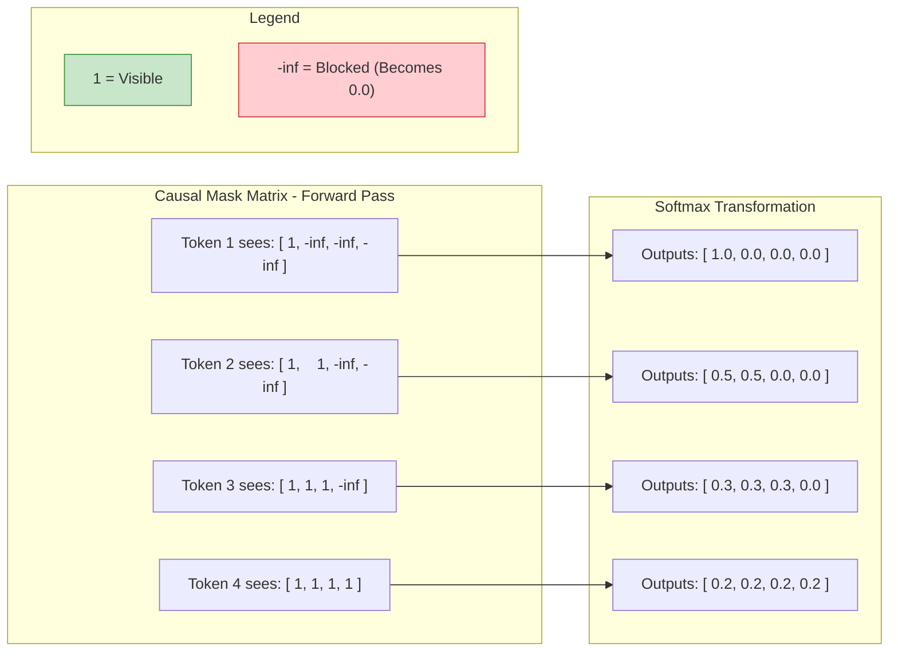

# 03 - Building the GPT Causal Decoder Block

## 1. The Problem

Standard attention allows every token in a sequence to read every other token. This is perfect for encoding an entire document when you already have all the text (like BERT). 
However, for Tiny Mitra, we want to generate text one token at a time. If we train our model using standard attention, the word `PATIENT` could "cheat" by looking at the word `[NAME]` that comes *after* it in the training data. 
When the model is deployed and tries to generate text for real, `[NAME]` won't exist yet! The model will fail because it learned to rely on future tokens that are no longer there.

## 2. Why We Need Something New

We need a mechanism that allows the model to process all tokens in parallel during training (for speed), but mathematically guarantees that no token can ever peek at tokens that come after it.

## 3. One-Line Definition

A **Causal Decoder Block** is a transformer block that uses a causal mask to restrict attention, ensuring that a token can only aggregate information from itself and the tokens before it.

## 4. Beginner Intuition / Mental Model

Imagine a group of students (tokens) taking a test in a row of desks. The teacher says they are allowed to look at the answers of the students sitting in front of them (earlier tokens), but they are physically blocked from turning around to see the answers of the students sitting behind them (future tokens). 

## 5. What Came Before → What Changes Now

* **Before (Bidirectional Attention):** Token 3 can read tokens 1, 2, 3, 4, 5.
* **Now (Causal Attention):** Token 3 can only read tokens 1, 2, 3. The scores for tokens 4 and 5 are forced to zero.

## 6. How It Works

Inside the block, three independent linear projections create the Query (Q), Key (K), and Value (V) matrices. 

**The Q, K, V Analogy (from *Hands-On LLMs*):**
*   **Query (Q):** What I am looking for (e.g., "I am an adjective looking for a noun").
*   **Key (K):** What I contain (e.g., "I am a noun").
*   **Value (V):** What I offer if my Key matches your Query (e.g., the actual meaning/features of the noun).

The attention scores are calculated as $Q \times K^T$. 
Before these scores are turned into probabilities using Softmax, we apply a **Causal Mask**. The mask replaces all the score values "above the diagonal" (which correspond to future tokens) with negative infinity (`-inf`). When Softmax processes `-inf`, it outputs exactly `0`, meaning zero attention is paid to the future.

## 7. Visual Diagram



## 8. Required Mathematics 

1. **LayerNorm:** $LN(x) = \text{scale} \times \text{normalized}(x) + \text{shift}$ (Normalizes token features independently)
2. **Attention Scores:** $Scores = \frac{Q \times K^T}{\sqrt{d_{head}}}$ (Divides by the square root of the head dimension to prevent gradients from disappearing when softmax is applied).
3. **Causal Masking:** $Scores[i, j] = -\infty \text{ if } j > i$
4. **Softmax:** converts scores into weights summing to 1.
5. **Context Vector:** $Context = Weights \times V$

## 9. Complete Worked Example

Suppose our prompt is `A B C`. 
Our raw Attention Scores ($Q \times K^T$) look like this:
```text
   A   B   C
A  5   3   2
B  1   4   1
C  2   2   6
```
We apply the Causal Mask (setting upper triangle to `-inf`):
```text
   A   B      C
A  5   -inf   -inf
B  1   4      -inf
C  2   2      6
```
After Softmax (probabilities):
```text
   A     B     C
A  1.0   0.0   0.0  (A only looks at A)
B  0.05  0.95  0.0  (B looks at A and B)
C  0.02  0.02  0.96 (C looks at A, B, and C)
```

## 10. Math → Code Mapping

```python
# Create the causal mask (True for upper triangle, False for lower)
causal_mask = torch.triu(torch.ones(time, time, dtype=torch.bool), diagonal=1)

# Apply the mask to the scores. Masked values become -infinity.
scores = scores.masked_fill(causal_mask, float("-inf"))

# Softmax converts -inf to 0
weights = torch.softmax(scores, dim=-1)
```

## 11. Experiments / What-If Questions

**What if we temporarily remove the causal mask during training?**
*Prediction:* The training loss will plummet almost instantly to zero. The model is "cheating" by directly looking at the target token in the future. However, during generation, the model will output total garbage because the future tokens it learned to rely on are missing.

## 12. Common Misunderstandings

* **"Causal masking deletes future tokens from the dataset."** -> No. It only sets their attention scores to `-inf` for earlier queries. The tokens are still physically in the matrix.
* **"Residual connections preserve the original input unchanged forever."** -> They add a bypass path, but every block still accumulates learned updates on top of the original input.

## 13. Limitations and Trade-Offs

Because the model can only look backward, it cannot fully understand the context of a word until it has read the entire sentence. For tasks like full-document translation, bidirectional encoders (like BERT) are better. But for generative tasks, causal decoders are strictly necessary.

## 14. Where It Appears in the Current Assignment

You will implement the `ManualMultiHeadCausalAttention` class in Tiny Mitra, where you must correctly construct and apply the `torch.triu` causal mask before the Softmax operation.

## 15. Where It Appears in Modern AI Systems

Every GPT model (Generative Pre-trained Transformer) uses this exact causal masking technique. It is the fundamental reason why GPTs can generate text endlessly.

## 16. Connection to the Next Concept

Now that we have a block that restricts attention to the past, how do we actually use this block in a loop to generate a complete sentence from scratch? We will explore this in **Topic 4: Autoregressive Generation and Temperature**.

## 17. Teach-Back and Small Application Exercise

**Exercise:** If you have a sequence of 5 tokens, what is the shape of the attention score matrix? How many cells in that matrix will be overwritten with `-inf` by the causal mask?

## 18. Quick Revision Summary

A decoder block uses causal attention to gather relevant earlier context, preventing information leakage from the future. The Feed-Forward Network transforms the features, LayerNorm stabilizes them, and residual paths preserve the signal.

## 19. My Understanding

*(Write your own intuition here. How would you explain the causal mask to a teammate?)*

## 20. Flashcards

**Q:** Why do we divide the attention scores by $\sqrt{d_{head}}$?
**A:** To prevent the dot products from growing too large, which would make the Softmax output extremely sharp and kill the gradients during training.

**Q:** What happens if the causal mask is applied incorrectly?
**A:** The model will cheat during training by reading future tokens, leading to excellent training metrics but complete failure during generation.

## 21. Sources
- AI Learning Lab - Tiny-GPT Core Concepts
- *Hands-On Large Language Models* by Jay Alammar & Maarten Grootendorst (Q, K, V analogy and intuitive mechanics)
