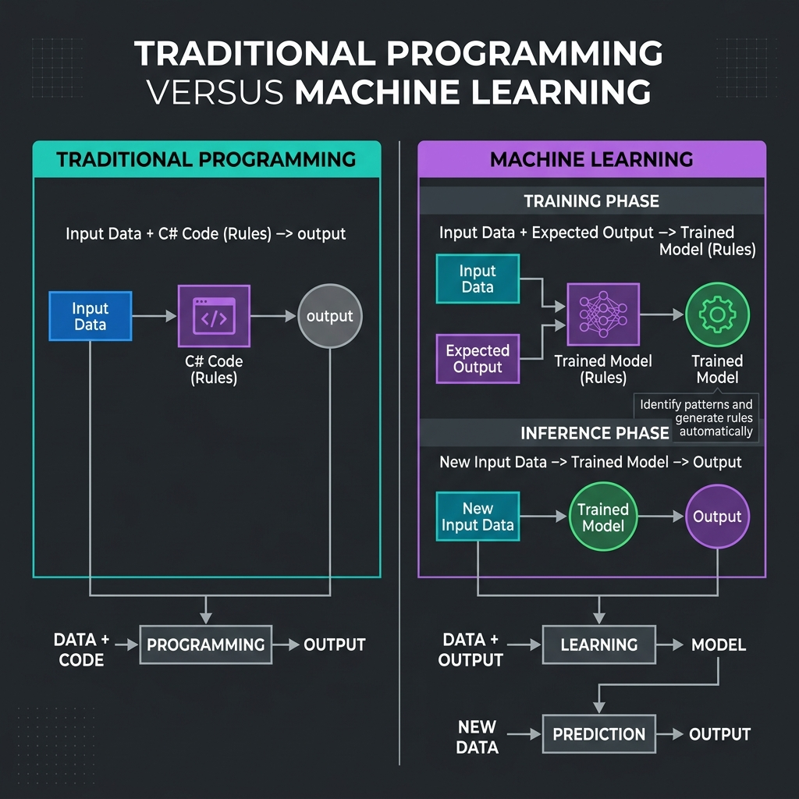
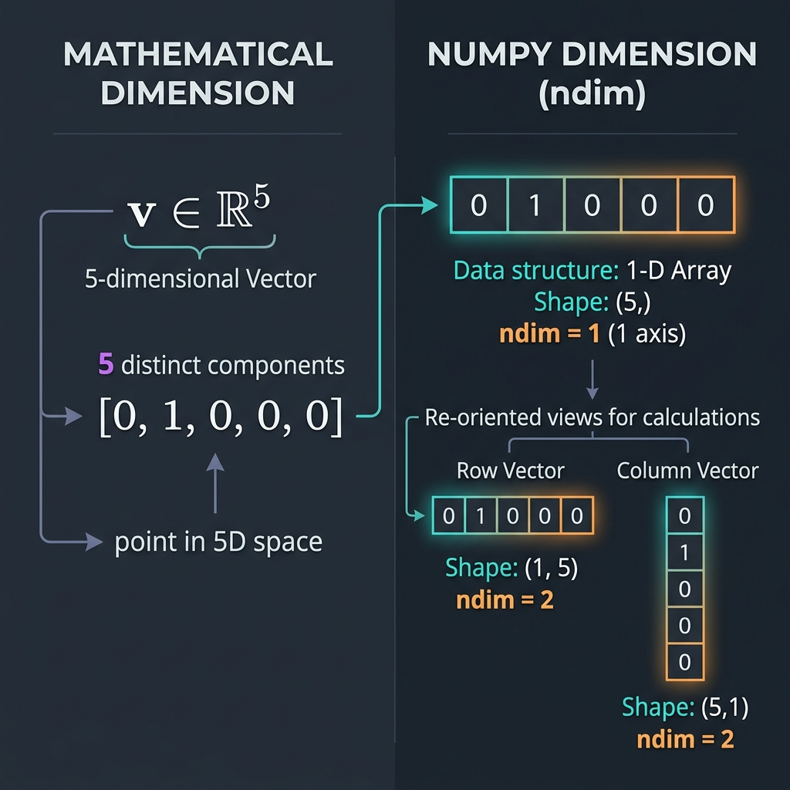
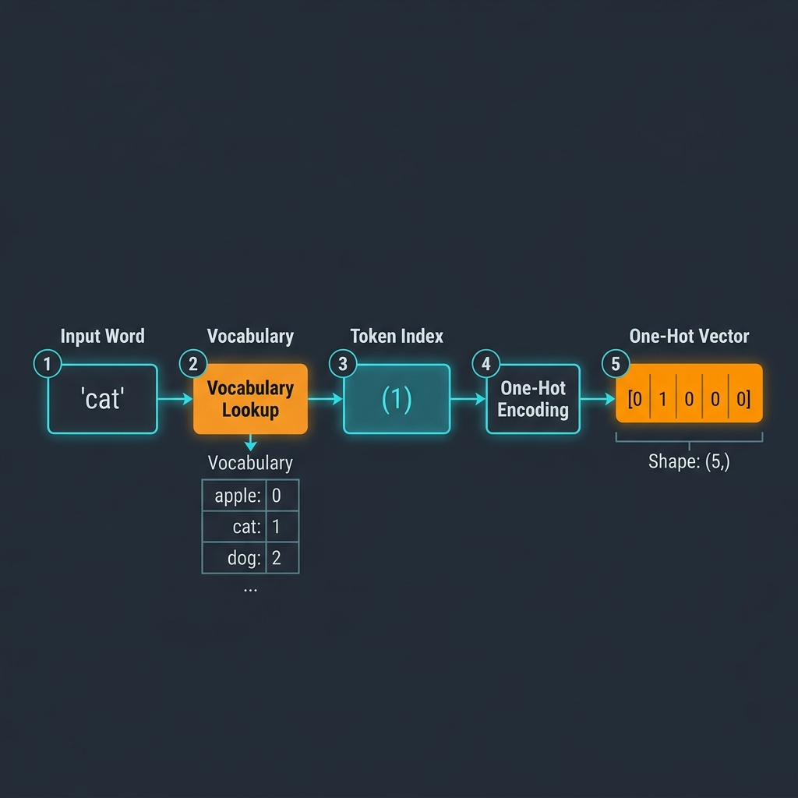
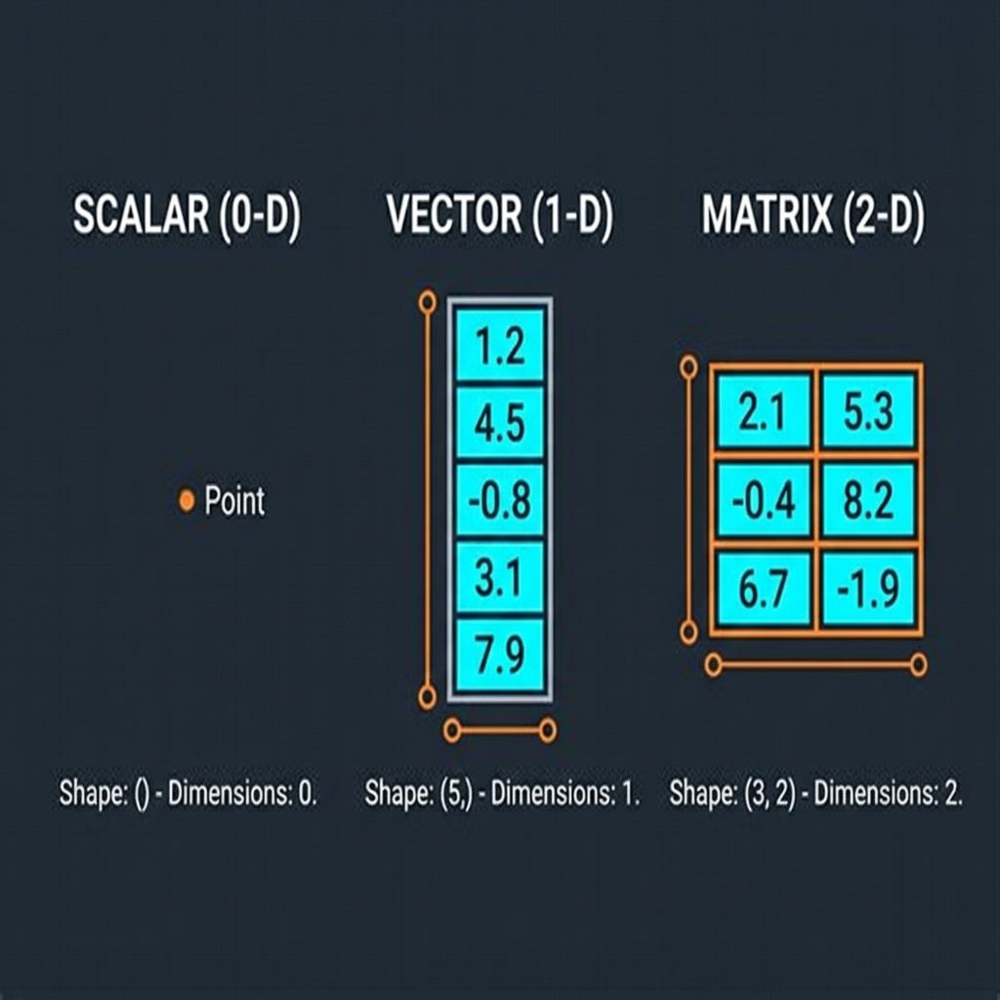
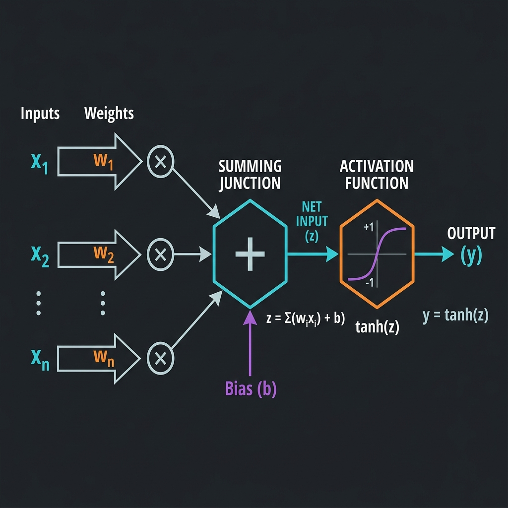
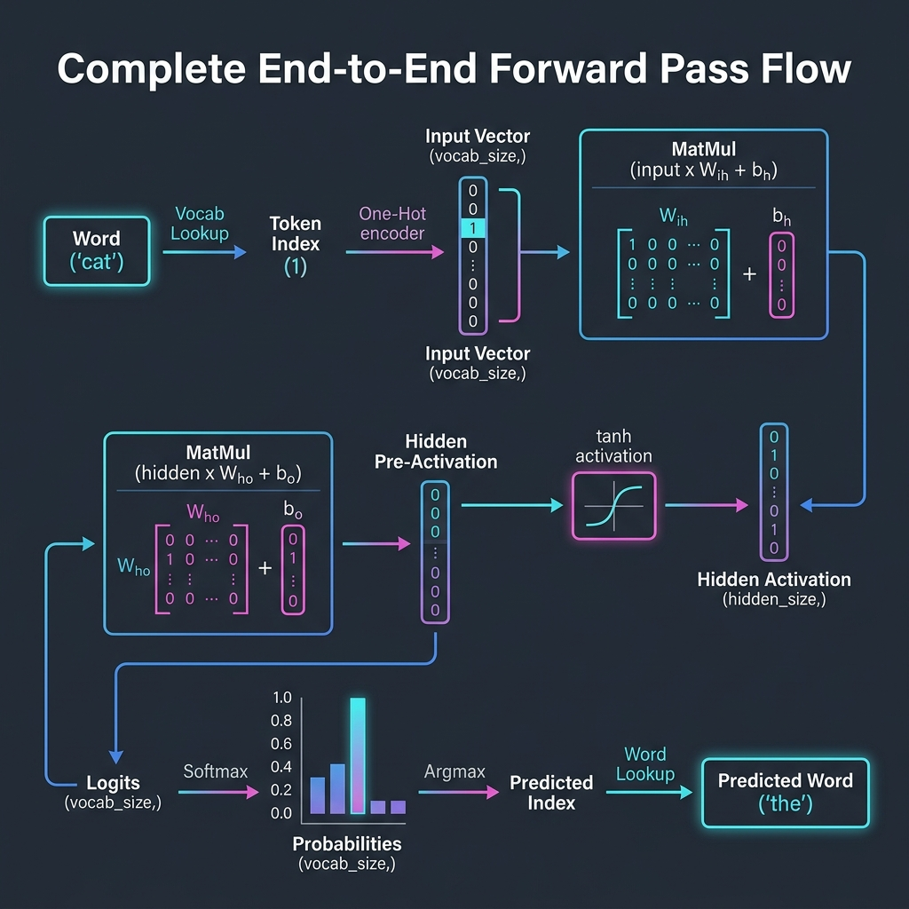
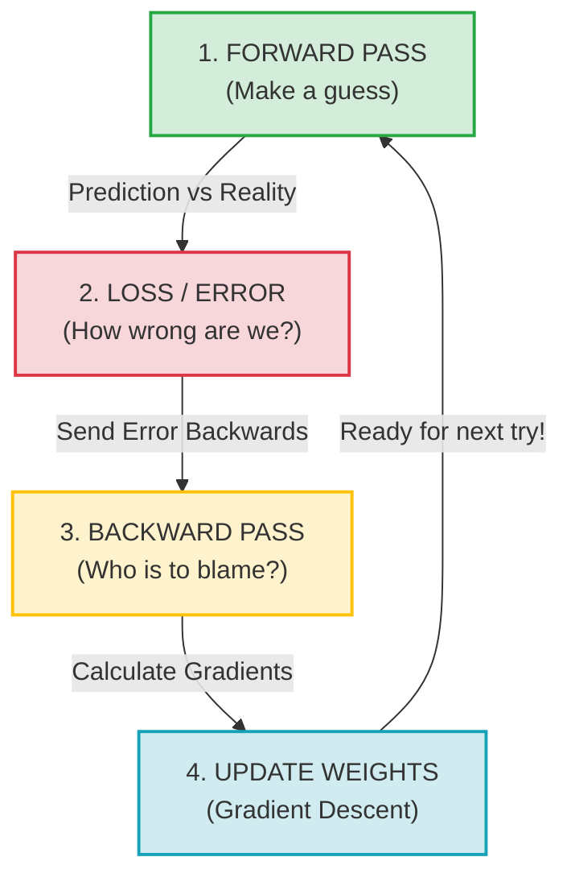

# Prerequisite Knowledge — Forward Pass Assignment

> **Purpose**
>
> This is a self-contained study guide. It covers every concept you need
> before implementing the forward-pass assignment. No external course or
> textbook is required.
>
> Read it from top to bottom. Each section builds on the one before it.
> By the end you will be able to trace an input word through an entire
> neural network and explain every computation that happens along the way.

---

# 1. How to Use This Guide

1. Read each section in order — concepts are arranged by dependency.
2. Pay attention to the **Connection to the assignment** paragraph in
   every concept — it tells you exactly where and why the idea appears
   in the code you will implement.
3. Section 8 contains one complete worked numerical example. After
   reading the theory, work through that example by hand to confirm
   your understanding.
4. Section 9 is a glossary for quick revision.
5. Section 10 contains readiness questions. If you can answer them
   comfortably, you are ready to begin the assignment.

---

# 2. Machine-Learning Foundations

## 2.1 Machine Learning

**Definition.**
Machine learning is a way of building systems that learn patterns from
data instead of following rules written by a programmer.

**Why it is needed.**
Some problems have so many possible inputs and edge cases that writing
explicit rules becomes impractical. Consider recognising a cat in a
photograph: no human can write enough `if/else` statements to cover
every possible arrangement of pixels. Machine learning lets the computer
discover those rules by studying thousands of examples.

**Intuition.**
Think of a junior developer joining your team. Instead of reading a
1,000-page coding standard, they study 500 pull-request reviews and
gradually learn what "good code" looks like. They are learning patterns
from examples, not from explicit rules. Machine learning works the same
way — but with numbers.

**Example.**
A spam filter trained on 10,000 emails tagged as spam or not-spam. After
studying the examples, the system can classify a new email it has never
seen before.

**Connection to the assignment.**
The forward-pass code is the first half of a machine-learning system. It
takes an input and produces a prediction. Right now the system has not
learned anything, so its prediction is essentially random. Later
assignments will add the "learning from data" part.

**Common misunderstanding.**
> [!NOTE]
> "Machine learning replaces all programming." It does not. Machine learning replaces the *rule-discovery* step. You still write code to load data, build the network, run training, and deploy the result.

---

## 2.2 Traditional Programming vs Machine Learning

**Definition.**
Traditional programming and machine learning are two different
strategies for solving a problem. The difference lies in *who writes the
rules*.

**Traditional programming formula:**

```
Input Data + Rules (written by engineer) → Output
```

**Machine learning formula:**

```
Input Data + Expected Output (examples) → Rules (learned by computer)
```



**Why it is needed.**
Understanding this distinction is the single most important mental-model
shift when moving from software engineering to AI engineering. Without
it, the rest of the journey will feel arbitrary.

**Intuition (C# analogy).**
In traditional programming you write a method:

```csharp
bool IsSpam(Email email)
{
    if (email.Subject.Contains("Free Money")) return true;
    if (email.SenderReputation < 0.3)        return true;
    return false;
}
```

You, the engineer, wrote every rule. In machine learning, you instead
provide labelled examples:

```
Email A → Spam
Email B → Not Spam
Email C → Spam
...
```

The algorithm processes these examples and produces a trained model.
That model is the equivalent of a compiled DLL containing thousands of
micro-rules the computer discovered on its own.

**Example.**
Predicting house prices. Traditional: `price = sqft * 150`. Machine
learning: give the system 10,000 sales records and let it discover that
`price = sqft * 153.2 + bedrooms * 8,400 − age * 1,200 + 12,000`.

**Connection to the assignment.**
The forward-pass code you will study *is* the learned model (or rather,
the skeleton of one). It takes an input and produces an output using
mathematical operations — no `if/else` anywhere.

**Common misunderstanding.**
> [!NOTE]
> "ML is always better than traditional programming." It is not. If you can express a rule precisely (e.g., "reject all orders over ₹10 lakh without manager approval"), traditional code is simpler, faster, and easier to debug.

---

## 2.3 Supervised Learning

**Definition.**
Supervised learning is a type of machine learning where the system
learns from input–output pairs that a human has labelled in advance. The
word "supervised" means a teacher (the labelled data) is guiding the
learning.

**Why it is needed.**
Without labelled examples, the system has no way of knowing what the
correct answer should be. Supervised learning gives the system a
"cheat sheet" so it can compare its own guesses to the correct answers
and improve.

**Intuition.**
Imagine a student preparing for an exam using past papers *with answer
keys*. Each question (input) has a correct answer (expected output). The
student practises, checks, corrects mistakes, and gradually improves.
That is supervised learning.

**Example.**
| Input word | Expected output word |
|------------|----------------------|
| "the"      | "cat"                |
| "cat"      | "sat"                |
| "sat"      | "on"                 |

Given the word "the", the correct next word is "cat". The system tries
to guess, compares its guess to "cat", and adjusts.

**Connection to the assignment.**
The forward-pass assignment uses a small next-word-prediction task.
Each training pair is `(input word, expected next word)`. The network
will receive "the" and try to predict "cat". This is supervised learning
because we know the correct next word.

**Common misunderstanding.**
> [!NOTE]
> "Supervised means a human watches the computer in real time." No. The "supervision" is the *labels* in the data, not a human sitting at the keyboard.

---

## 2.4 Dataset

**Definition.**
A dataset is a structured collection of examples used to train or
evaluate a machine-learning model. Each example is one input–output
pair.

**Why it is needed.**
Without data there is nothing for the model to learn from. The dataset
is the "textbook" the model studies.

**Intuition.**
Think of a SQL table. Each row is one example. The columns are the
properties (features) the model will use, plus one column for the
correct answer (label).

**Example.**

| Row | Input word | Expected next word |
|-----|------------|--------------------|
| 1   | "the"      | "cat"              |
| 2   | "cat"      | "sat"              |
| 3   | "sat"      | "on"               |

This tiny dataset has three examples.

**Connection to the assignment.**
The forward-pass code defines a small vocabulary and a set of
word-pairs. That set of word-pairs is the dataset.

**Common misunderstanding.**
> [!NOTE]
> "More data is always better." Not necessarily. Bad data (incorrect labels, duplicates, biased samples) can make a model worse. Quality matters as much as quantity.

---

## 2.5 Input and Output

**Definition.**
The *input* is the data the model receives. The *output* is the data
the model produces. In supervised learning, the expected output is
already known during training so the model can compare and learn.

**Why it is needed.**
Every machine-learning system has a clearly defined input and output.
Without knowing what goes in and what comes out, you cannot design or
debug the system.

**Intuition.**
Think of a C# method signature:

```csharp
string PredictNextWord(string currentWord)
```

`currentWord` is the input. The returned string is the output.

**Example.**
Input: the word `"the"`. Output: the word `"cat"`.

**Connection to the assignment.**
In the forward pass, the input is a single word from the vocabulary. The
output is the network's predicted next word. The prediction may be wrong
because the network has not learned yet.

**Common misunderstanding.**
> [!NOTE]
> "The output is always a single number." Not in this assignment. The network produces a score for *every* word in the vocabulary, then picks the word with the highest score.

---

## 2.6 Features and Labels

**Definition.**
*Features* are the input properties the model uses to make predictions.
*Labels* are the correct answers provided in the training data.

**Why it is needed.**
The split between features and labels defines what the model should pay
attention to (features) and what it should try to predict (labels).

**Intuition (database analogy).**
In a SQL table of house sales:

```
SELECT sqft, bedrooms, age  -- features
FROM   houses
```

The `price` column is the label — the value we want to predict.

In our assignment the feature is the input word and the label is the
expected next word.

**Example.**

| Feature (input word) | Label (expected next word) |
|----------------------|----------------------------|
| "the"                | "cat"                      |
| "cat"                | "sat"                      |

**Connection to the assignment.**
Each word-pair in the code defines one feature (the input word) and one
label (the expected output word).

**Common misunderstanding.**
> [!NOTE]
> "Features and labels must be different data types." They do not. Here both the feature and the label are words. The distinction is purely about *role*: what goes in vs. what comes out.

---

## 2.7 Model

**Definition.**
A model is the mathematical structure that takes an input, performs
calculations, and produces an output. Before training, the model
contains random parameters and its predictions are meaningless. After
training, its parameters have been adjusted so that its predictions are
(hopefully) useful.

**Why it is needed.**
The model is the thing that actually does the predicting. Everything
else (data, training, evaluation) exists to create and improve the
model.

**Intuition.**
Think of a model as a formula in an Excel spreadsheet with some unknown
coefficients. Training fills in those coefficients using data. Once
filled in, the spreadsheet can take new inputs and produce predictions.

**Example.**
A very simple model: `output = input × w + b`, where `w` and `b` are
parameters the model needs to learn. Before training, `w` and `b` are
random, so the output is meaningless.

**Connection to the assignment.**
The entire forward-pass code *is* the model. It defines a sequence of
mathematical operations: one-hot encoding → hidden layer → activation
→ output layer → softmax. The weights and biases are the parameters.
They start random — which is exactly why the first prediction is random.

**Common misunderstanding.**
> [!IMPORTANT]
> "Model = code." Not exactly. The *code* defines the structure. The *model* is the structure + the learned parameter values. Same code with different parameters is a different model.

---

## 2.8 Prediction

**Definition.**
A prediction is the output the model produces for a given input. During
training it is compared against the correct label. During deployment it
is the system's best guess.

**Why it is needed.**
Prediction is the purpose of the whole system. Everything we build (data
pipelines, networks, training loops) exists so that the model can make
accurate predictions.

**Intuition.**
If someone asks you "What comes after 'the'?" and you guess "cat", that
guess is your prediction. If the answer key says "cat", your prediction
was correct.

**Example.**
The model receives the word `"the"` and predicts `"sat"`. The correct
answer is `"cat"`. The prediction is wrong this time.

**Connection to the assignment.**
The forward pass ends with a prediction: the word with the highest
probability after softmax. Since the model has not been trained, this
prediction is effectively a random guess.

**Common misunderstanding.**
> [!WARNING]
> "A confident prediction is a correct prediction." No. A model can output a very high probability for the wrong word. Confidence ≠ correctness.

---

# 3. Representing Words as Numbers

## 3.1 Vocabulary

**Definition.**
The vocabulary is the complete, fixed list of words (or tokens) the
model knows about. Every word the model can accept as input or produce
as output must be in this list. Words outside the vocabulary are unknown
to the model.

**Why it is needed.**
Computers work with numbers, not text. Before we can convert a word to
a number, we need a definitive list of all possible words so we can
assign each one a unique number.

**Intuition.**
Think of an enum in C#:

```csharp
enum Vocab { The = 0, Cat = 1, Sat = 2, On = 3, Mat = 4 }
```

This enum is the vocabulary. Any word not in the enum cannot be used.

**Example.**

| Index | Word  |
|------:|-------|
| 0     | "the" |
| 1     | "cat" |
| 2     | "sat" |
| 3     | "on"  |
| 4     | "mat" |

Vocabulary size = 5.

**Connection to the assignment.**
The first thing the forward-pass code does is define a vocabulary. The
vocabulary size determines the dimensions of the input vector, the
output vector, and several weight matrices.

**Common misunderstanding.**
> [!WARNING]
> "The vocabulary can grow at inference time." No. If the model was built for a 5-word vocabulary, it cannot handle a 6th word without being rebuilt.

---

## 3.2 Token

**Definition.**
A token is the smallest unit of text the model operates on. In simple
models, one token = one word. In production LLMs, tokens can be
sub-words (e.g., "running" → "run" + "ning").

**Why it is needed.**
We need a consistent unit of processing. "Token" is the general term
for that unit, whether it is a word, a sub-word, or even a single
character.

**Intuition.**
Tokens are to an NLP model what rows are to a database: the fundamental
unit of data.

**Example.**
In the sentence "the cat sat", the tokens are: `"the"`, `"cat"`,
`"sat"` — three tokens.

**Connection to the assignment.**
Each input to the network is one token (one word). The model predicts
one token (one word) as output.

**Common misunderstanding.**
> [!NOTE]
> "Token always means word." In this assignment it does, but in GPT-style models a token can be part of a word (e.g., "un" + "believ" + "able").

---

## 3.3 Token Index

**Definition.**
A token index is the integer position of a token in the vocabulary. It
is how we convert a human-readable word into a number the computer can
use.

**Why it is needed.**
Neural networks cannot process the string `"cat"`. They need a number.
The token index provides that number.

**Intuition.**
It is the same as looking up the position of an item in an array:

```csharp
string[] vocab = { "the", "cat", "sat", "on", "mat" };
int index = Array.IndexOf(vocab, "cat"); // returns 1
```

**Example.**
If the vocabulary is `["the", "cat", "sat", "on", "mat"]`:

| Word  | Token index |
|-------|-------------|
| "the" | 0           |
| "cat" | 1           |
| "sat" | 2           |
| "on"  | 3           |
| "mat" | 4           |

**Connection to the assignment.**
The code uses a dictionary (Python `dict`) to map each word to its
index. This index is then used to construct the one-hot vector.

**Common misunderstanding.**
> [!NOTE]
> "The index encodes meaning." It does not. Index 0 is not "less than" index 4. The numbers are arbitrary identifiers, like primary keys in a database.

---

## 3.4 Scalar

**Definition.**
A scalar is a single number. It has no rows, no columns — just one
value.

**Why it is needed.**
Understanding scalars helps you distinguish them from vectors (lists of
numbers) and matrices (grids of numbers). Shape-tracking through a
neural network requires knowing what is a scalar and what is not.

**Intuition.**
A scalar is like a single cell in an Excel spreadsheet.

**Example.**
`42`, `3.14`, `-0.7` — all scalars.

**Connection to the assignment.**
The token index is a scalar. The predicted index after argmax is a
scalar. The learning rate (in later assignments) is a scalar.

**Common misunderstanding.**
> [!NOTE]
> "A one-element array is a scalar." Technically, a scalar has no dimensions while a one-element array has shape `(1,)`. In practice this distinction rarely matters, but be aware of it when debugging shape errors.

---

## 3.5 Vector

**Definition.**
A vector is an ordered list of numbers. In machine learning, it is the primary data structure for representing features, activations, and predictions.

**Why it is needed.**
Vectors are the standard way to represent data in neural networks. The input (one-hot word representation), the hidden-layer activations, the logits, and the softmax probabilities are all vectors.

**Intuition.**
Think of a single row in a database table or a 1-D array in C#:
```csharp
float[] v = { 0.0f, 1.0f, 0.0f, 0.0f, 0.0f };
```

**Example.**
Vectors can hold any numbers — not just 0s and 1s:
```text
One-hot vector:    [0, 1, 0, 0, 0]          (binary — used for input encoding)
Activation vector: [0.21, -0.85, 0.47]      (continuous — output of a hidden layer)
Probability vector:[0.05, 0.65, 0.10, 0.15, 0.05]  (sums to 1.0 — output of softmax)
```
All three are vectors — ordered lists of numbers. The one-hot vector is a *special case*. Most vectors inside a neural network contain continuous (decimal) values.

---

### The Dual Meaning of "Dimension"
The word "dimension" is used in two different ways in ML engineering: mathematical dimension and programming (NumPy) dimension. Confusing the two is a major source of shape-mismatch bugs.

#### 1. Mathematical Vector Dimensionality
In mathematics, the dimension of a vector is simply the **number of components** (elements) it contains.
- `[3, 4]` is a 2-dimensional vector (2D space).
- `[1, 2, 3]` is a 3-dimensional vector (3D space).
- `[0, 1, 0, 0, 0]` is a **5-dimensional vector** because it has five components.

#### 2. NumPy Array Dimensionality (`ndim`)
In programming libraries like NumPy, `ndim` means the **number of array axes (grid dimensions)**, not the number of components.
- A flat 1-D array is a single axis. Its NumPy dimension (`ndim`) is always `1`, regardless of how many elements it holds.

```python
import numpy as np

# A 5-dimensional mathematical vector represented as a 1-D NumPy array
v = np.array([0, 1, 0, 0, 0])

print(v.ndim)
# Outputs: 1  (Because it is a 1-D array of numbers)

print(v.shape)
# Outputs: (5,)  (A tuple with 5 elements along its single axis)
```

---

### Shape and Orientation (Row vs. Column)
A raw 1-D vector has no orientation (it is neither a row nor a column; it is just a flat sequence of numbers). However, when we perform matrix multiplication, the math requires us to treat vectors as either:
- **Row Vector:** A matrix with 1 row and N columns. Shape: `(1, N)`. `ndim` = `2`.
- **Column Vector:** A matrix with N rows and 1 column. Shape: `(N, 1)`. `ndim` = `2`.

In NumPy, you can add an axis to convert a flat `(N,)` vector into a 2-D row or column vector:
```python
v_row = v[np.newaxis, :]  # Shape: (1, 5), ndim: 2
v_col = v[:, np.newaxis]  # Shape: (5, 1), ndim: 2
```



**Connection to the assignment.**
The one-hot encoded input is represented as a flat 1-D vector of shape `(vocab_size,)`. In your assignment, you will compute the hidden layer using matrix multiplication:
```python
hidden_pre_activation = input_vector @ input_to_hidden_weights + hidden_bias
```
Here is the step-by-step logic of how NumPy handles this under the hood:
1. **The Shape Mismatch Problem:** Mathematically, you cannot multiply a 1-D array of shape `(vocab_size,)` directly by a 2-D matrix of shape `(vocab_size, hidden_size)`. Standard matrix multiplication requires the left operand to have 2 dimensions (rows and columns).
2. **NumPy's Automatic Promotion:** To resolve this, when NumPy encounters a 1-D array on the **left** of the `@` operator:
   - It temporarily *promotes* (pads) the vector by prepending a `1` to its shape: `(vocab_size,)` becomes a row vector of shape `(1, vocab_size)`.
3. **The Matrix Math:** Now that shapes are aligned, the multiplication runs:
   $$\text{Shape: } (1, \text{vocab\_size}) \times (\text{vocab\_size}, \text{hidden\_size}) \rightarrow (1, \text{hidden\_size})$$
4. **Automatic Demotion:** Once the multiplication is finished, NumPy automatically *demotes* the result by stripping the prepended `1`, converting the shape from `(1, hidden_size)` back to a clean 1-D vector of shape `(hidden_size,)`.

This convenient behavior means you do not have to write boilerplate code like `input_vector.reshape(1, -1)` before every layer just to satisfy matrix algebra. NumPy treats it as a row vector for the math but returns a clean flat vector for your code.

**Common misunderstanding.**
> [!IMPORTANT]
> "A mathematical 5D vector must have shape `(5, 5)` or have `ndim = 5`." No. A 5D vector is a flat list of 5 numbers, which is represented in NumPy as shape `(5,)` and `ndim = 1`.

---

## 3.6 One-Hot Encoding

**Definition.**
One-hot encoding converts a token index into a vector where exactly one
element is `1` and all others are `0`. The position of the `1`
corresponds to the token index.

**Why it is needed.**
A neural network cannot take an integer like `1` and understand that it
means "cat". One-hot encoding converts the integer into a vector that
the network's matrix multiplication can process.

**Intuition.**
Imagine a row of light switches — one for each word in the vocabulary.
To say "cat", you flip only the switch at position 1 and leave all
others off.

**Example.**
Vocabulary: `["the", "cat", "sat", "on", "mat"]` (size 5).

Token index for `"cat"` = 1.

One-hot vector: `[0, 1, 0, 0, 0]` — shape `(5,)`.

Notice that:
- The vector length equals the vocabulary size.
- There is exactly one `1`.
- The position of the `1` is the token index.

**Connection to the assignment.**
The forward-pass code constructs a one-hot vector from the input word's
token index. This vector becomes the input to the first layer of the
network.

**Common misunderstanding.**
> [!IMPORTANT]
> "One-hot vectors capture word meaning." They do not. The vectors for "cat" and "kitten" are just as different as the vectors for "cat" and "airplane". One-hot encoding preserves identity but not semantics. Embeddings (a later assignment) solve this problem.

---

## 3.7 How a Word Becomes a Numerical Representation

This subsection ties together the four concepts above into one clear
pipeline. This is the process the forward-pass code performs before any
neural-network computation begins.

```
Step 1: Start with a word
        "cat"

Step 2: Look up the word in the vocabulary
        vocabulary = ["the", "cat", "sat", "on", "mat"]

Step 3: Get the token index
        "cat" → index 1

Step 4: Create a one-hot vector (length = vocabulary size)
        index 1 → [0, 1, 0, 0, 0]

Step 5: This vector is the neural network's input
        input_vector = [0, 1, 0, 0, 0]   shape: (5,)
```



**Why this pipeline exists.**
Neural networks perform matrix multiplication. Matrix multiplication
requires numerical inputs. A string like `"cat"` has no numerical
meaning. This pipeline converts the string into a fixed-length numerical
vector that matrix multiplication can operate on.

**What information is preserved.**
The identity of the word (which word was chosen).

**What information is lost.**
Any notion of similarity between words. "cat" and "kitten" produce
completely different vectors.

---

# 4. Mathematical Foundations

## 4.1 Matrix

**Definition.**
A matrix is a rectangular grid of numbers arranged in rows and columns.
A vector is a special case of a matrix (either one row or one column).

**Why it is needed.**
Neural networks store their learnable parameters (weights) in matrices.
The core operation of a neural network — transforming an input into an
output — is matrix multiplication.

**Intuition.**
Think of a 2-D array in C#, or a table in Excel with rows and columns:

```
[ 0.2  0.5 ]
[ 0.8 -0.1 ]
[ 0.3  0.6 ]
```

This is a 3×2 matrix: 3 rows, 2 columns.

**Example.**

```
A = [ 1  2 ]    shape: (2, 2) — 2 rows, 2 columns
    [ 3  4 ]

A = [ 1  2  3 ]    shape: (2, 3) — 2 rows, 3 columns
    [ 4  5  6 ]
```

**Connection to the assignment.**
The weights connecting the input layer to the hidden layer are stored in
a matrix of shape `(vocab_size, hidden_size)`. The weights connecting
the hidden layer to the output layer are stored in a matrix of shape
`(hidden_size, vocab_size)`.

**Common misunderstanding.**
> [!NOTE]
> "Matrix and array mean the same thing." In everyday code they are used interchangeably, but mathematically a matrix has specific rules about multiplication and transposition. When debugging neural networks, you think of them as matrices with shapes.

---

## 4.2 Matrix Shape

**Definition.**
The shape of a matrix is a tuple `(rows, columns)` that tells you its
dimensions. The shape of a vector is `(length,)`.

**Why it is needed.**
Shape tracking is the single most important debugging skill in neural
network engineering. If two matrices have incompatible shapes, the
multiplication will fail. Knowing the shape at every step lets you catch
errors before they happen.

**Intuition.**
Shape is like a type signature in C#. If a function expects `int[]` and
you pass `string`, it fails at compile time. Similarly, if a matrix
multiplication expects shape `(5,)` and you provide shape `(3,)`, it
fails at runtime.

**Example.**

| Value                     | Shape     |
|---------------------------|-----------|
| A single number: `42`    | scalar    |
| `[0, 1, 0, 0, 0]`        | `(5,)`   |
| A 5×3 grid of numbers    | `(5, 3)` |
| A 3×5 grid of numbers    | `(3, 5)` |



**Connection to the assignment.**
Every variable in the forward pass has a specific shape. Tracking shapes
from input to output is how you verify the code is correct:

```
input_vector:            (vocab_size,)
input_to_hidden_weights: (vocab_size, hidden_size)
hidden_bias:             (hidden_size,)
hidden_activation:       (hidden_size,)
hidden_to_output_weights:(hidden_size, vocab_size)
output_bias:             (vocab_size,)
logits:                  (vocab_size,)
probabilities:           (vocab_size,)
```

**Common misunderstanding.**
> [!WARNING]
> "Shape `(5,)` and shape `(1, 5)` are the same." They are not. `(5,)` is a 1-D vector. `(1, 5)` is a 2-D matrix with one row and five columns. Most code handles this gracefully, but it can cause subtle bugs.

---

## 4.3 Dot Product

**Definition.**
The dot product takes two vectors of the same length, multiplies
corresponding elements, and sums the results to produce a single
scalar.

**Why it is needed.**
The dot product is the fundamental operation inside matrix
multiplication. Every element in the output of a matrix multiplication
is computed by a dot product.

**Intuition.**
Think of it as a "weighted score". If you have a feature vector
`[hours_studied, practice_tests]` and a weight vector
`[importance_of_study, importance_of_tests]`, the dot product gives you
a single overall score.

**Example.**

```
a = [1, 2, 3]
b = [4, 5, 6]

dot product = (1×4) + (2×5) + (3×6)
            =   4   +  10   +  18
            =  32
```

Two vectors of length 3 produce one scalar.

**Connection to the assignment.**
When the input vector is multiplied by the weight matrix, each column of
the weight matrix is dot-producted with the input vector. This produces
one hidden neuron's value.

**Common misunderstanding: Dot Product vs. Element-wise Multiplication.**
"The dot product is the same as element-wise multiplication." They are related, but fundamentally different operations with different outputs and use-cases.

**Element-wise Multiplication (Hadamard Product):**
Multiplies corresponding elements together but *keeps them separate*.
- **Output:** A vector of the same size.
- **Example:** 
  ```text
  a = [1, 2, 3]
  b = [4, 5, 6]
  
  element-wise = [1×4, 2×5, 3×6]
               = [4, 10, 18]
  ```
- **When it is used:** Used when you want to apply a mask (e.g., zeroing out certain values), scale individual features independently, or combine two vectors where each position represents an independent concept (e.g., gating mechanisms).

**Dot Product:**
Multiplies corresponding elements together AND *sums them all up*.
- **Output:** A single scalar (number).
- **Example:**
  ```text
  a = [1, 2, 3]
  b = [4, 5, 6]
  
  dot product = (1×4) + (2×5) + (3×6)
              = 4 + 10 + 18
              = 32
  ```
- **When it is used:** Used when you need to calculate an aggregate "score" or measure "similarity" between two vectors. It is the core operation of fully connected layers, aggregating multiple inputs into a single neuron's activation.

**Visual Summary:**
```text
Element-wise:  [1, 2, 3] ⊙ [4, 5, 6]  ➔  [4, 10, 18]   (Vector)
Dot Product:   [1, 2, 3] · [4, 5, 6]  ➔  32            (Scalar)
```

---

## 4.4 Matrix Multiplication

**Definition.**
Matrix multiplication (matmul) takes two matrices and produces a new
matrix. Each element of the result is the dot product of one row from
the first matrix and one column from the second matrix.

**The shape rule:**
If matrix $A$ has shape $(m, n)$ and matrix $B$ has shape $(n, p)$, the
result has shape $(m, p)$. The inner dimensions ($n$ and $n$) must
match.

$$A_{(m \times n)} \times B_{(n \times p)} = C_{(m \times p)}$$

**Why it is needed.**
Matrix multiplication is how a neural network transforms its input at
each layer. Input × Weights = Output.

**Intuition.**
Think of it as running the dot product in a loop. If you have one input
vector (shape `(5,)`) and a weight matrix with 3 columns (shape
`(5, 3)`), you perform 3 dot products — one per column — and get a
result vector of shape `(3,)`.

**Example.**

```
input  = [0, 1, 0, 0, 0]    shape: (5,)

weights = [ 0.1  0.4 ]
          [ 0.2  0.5 ]      shape: (5, 2)
          [ 0.3  0.6 ]
          [ 0.7  0.8 ]
          [ 0.9  1.0 ]

result = input × weights

Column 0: (0×0.1) + (1×0.2) + (0×0.3) + (0×0.7) + (0×0.9) = 0.2
Column 1: (0×0.4) + (1×0.5) + (0×0.6) + (0×0.8) + (0×1.0) = 0.5

result = [0.2, 0.5]    shape: (2,)
```

> [!NOTE]
> **Note on shapes:** As detailed in Section 3.5, programming libraries like NumPy automatically treat a 1-D vector of shape `(5,)` as a row vector of shape `(1, 5)` during matrix multiplication. Thus, the inner dimensions `(1, 5) × (5, 2)` do match! The mathematical result `(1, 2)` is then cleanly returned as a flat `(2,)` vector.

**Visual representation (Corrected Shapes):**
```text
   Input Vector                    Weight Matrix (W)               Output Vector
   Shape: (1, 5)                     Shape: (5, 2)                 Shape: (1, 2)

                         [ 0.1   0.4 ]
                         [ 0.2   0.5 ] ⟵ (Row 1 selected)
[ 0,  1,  0,  0,  0 ]  × [ 0.3   0.6 ]                      =  [ 0.2,  0.5 ]
                         [ 0.7   0.8 ]
                         [ 0.9   1.0 ]
```

Notice what happened: the one-hot vector effectively *selected row 1*
from the weight matrix. This is an important insight — multiplying a
one-hot vector by a matrix picks out the row corresponding to the hot
index.

**Connection to the assignment.**
The forward pass performs two matrix multiplications:
1. `input_vector × input_to_hidden_weights` → produces the hidden
   layer's pre-activation values.
2. `hidden_activation × hidden_to_output_weights` → produces the raw
   scores (logits).

**Common misunderstanding.**
> [!WARNING]
> "Matrix multiplication is commutative ($A \times B = B \times A$)." It is not. Order matters. $A \times B$ and $B \times A$ produce different results (and may not even be compatible).

---

# 5. Neural-Network Building Blocks

This section breaks down the fundamental components of a neural network, from a single artificial neuron up to deep multi-layer architectures.

---

## 5.1 The Artificial Neuron (The Atomic Unit)

**Definition.**
An artificial neuron is the basic computational unit of a neural network. It takes one or more inputs, multiplies each by a corresponding weight, sums them up, adds a bias, and passes the result through an activation function to produce a single output.

**Mathematical Formula:**
$$\text{Output} = f\left(\sum_{i=1}^{n} w_i x_i + b\right) = f(w_1 x_1 + w_2 x_2 + \dots + w_n x_n + b)$$

Where $x_i$ are the inputs, $w_i$ are the weights, $b$ is the bias, and $f$ is the activation function.



**Why it is needed.**
A single neuron acts as a simple classifier (like a straight line separating two classes). Stacking them in groups and layers allows the network to learn extremely complex patterns that a single line cannot capture.

**Intuition.**
Think of a neuron as a tiny decision-maker. It receives several signals (inputs), weighs their importance (weights), makes a combined decision (weighted sum + bias), and outputs a signal (activation).

**Example.**
Imagine a neuron deciding if you should go for a run:
*   **Inputs ($x$):** Is it sunny? ($x_1 = 1.0$), Is it hot? ($x_2 = 0.8$)
*   **Weights ($w$):** How much you like sun ($w_1 = 0.5$), How much you hate heat ($w_2 = -0.4$)
*   **Bias ($b$):** Your general baseline desire to run ($b = 0.2$)

$$\text{Weighted Sum} = (1.0 \times 0.5) + (0.8 \times -0.4) + 0.2 = 0.5 - 0.32 + 0.2 = 0.38$$
If we pass this through a simple activation threshold (e.g., if sum > 0, output 1), the output is 1 (you go for a run!).

**Connection to the assignment.**
Each hidden neuron in your assignment's network will receive the entire one-hot input vector, multiply it by its weights, add its bias, and output a single activation value.

**Common misunderstanding.**
> [!WARNING]
> **Biological vs. Artificial Neurons:** Artificial neurons are loosely inspired by biological brain cells, but they are vastly simplified mathematical approximations, not biological simulations. Don't take the biological analogy too literally!

---

## 5.2 Weights (Learnable Importance)

**Definition.**
Weights are learnable parameters that determine the strength and direction of the connection between two neurons. They control how much influence an input feature has on the next neuron's output.

**Why they are needed.**
Without weights, a network could only perform fixed, hardcoded math. The weights are the "knowledge" of the network—they start out random and are gradually adjusted during training to capture patterns in your dataset.

**Intuition.**
Think of weights as volume knobs on a mixing console. Each knob controls how loud one input channel is in the final mix. Training is the process of adjusting these knobs until the music sounds perfect.

**Example.**
*   A weight of `+1.5` has a strong positive influence (increases the output).
*   A weight of `+0.02` has almost no influence (ignored).
*   A weight of `-0.8` has a strong negative influence (decreases the output).

**Connection to the assignment.**
Your model stores all weights in 2-D matrices:
*   `input_to_hidden_weights`: Connects the input words to the hidden neurons.
*   `hidden_to_output_weights`: Connects the hidden activations to the final word predictions.

**Common misunderstanding.**
> [!NOTE]
> **Sign vs. Magnitude:** A negative weight is not "bad" or "weak." The magnitude (absolute value) determines the *strength* of the relationship, while the sign (+/-) determines the *direction*.

---

## 5.3 Bias (Flexible Shifts)

**Definition.**
A bias is a learnable offset added to the weighted sum before the activation function. It allows the neuron to shift its activation threshold up or down.

**Why it is needed.**
Without bias, a neuron's activation function must pass through the origin (i.e., if all inputs are zero, the output is forced to be zero). A bias allows the network to shift the activation function, giving it the flexibility to activate even when all inputs are zero.

**Intuition.**
Think of the linear equation $y = mx + c$.
*   $m$ (weight) controls the *slope* of the line.
*   $c$ (bias) controls the *intercept* (shifts the line up or down).
Without $c$, the line is locked to the center $(0,0)$.

```text
    Locked at Origin (No Bias)                 Shifted (With Bias)
             ▲                                        ▲
             │  /                                     │  /
             │ /                                      │ /  (Shifted up)
      ───────┼───────▶                         ───────┼───────▶
            /│                                 /      │
           / │                                /       │
```

**Example.**
If all inputs happen to be zero, the weighted sum is `0.0`.
*   **Without bias:** The output is `0.0`. The neuron is stuck and cannot activate.
*   **With bias = +0.4:** The output is `0.4`. The neuron can now cross the activation threshold and fire.

**Connection to the assignment.**
Biases are stored as 1-D vectors and added to the matrix multiplications:
*   `hidden_bias` (added after input-to-hidden layer).
*   `output_bias` (added after hidden-to-output layer).

**Common misunderstanding.**
> [!IMPORTANT]
> **Bias is Essential:** While a network can technically be trained without biases, doing so severely limits its mathematical capacity and makes it fail on simple offset tasks.

---

## 5.4 Random Initialization (Symmetry Breaking)

**Definition.**
Random initialization is the practice of setting all weights and biases to small random numbers before training begins, rather than setting them all to zero.

**Why it is needed.**
If all weights are initialized to the same value (like zero), every neuron in a layer will compute the exact same output and receive the exact same gradients during training. They would update in lockstep, making them identical. We initialize randomly to **break this symmetry**, forcing different neurons to look for different features.

**Intuition.**
Imagine sending ten detectives to investigate a crime. If they all start at the same spot and follow the same clues, they cover the exact same ground. If you start them at different random locations, they explore different parts of the city and solve the case faster.

**Example.**
In NumPy, we initialize weights randomly using:
```python
weights = np.random.randn(input_size, output_size) * 0.1
```
This draws values from a normal distribution and scales them down so the weights start small.

**Connection to the assignment.**
Your assignment's code initializes weights randomly. Because they start random, the initial forward pass predictions are also random guesses.

**Common misunderstanding.**
> [!TIP]
> **Untrained is not Broken:** A model outputting garbage predictions at startup is not a bug; it is simply in its initial randomly initialized state.

---

## 5.5 Hidden Layer (Representation Learning)

**Definition.**
A hidden layer is a group of neurons situated between the input layer and the output layer. Its outputs are intermediate computations not directly visible to the external world.

**Why it is needed.**
A single-layer network (input → output) can only learn linear relationships. Stacking hidden layers allows the network to transform the input space step-by-step, building a richer internal representation of the data and enabling it to solve non-linear problems.

**Intuition.**
Think of a classic three-tier software architecture:
```text
Client (Input Layer) ──▶ Business Logic (Hidden Layer) ──▶ Database (Output Layer)
```
The Business Logic layer takes raw user requests and processes them into a clean format before sending them to the database. Similarly, the hidden layer transforms raw input features into higher-level features before generating predictions.

**Example.**
If the input vector has 5 elements and the hidden layer has 3 neurons:
1. Input is a 1-D vector of shape `(5,)`.
2. It is multiplied by a `(5, 3)` weight matrix.
3. The hidden layer outputs a 1-D vector of shape `(3,)`.
The raw 5-dimensional input is compressed into a 3-dimensional representation.

**Connection to the assignment.**
The forward pass uses one hidden layer with a shape of `(hidden_size,)`.

---

## 5.6 Parameter Shapes and Routing (Putting it Together)

Now that we understand **Neurons, Weights, Biases, and Hidden Layers**, let's see how these pieces fit together mathematically in a network.

### How Shapes are Determined
The shape of a weight matrix connecting Layer A to Layer B is always strictly:
`W Shape: (Number of Incoming Neurons in A, Number of Outgoing Neurons in B)`

The shape of the bias vector for the destination layer is always:
`B Shape: (Number of Outgoing Neurons in B,)`

#### Visualizing a Single Connection Layer
Let's see what this looks like for a layer that takes **5 input features** and routes them to a **hidden layer of 3 neurons**:

```text
    Incoming Layer A (Inputs)                    Outgoing Layer B (Hidden Neurons)
          (5 features)                                     (3 neurons)

                                                ╭── Neuron 1 (Has 5 unique weights + 1 bias)
    [ F1, F2, F3, F4, F5 ]  ──────────────────▶ ├── Neuron 2 (Has 5 unique weights + 1 bias)
                                                ╰── Neuron 3 (Has 5 unique weights + 1 bias)

    Weight Matrix Shape: (5, 3)                Bias Vector Shape: (3,)
    (5 inputs mapped to 3 neurons)             (One bias per destination neuron)
```

To compute this entire layer in one operation, we use Matrix Multiplication:
$$\text{Hidden Activations} = \text{Inputs} \times W + B$$
$$\text{Shapes: } (1, 5) \times (5, 3) + (3,) \rightarrow (1, 3)$$

---

### Chaining Multiple Layers (Deep Learning)
Deep Learning is simply the process of chaining multiple hidden layers together. The output dimension of one layer's matrix multiplication must perfectly match the input dimension of the next layer.

#### Visualizing a Multi-Layer Network with Weights and Biases
Let's trace the shapes through a network with an input size of 5, four hidden layers (sizes 3, 6, 5, and 3), and an output size of 5.

```text
    Data Flow               Weight Matrix connecting layers       Bias Vector for destination layer
 
 [ L1: Input ]               
  (5 features)               W1 Shape: (5, 3)                      B1 Shape: (3,)
       │
       ▼
 [ L2: Hidden ]              
  (3 neurons)                W2 Shape: (3, 6)                      B2 Shape: (6,)
       │
       ▼
 [ L3: Hidden ]              
  (6 neurons)                W3 Shape: (6, 5)                      B3 Shape: (5,)
       │
       ▼
 [ L4: Hidden ]              
  (5 neurons)                W4 Shape: (5, 3)                      B4 Shape: (3,)
       │
       ▼
 [ L5: Hidden ]              
  (3 neurons)                W5 Shape: (3, 5)                      B5 Shape: (5,)
       │
       ▼
 [ L6: Output ]              
  (5 predictions)            
```

Notice two critical rules in action:
1. **Weight Matrix Inner Dimensions Match:** The output dimension of `W1` is 3, which perfectly matches the input dimension of `W2`. This chain of matrix multiplications allows the data to flow flawlessly from the raw input all the way to the final prediction.
2. **Bias Shape Matches Destination Neurons:** The shape of a layer's Bias vector is always exactly equal to the number of neurons in that destination layer. Every destination neuron gets exactly one bias to add to its weighted sum. For example, L3 has 6 neurons, so its bias vector `B2` is shape `(6,)`. Note that the Input Layer (L1) has no bias, because no computation happens there!

---

## 5.7 Activation Function

**Definition.**
An activation function is a mathematical function applied to a neuron's output after the weighted sum and bias have been calculated. It introduces non-linearity into the network.

**Why it is needed.**
Without an activation function, stacking multiple layers is useless. A linear equation times a linear equation is still just a linear equation. Without non-linearity, a 100-layer network would be mathematically equivalent to a single-layer network. Activation functions allow the network to learn complex, curved boundaries.

**Intuition.**
Think of an activation function as a filter or a gate. The neuron computes a raw score, and the activation function decides how to reshape that score before passing it on.

**Example.**
Here are the three most common activation functions in deep learning:

| Function | Formula | Output Range | Key Characteristic |
| :--- | :--- | :--- | :--- |
| **Sigmoid** | $\frac{1}{1 + e^{-x}}$ | $(0, 1)$ | Excellent for binary classification / probability outputs. |
| **tanh** | $\frac{e^x - e^{-x}}{e^x + e^{-x}}$ | $(-1, 1)$ | Zero-centered, which helps keep values balanced during training. |
| **ReLU** | $\max(0, x)$ | $[0, \infty)$ | Extremely fast to compute, avoids vanishing gradients, standard for deep networks. |

**Connection to the assignment.**
The forward pass uses `tanh` as its activation function on the hidden layer.

**Common misunderstanding.**
> [!WARNING]
> **Output Activation:** The term "activation function" usually refers to the functions applied in hidden layers (like ReLU or tanh). The function applied to the final output layer (like Softmax) is also technically an activation function, but it serves a different role (converting raw scores to probability distributions).

---

## 5.8 tanh

**Definition.**
`tanh` (hyperbolic tangent) is an activation function that squashes any input value into the range `(-1, 1)`.

**Formula:**
$$\tanh(x) = \frac{e^x - e^{-x}}{e^x + e^{-x}}$$

**Why it is needed.**
It introduces non-linearity (essential, as discussed above) and also centres the output around zero. This zero-centred property can help during training because it keeps values balanced.

**Intuition.**
Imagine a thermostat that converts any temperature reading into a value between -1 and 1:
- Very cold → close to -1
- Room temperature → close to 0
- Very hot → close to 1

No matter how extreme the input, the output stays bounded.

**Example.**
*   $\tanh(-100) \approx -1.0$
*   $\tanh(-1) \approx -0.76$
*   $\tanh(0) = 0.0$
*   $\tanh(1) \approx 0.76$
*   $\tanh(100) \approx 1.0$

**Connection to the assignment.**
After `input_vector × input_to_hidden_weights + hidden_bias`, the forward pass applies `tanh` to every element:
```python
hidden_activation = np.tanh(hidden_pre_activation)
```
This squashes the hidden layer values into `(-1, 1)`.

**Common misunderstanding.**
> [!NOTE]
> **Asymptotic Limits:** `tanh` outputs can never be *exactly* -1 or 1 mathematically—they only approach those limits asymptotically. However, computer float-point arithmetic will round them to -1.0 or 1.0 for very large or small inputs.

---

# 6. Producing a Prediction

## 6.1 Raw Scores (Logits)

**Definition.**
After the hidden layer's output is multiplied by the second weight
matrix and the output bias is added, the result is a vector of numbers
— one number per word in the vocabulary. These numbers are called
**raw scores** or, in technical terminology, **logits**.

- **"Raw scores"** is the intuitive description: unnormalized numbers
  that indicate how much the network favours each word.
- **"Logits"** is the standard technical term used in papers and
  frameworks.

They mean the same thing. This guide uses both terms interchangeably.

**Why they are needed.**
The raw scores are the network's "opinion" before any normalisation.
They can be any value — positive, negative, or zero. They are not yet
probabilities.

**Intuition.**
Imagine a panel of judges scoring contestants. Each judge scribbles a
raw number on a card: `+3.2`, `-1.5`, `+0.8`. These are not yet
percentages — they are just gut-feeling scores. They need to be
converted to percentages before we can compare them fairly. That
conversion is what softmax does (next section).

**Example.**

```
logits = [2.1, 0.3, -1.0, 0.5, -0.2]
```

The network slightly favours word 0 (score 2.1) and dislikes word 2
(score -1.0), but these are not probabilities.

**Connection to the assignment.**
The forward pass computes logits as:

```
logits = hidden_activation × hidden_to_output_weights + output_bias
```

Shape: `(vocab_size,)`.

**Common misunderstanding.**
> [!NOTE]
> "A logit of 2.1 means 210% confidence." Logits have no bounded meaning on their own. Their magnitude only becomes meaningful *relative to each other* after softmax.

---

## 6.2 Softmax

**Definition.**
Softmax converts a vector of raw scores (logits) into a probability
distribution — a vector of positive numbers that sum to exactly 1.

**Formula:**

$$\text{softmax}(x_i) = \frac{e^{x_i}}{\sum_j e^{x_j}}$$

For each element: raise $e$ (Euler's number, ≈ 2.718) to the power of the element, then divide by the sum of $e$ raised to the power of *all* elements.

**Why $e$ (Euler's number)?**
You might wonder: why not just use the raw numbers directly? Two key reasons:
1. **Makes everything positive:** Logits can be negative (e.g., -2.5), but probabilities cannot be negative. Raising $e$ to *any* power always gives a positive number ($e^{-2.5} = 0.082$), so this step guarantees all values are positive.
2. **Amplifies differences:** $e^x$ grows exponentially, so larger logits get disproportionately larger values. This makes the model's "favourite" choice stand out more clearly in the final probabilities.

**Why it is needed.**
Logits are unbounded and hard to interpret. Softmax converts them into probabilities so we can say "the network is 65% confident the next word is 'cat'."

**Intuition.**
Think of softmax as a "normalise and make positive" function. It takes any list of numbers (positive, negative, mixed) and converts them into a valid probability distribution.

**Example.**

```
logits = [2.0, 1.0, 0.1]

e^2.0 = 7.389
e^1.0 = 2.718
e^0.1 = 1.105

sum   = 7.389 + 2.718 + 1.105 = 11.212

softmax = [7.389/11.212, 2.718/11.212, 1.105/11.212]
        = [0.659,        0.242,        0.099        ]

Sum = 0.659 + 0.242 + 0.099 = 1.000 ✓
```

The largest logit (2.0) gets the highest probability (0.659).

**Connection to the assignment.**
The forward pass applies softmax to the logits to produce probabilities:

```
probabilities = softmax(logits)    shape: (vocab_size,)
```

**Common misunderstanding.**
> [!WARNING]
> "The highest probability is always correct." No. On an untrained model, the probabilities are determined by random weights. A high probability means the random numbers happened to favour that word, not that the model "knows" the answer.

---

## 6.3 Probability Distribution

**Definition.**
A probability distribution is a set of non-negative numbers that sum
to 1. Each number represents the probability (likelihood) of one
outcome.

**Why it is needed.**
It gives us a standardised way to compare the network's confidence
across all possible outputs. Without it, raw scores are not directly
comparable.

**Intuition.**
Think of a pie chart. Each slice represents one word's probability. All
slices together make up 100% of the pie.

**Example.**

```
probabilities = [0.05, 0.65, 0.10, 0.15, 0.05]
                  the   cat   sat    on   mat
```

The model is 65% confident the next word is "cat". All values are ≥ 0
and they sum to 1.0.

**Connection to the assignment.**
The softmax output in the forward pass is a probability distribution
over the vocabulary: one probability for each word.

**Common misunderstanding.**
> [!NOTE]
> "A uniform distribution means the model is broken." A uniform distribution (e.g., `[0.2, 0.2, 0.2, 0.2, 0.2]` for 5 words) just means the model has no preference. This is expected for an untrained model with balanced random weights.

---

## 6.4 Argmax

**Definition.**
Argmax returns the *index* of the highest value in a vector. (Not the
value itself — the index.)

**Why it is needed.**
After softmax produces probabilities, we need to pick the single most
likely word. Argmax does this by finding which index has the highest
probability.

**Intuition.**
It is `Array.IndexOf(array, array.Max())` in C#:

```csharp
float[] probs = { 0.05f, 0.65f, 0.10f, 0.15f, 0.05f };
int predicted = Array.IndexOf(probs, probs.Max()); // returns 1
```

**Example.**

```
probabilities = [0.05, 0.65, 0.10, 0.15, 0.05]
argmax(probabilities) = 1
```

Index 1 → look up vocabulary → "cat".

**Connection to the assignment.**
The last step of the forward pass is:

```
predicted_index = argmax(probabilities)
predicted_word  = vocabulary[predicted_index]
```

This is how the network produces its final prediction.

**Common misunderstanding.**
> [!NOTE]
> "Argmax returns the highest value." It returns the *index* (position) of the highest value. If you want the value itself, that is just `max`.

---

# 7. The Complete Forward Pass

## 7.1 Input-to-Output Flow

The forward pass is the complete sequence of computations from input
word to predicted word. There is no learning, no error correction — just
a one-way flow of data through the network.

```
Word
  → Vocabulary look-up → Token Index (scalar)
  → One-Hot Encoding   → Input Vector (vocab_size,)
  → × Input-to-Hidden Weights + Hidden Bias
                        → Hidden Pre-Activation (hidden_size,)
  → tanh               → Hidden Activation (hidden_size,)
  → × Hidden-to-Output Weights + Output Bias
                        → Logits (vocab_size,)
  → Softmax            → Probabilities (vocab_size,)
  → Argmax             → Predicted Index (scalar)
  → Vocabulary look-up → Predicted Word
```



Every arrow represents one computation. Every computation has a defined
input shape and output shape.

---

## 7.2 Shape Tracing Through the Network

For a vocabulary of 5 words and a hidden layer of 3 neurons:

| Step | Value                      | Shape   |
|------|----------------------------|---------|
| 1    | Token index                | scalar  |
| 2    | Input vector (one-hot)     | (5,)    |
| 3    | Input-to-hidden weights    | (5, 3)  |
| 4    | Hidden bias                | (3,)    |
| 5    | Hidden pre-activation      | (3,)    |
| 6    | Hidden activation (tanh)   | (3,)    |
| 7    | Hidden-to-output weights   | (3, 5)  |
| 8    | Output bias                | (5,)    |
| 9    | Logits                     | (5,)    |
| 10   | Probabilities (softmax)    | (5,)    |
| 11   | Predicted index (argmax)   | scalar  |

Notice the pattern: the shapes go `5 → 3 → 5`. The network compresses
the input into a smaller hidden representation (5→3) and then expands
it back to the output size (3→5).

---

## 7.3 Inference

**Definition.**
Inference is the act of running data through a trained (or untrained)
model to get a prediction. No weights are changed during inference —
it is purely a read-only forward computation.

**Intuition.**
Training is like studying for an exam. Inference is like taking the
exam. During the exam, you do not learn new material — you use what
you already know.

**Connection to the assignment.**
The entire forward-pass assignment is inference. You run an input
through the network and observe the output. No learning happens.

---

## 7.4 Untrained-Model Behaviour

**Definition.**
An untrained model is one whose weights are still at their initial
random values. It has not seen any data, so its predictions are not
based on learned patterns.

**Why this matters.**
Understanding that an untrained model produces random predictions is
critical. It sets the baseline. Everything that follows in future
assignments (loss functions, backpropagation, training loops) exists
to move the model from random predictions to accurate ones.

**Connection to the assignment.**
The forward-pass assignment deliberately shows you an untrained model.
The point is to understand: this is what the network does *before* it
learns. The output is essentially a random guess.

---

## 7.5 Why the First Prediction Is Random

The prediction depends entirely on the weights and biases. Since these
are initialised randomly, the logits are random, the softmax
probabilities are random, and the argmax picks whichever random
probability happens to be highest.

**Can an untrained model be accidentally correct?**
Yes. With a 5-word vocabulary, there is a 20% chance the random
prediction matches the correct answer — like rolling a 5-sided die and
guessing correctly.

**What changes during training?**
Only the weights and biases. The forward-pass code (the structure) stays
the same. Training adjusts the weight values so that the logits for the
correct word become larger than the logits for incorrect words.

---

# 8. Complete Worked Numerical Example

This section traces the word `"cat"` through a tiny network from start
to finish. All numbers are chosen for clarity, not realism.

**Network dimensions:**
- Vocabulary size: 3 (`"the"`, `"cat"`, `"sat"`)
- Hidden size: 2

**Shapes at a glance:**

| Value                      | Shape   |
|----------------------------|---------|
| Input vector               | (3,)    |
| Input-to-hidden weights    | (3, 2)  |
| Hidden bias                | (2,)    |
| Hidden pre-activation      | (2,)    |
| Hidden activation          | (2,)    |
| Hidden-to-output weights   | (2, 3)  |
| Output bias                | (3,)    |
| Logits                     | (3,)    |
| Probabilities              | (3,)    |

---

## Step 1 — Token Index

```
Vocabulary: { "the": 0, "cat": 1, "sat": 2 }
Input word: "cat"
Token index: 1
```

---

## Step 2 — One-Hot Encoding

```
input_vector = [0, 1, 0]    shape: (3,)
```

Position 1 is `1` (for "cat"), all others are `0`.

---

## Step 3 — Input-to-Hidden Multiplication

```
input_to_hidden_weights = [ 0.1   0.4 ]
                          [ 0.2   0.5 ]     shape: (3, 2)
                          [ 0.3   0.6 ]

hidden_bias = [0.01, -0.02]                 shape: (2,)
```

Computation:

```
pre_activation = input_vector × weights + bias

Column 0: (0×0.1) + (1×0.2) + (0×0.3) + 0.01 = 0.2 + 0.01 = 0.21
Column 1: (0×0.4) + (1×0.5) + (0×0.6) - 0.02 = 0.5 - 0.02 = 0.48

hidden_pre_activation = [0.21, 0.48]        shape: (2,)
```

Note: Because the input is one-hot with the `1` at index 1, we
effectively selected row 1 of the weight matrix (`[0.2, 0.5]`) and
added the bias.

---

## Step 4 — Activation (tanh)

```
tanh(0.21) ≈ 0.2070
tanh(0.48) ≈ 0.4462

hidden_activation = [0.2070, 0.4462]        shape: (2,)
```

Both values are squashed into the range (-1, 1).

---

## Step 5 — Hidden-to-Output Multiplication

```
hidden_to_output_weights = [ 0.3  -0.1   0.2 ]
                           [ 0.4   0.6  -0.3 ]    shape: (2, 3)

output_bias = [0.05, 0.02, -0.01]                  shape: (3,)
```

Computation:

```
logits = hidden_activation × weights + output_bias

Word 0 ("the"): (0.2070×0.3) + (0.4462×0.4) + 0.05
              =  0.0621 + 0.1785 + 0.05
              =  0.2906

Word 1 ("cat"): (0.2070×-0.1) + (0.4462×0.6) + 0.02
              = -0.0207 + 0.2677 + 0.02
              =  0.2670

Word 2 ("sat"): (0.2070×0.2) + (0.4462×-0.3) - 0.01
              =  0.0414 + (-0.1339) - 0.01
              = -0.1025

logits = [0.2906, 0.2670, -0.1025]          shape: (3,)
```

---

## Step 6 — Softmax

```
e^0.2906  = 1.3373
e^0.2670  = 1.3060
e^-0.1025 = 0.9026

sum = 1.3373 + 1.3060 + 0.9026 = 3.5459

probabilities = [1.3373/3.5459, 1.3060/3.5459, 0.9026/3.5459]
              = [0.3771,        0.3683,         0.2546       ]

Sum check: 0.3771 + 0.3683 + 0.2546 = 1.0000 ✓
```

Shape: `(3,)`.

---

## Step 7 — Argmax

```
probabilities = [0.3771, 0.3683, 0.2546]
                  "the"   "cat"   "sat"

argmax = 0   (index of the highest value, 0.3771)
```

---

## Step 8 — Predicted Word

```
predicted_index = 0
predicted_word  = vocabulary[0] = "the"
```

---

## Result

| Field           | Value      |
|-----------------|------------|
| Input word      | "cat"      |
| Predicted word  | "the"      |
| Correct word    | (depends on training pair) |
| Was it correct? | Unlikely — the model is untrained |

The prediction `"the"` was determined entirely by random weights. The
probabilities `[0.38, 0.37, 0.25]` are roughly equal, confirming that
the model has no real preference — it is guessing.

---

# 9. Quick-Revision Glossary

| Term                    | One-line definition |
|-------------------------|---------------------|
| Machine learning        | Systems that learn patterns from data instead of explicit rules. |
| Supervised learning     | Learning from input–output pairs with known labels. |
| Dataset                 | Collection of examples used for training or evaluation. |
| Feature                 | An input property the model uses to make predictions. |
| Label                   | The correct answer the model tries to predict. |
| Model                   | Mathematical structure + learned parameters that produces predictions. |
| Prediction              | The output the model produces for a given input. |
| Vocabulary              | The fixed set of all words the model can process. |
| Token                   | The smallest unit of text the model operates on. |
| Token index             | The integer position of a token in the vocabulary. |
| Scalar                  | A single number with no dimensions. |
| Vector                  | An ordered list of numbers (one dimension). |
| One-hot encoding        | A vector with one `1` and all other elements `0`. |
| Matrix                  | A 2-D grid of numbers with rows and columns. |
| Matrix shape            | The `(rows, columns)` tuple describing a matrix's dimensions. |
| Dot product             | Multiply corresponding elements of two vectors, then sum. |
| Matrix multiplication   | Repeated dot products producing a new matrix or vector. |
| Artificial neuron       | A unit that computes: `activation(inputs × weights + bias)`. |
| Weights                 | Learnable parameters controlling input influence. |
| Bias                    | A learnable offset added before the activation function. |
| Random initialization   | Setting weights to small random values before training. |
| Hidden layer            | Neurons between input and output that learn intermediate features. |
| Activation function     | Non-linear function applied after the weighted sum. |
| tanh                    | Activation function that squashes values to (-1, 1). |
| Raw scores / Logits     | Unnormalized output scores before softmax. |
| Softmax                 | Converts logits into a probability distribution summing to 1. |
| Probability distribution| A set of non-negative numbers that sum to 1. |
| Argmax                  | Returns the index of the largest value in a vector. |
| Forward pass            | One-way computation from input to prediction (no learning). |
| Inference               | Running data through a model to get a prediction. |
| Shape tracing           | Tracking the dimensions of every value through the network. |
| Untrained model         | A model with random weights that has not yet learned from data. |
| Element-wise multiplication | Multiplying corresponding elements of two vectors, producing a vector of the same size. Also called Hadamard product. |
| Hyperparameter          | A configuration value chosen by the engineer (e.g., hidden layer size), not learned from data. |
| Deep learning / Deep neural network | A neural network with multiple hidden layers chained together. |

---

# 10. Readiness Questions

If you can answer these comfortably, you are ready for the assignment.

**Machine-learning foundations:**
1. Why would we use machine learning instead of writing explicit rules?
2. What does "supervised" mean in supervised learning?
3. What is the role of a dataset in machine learning?
4. What is the difference between a feature and a label?
5. What is the difference between a model's structure and its parameters?

**Representing words as numbers:**
6. Why can a neural network not accept the string `"cat"` directly?
7. What is the relationship between vocabulary size and one-hot vector length?
8. Does the one-hot vector for `"cat"` contain any information about what a cat is?

**Mathematical foundations:**
9. What shape results from multiplying a `(5,)` vector by a `(5, 3)` matrix?
10. What does multiplying a one-hot vector by a weight matrix effectively do?
11. What is the difference between element-wise multiplication and the dot product? What does each one output?

**Neural-network building blocks:**
12. What would happen if all weights were initialised to zero instead of randomly?
13. Why does the hidden layer apply tanh?
14. What range of values can tanh produce?
15. If Layer A has 10 neurons and Layer B has 4 neurons, what is the shape of the weight matrix and bias vector connecting them?

**Producing a prediction:**
16. Are logits probabilities? Why or why not?
17. What does softmax guarantee about its output?
18. Why does softmax use Euler's number ($e$) instead of raw numbers?
19. Does argmax return a value or an index?

**The complete forward pass:**
20. Can you trace the shape of every value from input to output?
21. Why is the untrained model's first prediction essentially random?
22. What would need to change for the model to make accurate predictions?

---

# 11. Concepts Deliberately Deferred

The following concepts are related to the forward pass but are **not**
required to understand it. They will be introduced when the learning
process (training) is added in a future assignment.

| Concept                     | Why it is deferred |
|-----------------------------|---------------------|
| Loss functions              | Needed for measuring prediction error (training). |
| Cross-entropy loss          | The specific loss function used with softmax (training). |
| Backpropagation             | Algorithm for computing how to adjust weights (training). |
| Gradients                   | The direction and magnitude of weight adjustments (training). |
| Gradient descent            | The optimisation strategy that uses gradients (training). |
| Stochastic gradient descent | A variant of gradient descent using random batches (training). |
| Adam optimizer              | A modern optimizer combining several techniques (training). |
| Training loop               | The repeated cycle of predict → measure error → adjust (training). |
| Batch processing            | Processing multiple examples at once for efficiency (training). |
| Regularization              | Techniques to prevent overfitting (training). |
| Embeddings                  | Dense vector representations that capture word meaning (future assignment). |

You do not need to understand any of these before starting the
forward-pass assignment.

---

# 12. Vanishing and Exploding Gradients

**Definition.**
The "Gradient" is the learning signal that tells a neural network how to update its weights. 
- **Vanishing Gradients** occur when this signal gets smaller and smaller as it travels backwards through the network, eventually shrinking to exactly zero. When it hits zero, the network completely stops learning.
- **Exploding Gradients** occur when this signal gets larger and larger, eventually growing to infinity (or `NaN` - Not a Number). When this happens, the network's math breaks and it becomes completely unstable.

**Why it is needed.**
Understanding this phenomenon is required to understand why we carefully initialize our weights as small decimals (like multiplying by `0.1`) and why we choose specific activation functions like ReLU or Tanh. Almost all modern deep learning architecture decisions exist specifically to prevent gradients from vanishing or exploding!

**Intuition (The Telephone Game).**
Imagine a line of 100 people playing the Telephone Game. 
- **Vanishing**: If every person whispers just 10% quieter than the person before them, by the 20th person, it is absolute silence. The message is completely lost.
- **Exploding**: If every person shouts 10% louder than the person before them, by the 20th person, the volume is so deafening that the eardrums burst.

**Real-world Example (Compound Interest).**
If you multiply fractions, they shrink exponentially: $0.5 \times 0.5 \times 0.5 = 0.125$.
If you multiply whole numbers, they grow exponentially: $2.0 \times 2.0 \times 2.0 = 8.0$.
Because a Neural Network is essentially a long chain of multiplications, a chain of numbers slightly less than 1 will vanish to 0, and a chain of numbers slightly greater than 1 will explode to infinity.

**Small Numerical Example (The Tanh Problem).**
In our forward pass, we use the `Tanh` activation function. `Tanh` squashes numbers between `-1` and `1`. 
If our initial weights are large (say, 5.0 instead of 0.5), the math flowing into the Tanh function will be a large number (like `10.0`). 
The `Tanh` of `10.0` is `0.999999995`. 
If the math wants to adjust the weight to make it `11.0`, the `Tanh` of `11.0` is `0.999999999`. 
The difference (the gradient) is `0.000000004`. It is so vanishingly small that the network cannot use it to learn. It is stuck!

**Connection to the assignment.**
In the `01_Next_Word_Predictor.ipynb` notebook, we explicitly initialized our weights as small decimals:
`W1 = np.random.randn(vocabulary_size, hidden_size) * 0.1`

We multiplied by `0.1` specifically to prevent the inputs to the `Tanh` function from becoming too large. By keeping the numbers small and close to zero, we keep the network in the "steep" part of the Tanh curve, guaranteeing that the learning signal will not vanish when we train it later!

**My Understanding**
(Learner space to explain this in their own words later).

---

# 13. Backpropagation and The Gradient

**Definition.**
Backpropagation is the algorithm a neural network uses to calculate exactly how much each weight contributed to the final error. It does this by calculating the **Gradient** (a partial derivative) for every single weight.

**What exactly is a Gradient?**
A Gradient is a mathematical measurement of **slope** or **sensitivity**. 
If you change a weight by $0.01$, the Gradient tells you exactly how much the final Error will change. 
- If the Gradient is $+5.0$, it means: *"Increasing this weight by 1 will increase the error by 5."* (So we should decrease the weight).
- If the Gradient is $-2.0$, it means: *"Increasing this weight by 1 will decrease the error by 2."* (So we should increase the weight).

**Why it is needed.**
Without the Gradient, the network is blind. If the network guesses `"Shipment"` instead of `"Receive"`, it knows it was wrong, but it has 10,000 weights. Which ones should it change? Randomly guessing would take millions of years. Backpropagation uses Calculus (the Chain Rule) to calculate the exact Gradient for every single weight in one mathematically perfect sweep backwards through the network.

**Intuition (The Factory Floor).**
Imagine a factory that builds cars. The car comes out missing a steering wheel (The Error). 
- **Forward Pass:** The chassis moves from Station 1 to Station 2 to Station 3.
- **Backpropagation:** The boss walks *backwards* from the end of the line. At Station 3, they ask: "Did you mess up?" Station 3 says "No, I just paint the car, but Station 2 gave it to me without a wheel." The boss goes to Station 2: "Did you mess up?" Station 2 says "Yes, my machine was calibrated wrong."
The boss just calculated the "Gradient" — they found exactly who was responsible and how much they need to adjust their machine.

**Small Numerical Example (The Apple Price).**
Let's predict the price of apples. Rule: 1 Apple = $2.
Our network has one weight: `W = 0.5`. 
Input: `3` apples.
- **Forward Pass:** $3 \times 0.5 = 1.50$.
- **Error (Loss):** Expected $\$6.00$. We guessed $\$1.50$. The Error is $4.50$.
- **The Gradient (Backpropagation):** The network uses Calculus to find the slope of the error. The formula for the Gradient here is just the negative of the Input: $-3$. This Gradient tells us: *"If you increase the weight, the error will go down by 3 times that amount."*
- **The Update (Fine-tuning):** We update the weight by subtracting a fraction of the Gradient. 
  `New Weight = Old Weight - (LearningRate * Gradient)`
  `New Weight = 0.5 - (0.1 * -3)`
  `New Weight = 0.5 + 0.3 = 0.8`
In one step, our weight improved from `0.5` to `0.8`!

**Connection to the assignment.**
In Week 1, we are only building the **Forward Pass**. We are just moving the car from Station 1 to Station 3. Because we don't have Backpropagation built yet, the network cannot learn. The predictions in our Jupyter notebook are random. In future assignments, we will write the code to send the boss walking backwards through the matrices to calculate the Gradients and update `W1` and `W2`!

**My Understanding**
(Learner space to explain this in their own words later).

---

# 14. Activation Functions

**Definition.**
An activation function is a mathematical equation applied to the output of a neural network layer. It determines whether a neuron should be "activated" or not, and introduces non-linearity into the network.

**Why it is needed.**
If a neural network only uses straight multiplication and addition (without an activation function), stacking multiple layers is completely useless because a linear equation times a linear equation is just another linear equation. Activation functions introduce "curves" into the math, allowing the network to learn complex, real-world patterns.

**Types of Activation Functions:**
1. **Sigmoid:** Squashes values between `0` and `1`. Historically popular, great for outputting probabilities (binary classification). However, it suffers from the "vanishing gradient" problem because the curve goes completely flat for large positive or negative numbers.
2. **Tanh:** Squashes values between `-1` and `1`. It is "zero-centered," which keeps the math balanced and makes learning faster. It is excellent for simple networks (like our Week 1 assignment) and Recurrent Neural Networks (RNNs).
3. **ReLU (Rectified Linear Unit):** The formula is `max(0, x)`. If the number is negative, it becomes 0. If it is positive, it stays the same. Because the curve never flattens out for positive numbers, it completely eliminates the vanishing gradient problem. It is the default choice for modern, deep neural networks.

**Connection to the assignment.**
In the `01_Next_Word_Predictor.ipynb` notebook, we use the `np.tanh()` activation function in our hidden layer to apply non-linearity. 

**My Understanding**
(Learner space to explain this in their own words later).

---

# 15. Gradient Descent (Visualizing the Learning Process)

**Definition.**
Gradient Descent is the optimization algorithm used to minimize the Error (Loss) of a neural network. It works by calculating the Gradient (slope) and taking small steps downhill.

**Intuition (The Bowl).**
Imagine a graph shaped like a giant bowl or valley:
* **The X-axis (horizontal)** is your **Weight** (e.g., the number `0.5`). 
* **The Y-axis (vertical)** is your **Error** (how wrong the network's guess was).

Our ultimate goal is to get to the very bottom of the bowl, where the Error (Y) is `0`.

Right now, you are standing at a specific point on the side of that bowl. Your current location is your current Weight (X) and your current Error (Y). The **Gradient** is literally just the steepness of the ground beneath your feet right now.

If you are blindfolded on a hill and want to reach the bottom, you feel the slope with your feet. 
* If the slope goes *up* to your right, you take a step to your left. 
* If the slope goes *up* to your left, you take a step to your right.

That is exactly what Gradient Descent does! 
1. It calculates the slope (Gradient).
2. It takes a step in the opposite direction (changing X, the Weight).
3. The Error (Y) goes down!

**Connection to the assignment.**
In Week 2, we will implement this exact logic to slide our randomly initialized weights down to the bottom of the error bowl!

---

# 16. The Complete Training Loop

To summarize everything we have learned so far, here is a visual flowchart of a Neural Network's entire lifecycle (Forward Pass + Backward Pass + Gradient Descent):



---

# 17. Loss Functions

**Definition.**
A Loss Function (or Cost Function) is a mathematical formula that calculates exactly how "wrong" a neural network's predictions are compared to the true answers.

**Types of Loss Functions:**
1. **Mean Squared Error (MSE):** 
   - *Best for:* Predicting continuous numbers (e.g., house prices, temperature).
   - *How it works:* It takes the difference between the prediction and the true number, and squares it. Squaring ensures that big errors are punished much harder than small errors.
2. **Cross-Entropy Loss (Log Loss):**
   - *Best for:* Classification tasks where the output is probabilities (like our Next Word Predictor).
   - *How it works:* It measures the "distance" between the network's predicted probabilities and the true 100% label. It heavily penalizes the network if it is confidently wrong (e.g., guessing 99% for "Cabinet" when the answer is "Shipment"). 

**Connection to the assignment.**
Because our Next Word Predictor outputs probabilities using Softmax, we must use **Cross-Entropy Loss**.

---

# 18. Train vs Test Data

**Definition.**
When training a neural network, we must split our dataset into two separate piles:
1. **Training Data (usually 80%):** The network uses this data to learn. It looks at the answers and updates its weights.
2. **Testing Data (usually 20%):** The network uses this data to prove it actually learned the underlying pattern, and didn't just memorize the answers. The network is NEVER allowed to look at the answers for the test data during training!

**Why it is needed (Overfitting).**
Imagine giving a student a practice exam with the answer key. They memorize the exact answers (A, B, C, A, D). If you give them the *exact same exam* for their final, they will score 100%, but they didn't actually learn the subject! This is called **Overfitting**. By hiding the Test Data until the very end, we verify that the network actually learned the rules of the universe.

---

# 19. The Calculus of Backpropagation (For Reference)

*Note: You do not need to memorize these formulas, but they are here if you want to understand the exact math happening under the hood.*

**1. The Output Layer Gradients (`dW2`, `db2`)**
Because we combine Softmax and Cross-Entropy Loss, the derivative simplifies into something incredibly elegant. The slope (gradient) of the error with respect to the output logits is simply the predicted probabilities minus the true one-hot vector:
`d_logits = probabilities - true_label_one_hot`
- `dW2 = hidden_layer.T.dot(d_logits)`
- `db2 = np.sum(d_logits, axis=0)`

**2. The Hidden Layer Gradients (`dW1`, `db1`)**
To calculate how much `W1` contributed to the error, we must send the `d_logits` error backwards through `W2` and then through the `Tanh` activation function. 
The derivative of `Tanh(x)` is `1 - Tanh(x)^2`.
- `d_hidden = d_logits.dot(W2.T) * (1 - hidden_layer**2)`
- `dW1 = input_data.T.dot(d_hidden)`
- `db1 = np.sum(d_hidden, axis=0)`

---

# 20. The Learning Rate

**Definition.**
The Learning Rate (often abbreviated as `lr` or $\alpha$) is a hyperparameter that determines **how big of a step** the neural network takes during Gradient Descent. 

**Why it is needed.**
When Backpropagation calculates the Gradient, the Gradient only tells us the *direction* to move to reduce the error. If we blindly subtract the full Gradient from our weights, we might change the weights too violently and break the network. The Learning Rate scales that Gradient down so we take safe, controlled steps.

**Intuition (Walking down the bowl).**
Imagine you are walking down the side of the bowl to reach the bottom (Error = 0).
- **Too Small (e.g., `0.0001`):** You take microscopic baby steps. It will take you 10 years (millions of epochs) to reach the bottom. The training is painfully slow.
- **Too Big (e.g., `10.0`):** You take giant leaps. You completely overshoot the bottom of the bowl and accidentally jump to the other side of the mountain, getting further away from the answer! The network becomes unstable and the Loss explodes to infinity.
- **Just Right (e.g., `0.1` or `0.01`):** You take smooth, steady strides directly to the bottom of the bowl in a reasonable amount of time.

**Connection to the assignment.**
In the `01_Next_Word_Predictor.ipynb` notebook, we use the formula:
`New Weight = Old Weight - (LearningRate * Gradient)`
By setting `learning_rate = 0.1`, we tell our network to only apply 10% of the Gradient's recommended change during each step, ensuring stable and steady learning.