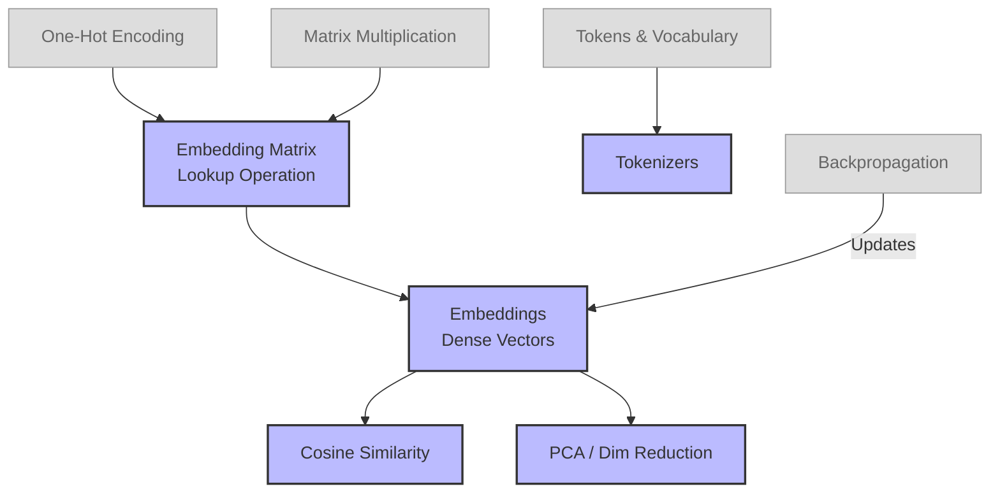

# Prerequisite Map: Week 2

```mermaid
graph TD
    %% Week 1 Foundations
    OneHot[One-Hot Encoding]:::week1
    Backprop[Backpropagation]:::week1
    MatMul[Matrix Multiplication]:::week1
    Vocab[Tokens & Vocabulary]:::week1
    
    %% Week 2 Data Prep
    Tok[Tokenizers]:::week2
    Vocab --> Tok
    
    %% Week 2 Embeddings
    OneHot --> EmbMat[Embedding Matrix<br/>Lookup Operation]:::week2
    MatMul --> EmbMat
    EmbMat --> Emb[Embeddings<br/>Dense Vectors]:::week2
    Backprop -->|Updates| Emb
    
    %% Week 2 Math / Eval
    Emb --> CosSim[Cosine Similarity]:::week2
    Emb --> PCA[PCA / Dim Reduction]:::week2
    
    classDef week1 fill:#ddd,stroke:#999,stroke-width:1px,color:#666
    classDef week2 fill:#bbf,stroke:#333,stroke-width:2px
```

*Note: Gray nodes are concepts from Week 1 that you must understand before learning the blue Week 2 concepts.*
