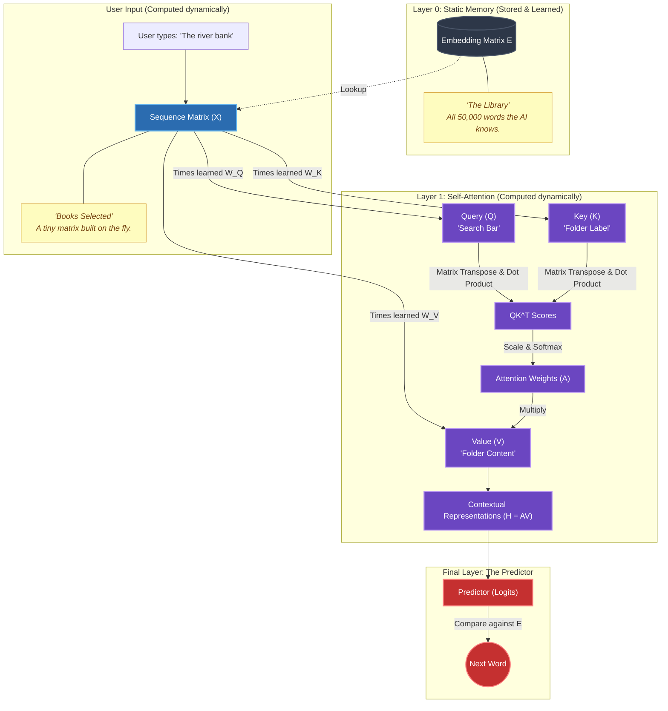

# PREREQUISITE KNOWLEDGE (Week 3: Attention & Contextual Representations)

This is the consolidated study guide for **Week 3 (Attention & Contextual Representations)**. It covers every new concept, mathematical operation, and shape transformation required for the Week 3 assignment. 

---

## 1. From Embeddings to Sequence Matrix $\mathbf{X}$
In Week 1 and Week 2, our neural network processed single isolated tokens. The **Embedding Matrix $\mathbf{E} \in \mathbb{R}^{|V| \times d_{model}}$** is a trainable parameter of the embedding layer containing learned representations for the *entire* vocabulary. It is essentially a dictionary lookup table initialized with random values.

When we process a sentence of length $T$, we retrieve the specific rows from $\mathbf{E}$ that correspond to our token IDs and stack them into a **Sequence Matrix $\mathbf{X}$**:

$$\mathbf{X} = \begin{bmatrix} \mathbf{e}_{t_1} \\ \mathbf{e}_{t_2} \\ \vdots \\ \mathbf{e}_{t_T} \end{bmatrix} \in \mathbb{R}^{T \times d_{model}}$$

**CRITICAL DISTINCTION:**
- **$\mathbf{E}$** = Learned, permanent embeddings for the whole vocabulary.
- **$\mathbf{X}$** = The specific computed embeddings for the current input sequence.

---

## 2. Why Static Embeddings Are Not Enough
Embeddings learn from the company a token kept *during training*. For example, the token `bank` learned its base embedding $\mathbf{E}[\text{bank}]$ from thousands of sentences like "river bank" and "bank loan".

However, at lookup time, static embeddings are **context-independent**:
- `"The river bank flooded"` $\to$ base $\mathbf{E}[\text{bank}]$
- `"The bank approved my loan"` $\to$ exact same base $\mathbf{E}[\text{bank}]$

The embedding lookup itself does not inspect the surrounding tokens of the current sentence. We need the token representations in the sequence to interact with each other to determine what "bank" means *right now*.

---

## 3. Attention Conceptually
To solve this, we use **Attention**, which looks at the company the token is keeping in the *current* sequence.

For the sentence `"The river bank flooded"`, to understand `"bank"`, the model needs to determine:
- `river` $\to$ highly relevant (0.70)
- `bank` $\to$ relevant (0.20)
- `flooded` $\to$ relevant (0.08)
- `The` $\to$ less relevant (0.02)

Conceptually, Attention calculates relevance between tokens, converts that relevance into percentage weights, and uses those weights to mix information from other tokens into a **new contextual representation**.

---

## 4. Why We Need Query, Key, and Value
How does the model calculate which tokens are relevant to each other? If we just compared $\mathbf{X}$ directly to itself, a single token vector would be forced to simultaneously represent what it is searching for, what it offers, and what its content is.

Instead, we project $\mathbf{X}$ into three separate roles using learned weight matrices $\mathbf{W}_Q, \mathbf{W}_K, \mathbf{W}_V$:
- **Query ($\mathbf{Q}$):** What am I looking for? $\mathbf{Q} = \mathbf{X} \mathbf{W}_Q$
- **Key ($\mathbf{K}$):** What information do I offer? $\mathbf{K} = \mathbf{X} \mathbf{W}_K$
- **Value ($\mathbf{V}$):** What information should actually be passed? $\mathbf{V} = \mathbf{X} \mathbf{W}_V$

**Important Distinction:**
- $\mathbf{E}, \mathbf{W}_Q, \mathbf{W}_K, \mathbf{W}_V$ are **learned and stored** (updated via backpropagation).
- $\mathbf{X}, \mathbf{Q}, \mathbf{K}, \mathbf{V}$ are **computed temporarily** for the current input.

---

## 5. Dot Products and Pairwise Token Comparison
To measure relevance, the model compares the Query of one token with the Keys of the other tokens using a simple dot product: $q_i \cdot k_j$.
- $\text{Query}(\text{bank}) \cdot \text{Key}(\text{river})$ produces a high relevance score.
- $\text{Query}(\text{bank}) \cdot \text{Key}(\text{The})$ produces a low relevance score.

---

## 6. Matrix Transpose and $\mathbf{Q}\mathbf{K}^\top$
We could calculate every $q_i \cdot k_j$ one by one, but matrix multiplication lets us calculate all token-to-token comparisons simultaneously. 
Given $\mathbf{Q} \in \mathbb{R}^{T \times d_k}$ and $\mathbf{K} \in \mathbb{R}^{T \times d_k}$, we transpose $\mathbf{K}$ so the inner dimensions match: $\mathbf{K}^\top \in \mathbb{R}^{d_k \times T}$.

The raw attention scores are computed as:
$$\mathbf{S} = \mathbf{Q} \mathbf{K}^\top \in \mathbb{R}^{T \times T}$$

---

## 7. Softmax and Attention Weights
Raw scores are difficult to interpret as mixing proportions. We apply a row-wise Softmax to convert raw scores into normalized **Attention Weights** $\mathbf{A} \in \mathbb{R}^{T \times T}$:
$$\mathbf{A} = \text{Softmax}(\mathbf{S})$$
Now, every row $i$ in $\mathbf{A}$ is a probability distribution summing to 1.0, representing exactly how much attention token $i$ pays to every other token.

---

## 8. Value $\mathbf{V}$ and Contextual Output ($\mathbf{H}$)
- $\mathbf{Q}$ and $\mathbf{K}$ determined WHO matters.
- $\mathbf{A}$ contains HOW MUCH information to take.
- $\mathbf{V}$ determines WHAT information is taken.

The Contextual Representation Matrix $\mathbf{H}$ is computed as:
$$\mathbf{H} = \mathbf{A} \mathbf{V} \in \mathbb{R}^{T \times d_v}$$

---

## 9. Scaled Dot-Product Attention
Assuming the components of $\mathbf{q}$ and $\mathbf{k}$ are independent random variables with mean $0$ and variance $1$, their dot product has variance $d_k$. Large dimensions ($d_k$) can produce large dot products, pushing Softmax into extreme saturation regions where gradients become very small. 

Dividing by $\sqrt{d_k}$ controls the scale of the distribution, mitigating the risk of Softmax saturation:
$$\mathbf{S}_{\text{scaled}} = \frac{\mathbf{Q} \mathbf{K}^\top}{\sqrt{d_k}}$$

---

## 10. Self-Attention Visual Architecture Pipeline
Because $\mathbf{Q}, \mathbf{K},$ and $\mathbf{V}$ are all derived from the exact same input sequence $\mathbf{X}$, this entire flow is called **Self-Attention**. 

---

## 11. Causal Masking (Autoregressive Property)
In autoregressive next-token prediction, token $i$ must not look into future positions $j > i$ (it cannot cheat by looking at the answer it is trying to predict).
We add a lower-triangular Causal Mask Matrix $\mathbf{M} \in \mathbb{R}^{T \times T}$ to the scaled scores before Softmax:

$$M_{i, j} = \begin{cases} 0 & \text{if } j \le i \\ -\infty & \text{if } j > i \end{cases}$$

Because $e^{-\infty} = 0.0$, future positions receive exactly 0% attention.

---

## 12. Complete Hand-Calculated Worked Numerical Example

Let sequence length $T = 3$ tokens (`["Order", "Shipment", "Receive"]`), hidden size $d_{model} = 2$, key dimension $d_k = 2$, value dimension $d_v = 2$.
$$\text{Scaling factor } \sqrt{d_k} = \sqrt{2} \approx 1.414$$

### Step 1: Input Sequence Matrix $\mathbf{X} \in \mathbb{R}^{3 \times 2}$
$$\mathbf{X} = \begin{bmatrix} 1.0 & 0.0 \\ 0.0 & 2.0 \\ 1.0 & 1.0 \end{bmatrix}$$

### Step 2: Linear Projection Weights (Learned Parameters)
$$\mathbf{W}_Q = \begin{bmatrix} 1 & 0 \\ 0 & 1 \end{bmatrix}, \quad \mathbf{W}_K = \begin{bmatrix} 1 & 1 \\ 0 & 1 \end{bmatrix}, \quad \mathbf{W}_V = \begin{bmatrix} 2 & 0 \\ 0 & 1 \end{bmatrix}$$

### Step 3: Compute Projections $\mathbf{Q}, \mathbf{K}, \mathbf{V}$
$$\mathbf{Q} = \mathbf{X} \mathbf{W}_Q = \begin{bmatrix} 1.0 & 0.0 \\ 0.0 & 2.0 \\ 1.0 & 1.0 \end{bmatrix} \begin{bmatrix} 1 & 0 \\ 0 & 1 \end{bmatrix} = \begin{bmatrix} 1.0 & 0.0 \\ 0.0 & 2.0 \\ 1.0 & 1.0 \end{bmatrix} \in \mathbb{R}^{3 \times 2}$$

$$\mathbf{K} = \mathbf{X} \mathbf{W}_K = \begin{bmatrix} 1.0 & 0.0 \\ 0.0 & 2.0 \\ 1.0 & 1.0 \end{bmatrix} \begin{bmatrix} 1 & 1 \\ 0 & 1 \end{bmatrix} = \begin{bmatrix} 1.0 & 1.0 \\ 0.0 & 2.0 \\ 1.0 & 2.0 \end{bmatrix} \in \mathbb{R}^{3 \times 2}$$

$$\mathbf{V} = \mathbf{X} \mathbf{W}_V = \begin{bmatrix} 1.0 & 0.0 \\ 0.0 & 2.0 \\ 1.0 & 1.0 \end{bmatrix} \begin{bmatrix} 2 & 0 \\ 0 & 1 \end{bmatrix} = \begin{bmatrix} 2.0 & 0.0 \\ 0.0 & 2.0 \\ 2.0 & 1.0 \end{bmatrix} \in \mathbb{R}^{3 \times 2}$$

### Step 4: Transpose Keys $\mathbf{K}^\top \in \mathbb{R}^{2 \times 3}$
$$\mathbf{K}^\top = \begin{bmatrix} 1.0 & 0.0 & 1.0 \\ 1.0 & 2.0 & 2.0 \end{bmatrix}$$

### Step 5: Compute Raw Scores $\mathbf{S} = \mathbf{Q} \mathbf{K}^\top \in \mathbb{R}^{3 \times 3}$
$$\mathbf{S} = \begin{bmatrix} 1.0 & 0.0 \\ 0.0 & 2.0 \\ 1.0 & 1.0 \end{bmatrix} \begin{bmatrix} 1.0 & 0.0 & 1.0 \\ 1.0 & 2.0 & 2.0 \end{bmatrix} = \begin{bmatrix} 1.0 & 0.0 & 1.0 \\ 2.0 & 4.0 & 4.0 \\ 2.0 & 2.0 & 3.0 \end{bmatrix}$$

### Step 6: Scale Scores by $\sqrt{2} \approx 1.414$
$$\mathbf{S}_{\text{scaled}} = \frac{\mathbf{S}}{1.414} \approx \begin{bmatrix} 0.707 & 0.000 & 0.707 \\ 1.414 & 2.828 & 2.828 \\ 1.414 & 1.414 & 2.121 \end{bmatrix}$$

### Step 7: Apply Causal Mask $\mathbf{M}$ (Set upper triangle $j > i$ to $-\infty$)
$$\mathbf{S}_{\text{masked}} = \begin{bmatrix} 0.707 & -\infty & -\infty \\ 1.414 & 2.828 & -\infty \\ 1.414 & 1.414 & 2.121 \end{bmatrix}$$

### Step 8: Row-wise Softmax $\mathbf{A} = \text{Softmax}(\mathbf{S}_{\text{masked}})$
- **Row 0 (`"Order"`):** $\text{Softmax}([0.707, -\infty, -\infty]) = [1.000, 0.000, 0.000]$
- **Row 1 (`"Shipment"`):** $\text{Softmax}([1.414, 2.828, -\infty]) \approx [0.196, 0.804, 0.000]$
- **Row 2 (`"Receive"`):** $\text{Softmax}([1.414, 1.414, 2.121]) \approx [0.248, 0.248, 0.504]$

$$\mathbf{A} = \begin{bmatrix} 1.000 & 0.000 & 0.000 \\ 0.196 & 0.804 & 0.000 \\ 0.248 & 0.248 & 0.504 \end{bmatrix} \in \mathbb{R}^{3 \times 3}$$

### Step 9: Compute Contextual Output $\mathbf{H} = \mathbf{A} \mathbf{V} \in \mathbb{R}^{3 \times 2}$
$$\mathbf{H} = \begin{bmatrix} 1.000 & 0.000 & 0.000 \\ 0.196 & 0.804 & 0.000 \\ 0.248 & 0.248 & 0.504 \end{bmatrix} \begin{bmatrix} 2.0 & 0.0 \\ 0.0 & 2.0 \\ 2.0 & 1.0 \end{bmatrix} = \begin{bmatrix} 2.000 & 0.000 \\ 0.392 & 1.608 \\ 1.504 & 1.000 \end{bmatrix}$$

Every calculation step matches matrix algebra exactly!

---

## 13. Manual Verification Exercises
Complete the hand calculations in:
- [Level 3: Single-Head Self-Attention](manual-exercises/01_SINGLE_HEAD_ATTENTION.md)

---

## 14. References & Sources
- Vaswani et al. (2017) *"Attention Is All You Need"*
- Bahdanau, Cho, & Bengio (2014) *"Neural Machine Translation by Jointly Learning to Align and Translate"*
- Jain & Wallace (2019) *"Attention is not Explanation"*
- Alammar, J. & Grootendorst, M. [Hands-On Large Language Models.md](file:///c:/Users/Nagar/source/repos/ai-learning-lab/resources/references/Hands-On%20Large%20Language%20Models.md)
- Goodfellow, I., Bengio, Y., & Courville, A. [Deep Learning.md](file:///c:/Users/Nagar/source/repos/ai-learning-lab/resources/references/Deep%20Learning.md)
