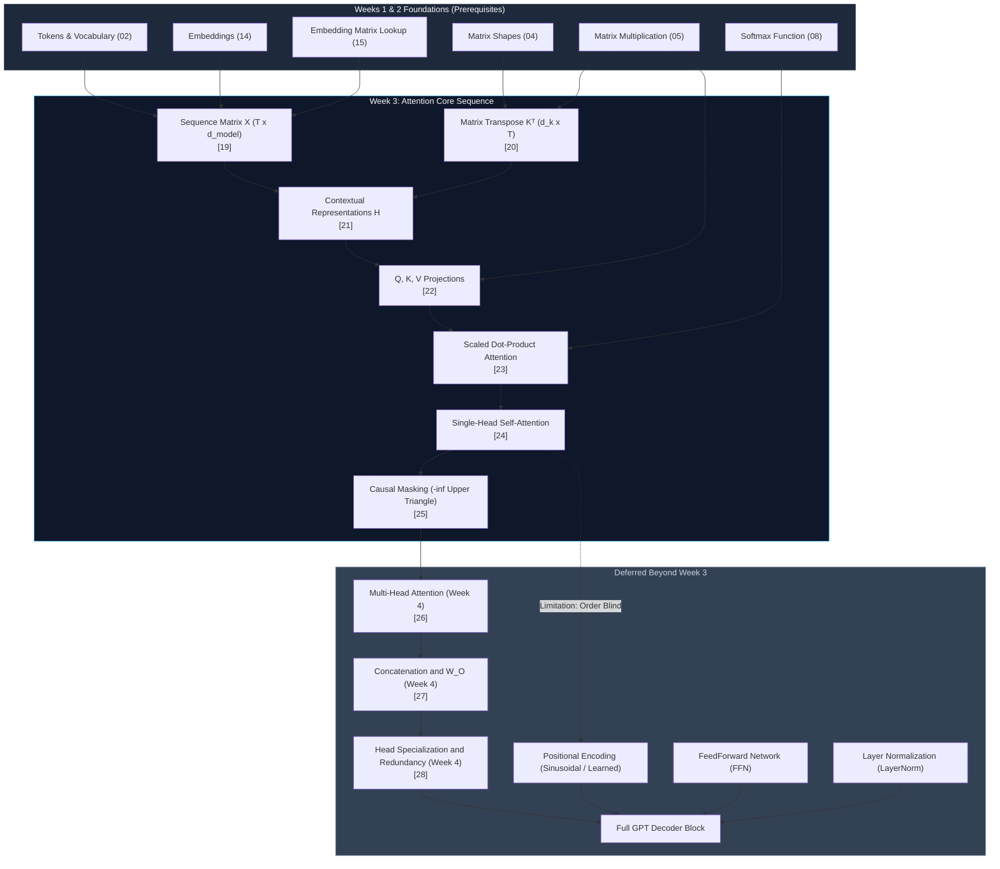

# PREREQUISITE MAP (Week 3: Attention)

The following diagram tracks how concepts from Weeks 1 and 2 flow directly into the Week 3 Self-Attention architecture:

```mermaid
flowchart TD
    subgraph W12 ["Weeks 1 & 2 Foundations (Prerequisites)"]
        style W12 fill:#1e293b,stroke:#475569,color:#f8fafc
        P02["Tokens & Vocabulary (02)"]
        P04["Matrix Shapes (04)"]
        P05["Matrix Multiplication (05)"]
        P08["Softmax Function (08)"]
        P14["Embeddings (14)"]
        P15["Embedding Matrix Lookup (15)"]
    end

    subgraph W3 ["Week 3: Attention Core Sequence"]
        style W3 fill:#0f172a,stroke:#38bdf8,color:#f8fafc
        T19["Sequence Matrix X (T x d_model)<br>[19]"]
        T20["Matrix Transpose Kᵀ (d_k x T)<br>[20]"]
        T21["Contextual Representations H<br>[21]"]
        T22["Q, K, V Projections<br>[22]"]
        T23["Scaled Dot-Product Attention<br>[23]"]
        T24["Single-Head Self-Attention<br>[24]"]
        T25["Causal Masking (-inf Upper Triangle)<br>[25]"]
    end

    subgraph W4 ["Deferred Beyond Week 3"]
        style W4 fill:#334155,stroke:#94a3b8,color:#cbd5e1
        MHA["Multi-Head Attention (Week 4)<br>[26]"]
        Concat["Concatenation and W_O (Week 4)<br>[27]"]
        Heads["Head Specialization and Redundancy (Week 4)<br>[28]"]
        PosEnc["Positional Encoding (Sinusoidal / Learned)"]
        FFN["FeedForward Network (FFN)"]
        Norm["Layer Normalization (LayerNorm)"]
        Block["Full GPT Decoder Block"]
    end

    P02 --> T19
    P14 --> T19
    P15 --> T19
    P04 --> T20
    P05 --> T20
    T19 --> T21
    T20 --> T21
    T21 --> T22
    P05 --> T22
    T22 --> T23
    P08 --> T23
    T23 --> T24
    T24 --> T25
    T25 --> MHA
    MHA --> Concat
    Concat --> Heads

    T24 -. Limitation: Order Blind .-> PosEnc
    Heads --> Block
    PosEnc --> Block
    FFN --> Block
    Norm --> Block
```
