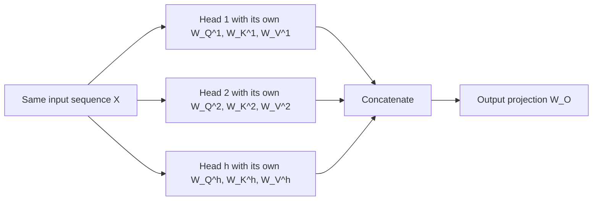
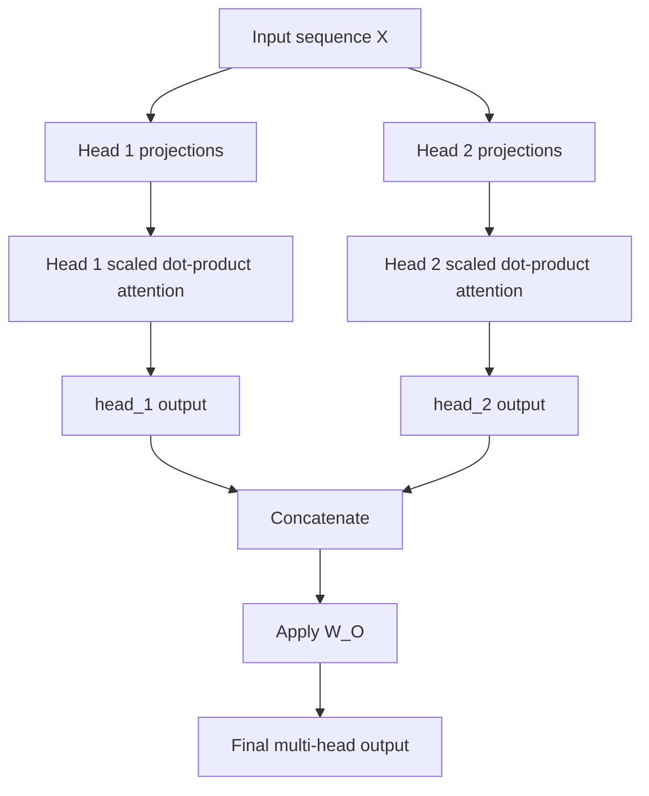

# PREREQUISITE KNOWLEDGE (Week 4: Multi-Head Attention)

This guide teaches the concepts required to understand the Week 4 assignment
before implementation. It assumes the learner finished Week 3 at roughly this
level:

- embeddings provide a learned but context-independent base representation
- one attention head can build context from the current sequence
- `Q`, `K`, and `V` are understood conceptually
- confidence is still developing around the mathematics, shapes, scaling, and
  implementation
- Multi-Head Attention has **not** yet been learned

The goal of this guide is not to rush to the final formula. The goal is to make
the need for Multi-Head Attention feel obvious before we write code.

## 1. Week 3 to Week 4 Bridge

By the end of Week 3, one attention head could do this:

1. take the sequence matrix `X`
2. build one set of `Q`, `K`, and `V`
3. compute one attention matrix
4. produce one contextual output stream

That was already a major improvement over static embeddings.

Embeddings tell us what a token generally is.
Attention tells us what matters in the current sequence.

Week 4 asks a narrower question:

> If one head already gives context, why do we need more than one?

## 2. The Visible Limitation of One Head

Use the same Healthcare GPO / ForecastIQ sequence throughout this week:

`Practice -> Drug -> Distributor -> Inventory -> Contract -> Invoice -> Rebate -> Forecast`

Suppose the current token being updated is `Forecast`.

What might matter?

- `Inventory`
- distributor activity or shipment patterns
- historical demand information encoded earlier in the sequence
- `Contract`
- `Invoice`
- `Rebate`

One head gives us:

- one learned query projection
- one learned key projection
- one learned value projection
- one attention matrix
- one contextual output stream

That does **not** mean one head is useless. It means one head has to compress
all token-to-token relevance into one learned perspective.

### Important distinction

- Theory permits the model to learn useful relationships with one head.
- We may expect one head to capture the strongest relationship first.
- But one head still produces only one attention pattern at a time.

If several different relationships are useful, one head may have to average or
compromise between them.

## 3. Why Multiple Independent Perspectives May Help

Multi-Head Attention does **not** split the input tokens across heads.

That is the first critical correction for this week.

Every head sees the **same full input sequence**.

What changes is this:

- each head has its own learned `W_Q`
- each head has its own learned `W_K`
- each head has its own learned `W_V`

So the same sequence is projected into different representation subspaces.

That gives the model several chances to form different relevance patterns from
the same token sequence.

## 4. Beginner Intuition

Imagine three ForecastIQ analysts reading the **same** PO lifecycle report.

- nobody receives only part of the report
- each analyst uses a different learned scoring rule
- each analyst writes a short summary
- the summaries are combined into one final summary

This analogy helps with two ideas:

1. the same sequence enters every head
2. heads differ because their learned projections differ

Where the analogy stops:

- analysts are humans with explicit roles
- attention heads are not manually assigned business jobs
- specialization may emerge during training, but it is not guaranteed

## 5. One-Line Definition

**Multi-Head Attention** runs several scaled dot-product attention heads in
parallel on the same input sequence using different learned projections, then
concatenates the head outputs and mixes them with an output projection `W_O`.

## 6. What Changes from Single-Head to Multi-Head

### Week 3 single-head

- `X in R^(T x d_model)`
- one `W_Q`, one `W_K`, one `W_V`
- one attention matrix `A in R^(T x T)`
- one output matrix `H in R^(T x d_v)`

### Week 4 multi-head

- the same `X in R^(T x d_model)`
- `h` different sets of `W_Q^i`, `W_K^i`, `W_V^i`
- `h` attention matrices, one per head
- `h` output matrices, one per head
- concatenation
- output projection `W_O`

## 7. Head Count, Model Dimension, and Head Dimension

We now need four dimension ideas:

- `T`: sequence length
- `d_model`: width of the model representation
- `h`: number of heads
- `d_k`, `d_v`: per-head key/query width and value width

### Common convention

A very common design is:

- `d_k = d_v = d_model / h`

Why is this common?

- because after concatenating `h` heads of width `d_v`, we get `h * d_v`
- if `d_v = d_model / h`, then `h * d_v = d_model`
- that makes the concatenated width match the model width

### But this is a convention, not the universal definition

Multi-Head Attention does **not** mathematically require
`d_k = d_model / h`.

It is simply the classic Transformer design choice used in
*Attention Is All You Need*.

## 8. The Full Multi-Head Formula

Do not memorize this yet. First read the symbol table.

### Symbol table

- `X`: the input sequence matrix, shape `(T, d_model)`
- `W_Q^i`: head `i` query projection matrix
- `W_K^i`: head `i` key projection matrix
- `W_V^i`: head `i` value projection matrix
- `Q_i = X W_Q^i`: head `i` query matrix
- `K_i = X W_K^i`: head `i` key matrix
- `V_i = X W_V^i`: head `i` value matrix
- `K_i^T`: transpose of `K_i`
- `Q_i K_i^T`: all pairwise raw scores for head `i`
- `sqrt(d_k)`: scaling factor used inside each head
- `softmax(...)`: row-wise conversion of scores into attention weights
- `head_i`: output of attention head `i`
- `Concat(...)`: stack all head outputs side by side across features
- `W_O`: output projection that mixes the concatenated result

### Formula

For one head:

`head_i = Attention(X W_Q^i, X W_K^i, X W_V^i)`

where

`Attention(Q_i, K_i, V_i) = softmax((Q_i K_i^T) / sqrt(d_k)) V_i`

For the full layer:

`MultiHead(X) = Concat(head_1, ..., head_h) W_O`

## 9. Shape Tracing

Let:

- `T = 4`
- `d_model = 4`
- `h = 2`
- `d_k = d_v = 2`

Then:

- `X`: `(4, 4)`
- `W_Q^1`, `W_K^1`, `W_V^1`: `(4, 2)`
- `Q_1`, `K_1`, `V_1`: `(4, 2)`
- `Q_1 K_1^T`: `(4, 4)`
- `softmax((Q_1 K_1^T) / sqrt(2))`: `(4, 4)`
- `head_1`: `(4, 2)`

The same is true for head 2.

After both heads:

- `head_1`: `(4, 2)`
- `head_2`: `(4, 2)`
- `Concat(head_1, head_2)`: `(4, 4)`
- `W_O`: `(4, 4)`
- final output: `(4, 4)`

### Why each multiplication is valid

1. `X W_Q^1`
   - `(4, 4) @ (4, 2)`
   - inner dimensions `4` and `4` match
   - output is `(4, 2)`

2. `Q_1 K_1^T`
   - `Q_1` is `(4, 2)`
   - `K_1^T` is `(2, 4)`
   - inner dimensions `2` and `2` match
   - output is `(4, 4)`

3. `A_1 V_1`
   - `A_1` is `(4, 4)`
   - `V_1` is `(4, 2)`
   - inner dimensions `4` and `4` match
   - output is `(4, 2)`

4. `Concat(head_1, head_2) W_O`
   - concatenation gives `(4, 4)`
   - `W_O` is `(4, 4)`
   - output is `(4, 4)`

## 10. Small Worked Example Focused on the New Idea

To keep the arithmetic readable, this example starts **after projection**.
Week 3 already taught how one head computes attention internally. Week 4 adds
parallel heads, concatenation, and `W_O`.

Assume:

- `T = 2`
- `d_model = 4`
- `h = 2`
- `d_v = 2`

Suppose the two heads already produced:

`head_1 = [[0.9, 0.1], [0.2, 0.8]]`

`head_2 = [[0.3, 0.7], [0.6, 0.4]]`

### Step 1: Concatenate

`Concat(head_1, head_2) = [[0.9, 0.1, 0.3, 0.7], [0.2, 0.8, 0.6, 0.4]]`

Shape:

- two rows because we still have two token positions
- four columns because each row now contains both heads side by side

### Step 2: Apply `W_O`

Let

`W_O = [[1,0,0,0],[0,1,0,0],[0,0,1,0],[0,0,0,1]]`

Then the output is unchanged:

`Output = Concat(head_1, head_2) @ W_O`

`Output = [[0.9, 0.1, 0.3, 0.7], [0.2, 0.8, 0.6, 0.4]]`

This identity example is boring on purpose. It isolates the mechanics:

- first produce per-head outputs
- then concatenate
- then apply `W_O`

In a real model, `W_O` is learned, so it usually **mixes** the head outputs
rather than leaving them untouched.

## 11. Why Concatenation Alone Is Not Enough

If we stop after concatenation:

- the heads are merely placed side by side
- there is no learned mixing of those head outputs
- the next layer receives a grouped feature bundle, but no learned recombination

`W_O` matters because it lets the model:

- recombine information from different heads
- return to the model width expected by the rest of the network
- decide how strongly each head’s features should influence the final result

## 12. The Complete Forward Pass

If the assignment uses causal masking, the mask is reused **inside every head**
before softmax.

## 13. Theory, Expectation, and Evidence

This week requires disciplined language.

| Category | What we can say |
|---|---|
| Theory permits | Different heads can learn different useful patterns from the same sequence. |
| We may expect | Some heads may become more local, some broader, some possibly redundant. |
| Experiment actually proves | Only what the measured attention maps, losses, and ablation tests show for the trained toy model we ran. |

Do **not** say:

- "Head 1 is the Inventory head"
- "Head 2 is the pricing head"

unless the measured attention and ablation evidence actually support that claim.

## 14. How Heads Learn

The heads do not become different because we manually assign them roles.

They become different, if they do, because:

1. the model makes predictions
2. loss measures how wrong the predictions are
3. backpropagation computes gradients for all learned parameters
4. the optimizer updates the per-head projection matrices and `W_O`
5. repeated updates can push heads toward different useful solutions

This is the Week 1 and Week 3 training loop returning in a new place.

The high-level learning idea comes from standard gradient-based optimization:

- loss gives the objective
- gradients tell parameters how to change
- repeated updates can reduce loss

## 15. What Multi-Head Attention Does Not Solve

This week also needs several negative statements:

- heads do **not** process different subsets of tokens
- heads are **not** Mixture-of-Experts
- Multi-Head Attention does **not** remove the `O(T^2)` attention-score cost
- more heads do **not** automatically mean better performance
- attention weights are **not** a complete explanation of model decisions
- random forward-pass attention patterns are **not** evidence of learned
  specialization

## 16. What Comes Next

Once we understand:

- why one head can be limiting
- how multiple heads are built
- how outputs are concatenated and mixed

the next architectural question becomes:

> How do we place Multi-Head Attention inside a full Transformer block with
> residual connections, Layer Normalization, and a feed-forward network?

That later question is previewed this week but taught in full later.

## 17. Study Order for the Rest of Week 4

1. Read this guide first.
2. Read [26 - TRANSFORMER - Multi-Head Attention](../../topics/26%20-%20TRANSFORMER%20-%20Multi-Head%20Attention.md).
3. Read [27 - TRANSFORMER - Concatenation and Output Projection](../../topics/27%20-%20TRANSFORMER%20-%20Concatenation%20and%20Output%20Projection.md).
4. Read [28 - TRANSFORMER - Inspecting Specialization and Redundancy in Attention Heads](../../topics/28%20-%20TRANSFORMER%20-%20Inspecting%20Specialization%20and%20Redundancy%20in%20Attention%20Heads.md).
5. Complete the manual exercises:
   - [01-two-head-shape-tracing](manual-exercises/01-two-head-shape-tracing.md)
   - [02-concatenation-and-output-projection](manual-exercises/02-concatenation-and-output-projection.md)

## 18. Sources Actually Consulted

- Vaswani et al., [Attention Is All You Need](https://arxiv.org/abs/1706.03762)
- Jay Alammar and Maarten Grootendorst, local reference:
  `resources/references/Hands-on- Large Language Models.md`
- Goodfellow, Bengio, and Courville, local reference:
  `resources/references/Deep Learning.md`
- Paul Michel, Omer Levy, and Graham Neubig,
  [Are Sixteen Heads Really Better than One?](https://papers.neurips.cc/paper_files/paper/2019/hash/2c601ad9d2ff9bc8b282670cdd54f69f-Abstract.html)
- Elena Voita et al.,
  [Analyzing Multi-Head Self-Attention: Specialized Heads Do the Heavy Lifting, the Rest Can Be Pruned](https://aclanthology.org/P19-1580/)
