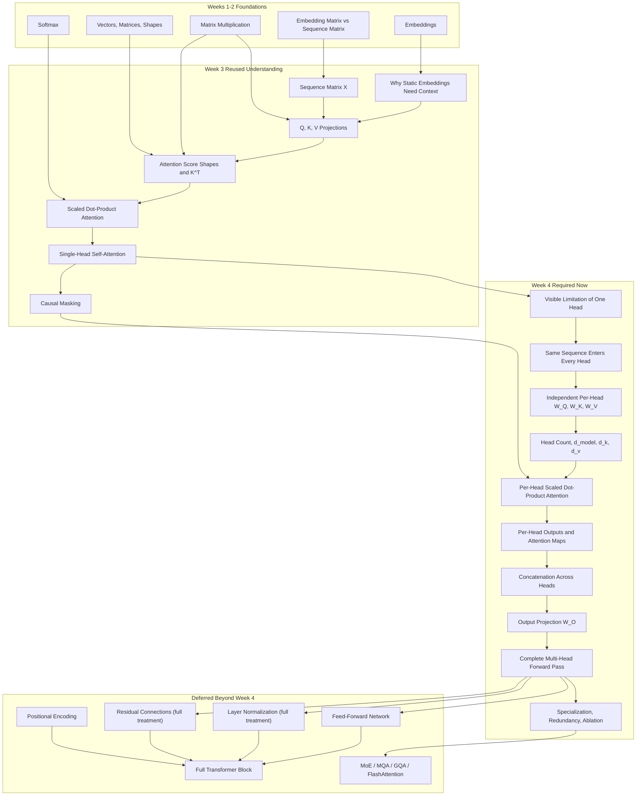

# PREREQUISITE MAP (Week 4: Multi-Head Attention)

Week 4 continues directly from Week 3. The learner already has the single-head
attention pipeline. The new work starts by making the limitation of that single
learned perspective visible, then introduces multiple independently projected
heads, and only later previews how this fits into a full Transformer block.

## Dependency Story

- Reuse from Week 3:
  - sequence matrix `X`
  - `Q`, `K`, `V`
  - scaled dot-product attention
  - causal masking
  - contextual output from one head
- Learn now:
  - why one head can be limiting
  - how all heads process the same full sequence
  - how separate `W_Q`, `W_K`, `W_V` per head create independent projections
  - how head dimensions relate to `d_model` and head count
  - concatenation and why `W_O` is still needed
  - evidence-based interpretation of specialization, redundancy, and ablation
- Defer:
  - positional encoding details
  - residual connections beyond a preview
  - Layer Normalization beyond a preview
  - feed-forward networks
  - full Transformer block assembly
  - MoE, MQA, GQA, FlashAttention, KV caching

